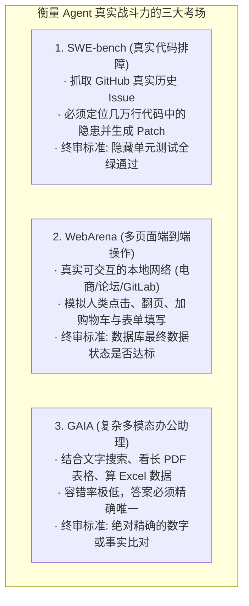

import { Quiz } from '@/components/Quiz'

# 7.2 工业级基准测试全景：SWE-bench、WebArena 与 GAIA

> 平时看大模型发布会，厂商总喜欢展示 MMLU 或数学题跑分。但这些测试就像让模型“刷高考选择题”，分数再高，也不代表它能进你的团队修代码或者替你订酒店。要想检验一个带手脚的 Agent 在真实世界里能不能打，业内公认的三个硬核考场是：测修 Bug 能力的 **SWE-bench**、测网页真实操作的 **WebArena**、以及测复杂办公多任务的 **GAIA**。这一节我们聊聊这三大标尺到底怎么测，以及为什么模型在真实考场里及格都很难。

---

## 1. 从“刷选择题”到“进现场干活”

做选择题只要靠脑内概率推理；但在真实世界里干活，需要面对几万行未知的源码、动辄报错的终端、以及点了没反应的网页按钮。



---

## 2. 软件工程的终极试炼：SWE-bench

2023 年底普林斯顿大学推出的 **SWE-bench**，彻底终结了“用 LeetCode 刷题评价编程能力”的时代。

它直接把开源社区（如 Django、Flask、Sympy）里真实用户报的 Issue 扔给模型：

```mermaid
sequenceDiagram
    autonumber
    participant Runner as 评测框架
    participant Box as Docker 隔离沙箱
    participant Agent as 待测 Coding Agent
    participant CI as 独立测试机

    Runner->>Box: 拉取 Django 某历史版本（几万行真实代码）
    Runner->>Agent: 发送真实 Issue 描述: "在某种极端传参下 ORM 报错"
    
    loop Agent 自由排查
        Agent->>Box: 翻看代码、grep 搜函数、修改文件、本地跑测试
    end
    
    Agent-->>Runner: 宣布完工，生成 Git Diff 补丁
    Runner->>CI: 打入补丁，运行隔离的隐藏测试套件
    CI-->>Runner: 跑双套用例: FAIL_TO_PASS 变绿 + PASS_TO_PASS 无回归
    Runner-->>Agent: 判定是否真正通过
```

### 为什么在 SWE-bench 上拿高分极难？
1. **代码体量庞大**：项目动辄数十万行，根本塞不进单次上下文，全靠 Agent 用 `grep` 和文件树慢慢摸索；
2. **严苛的“双向测试断言”**：
   * `FAIL_TO_PASS`：之前报错的那个测试用例，打上补丁后必须变绿（证明确实修好了 Bug）；
   * **`PASS_TO_PASS`**：之前本来就正常跑通的几百个老测试，**打上补丁后必须依然全绿（证明没把老业务改崩）**；
3. **真实及格线有多低？**
   * 2023 年底，裸模型 GPT-4 直接跑得分只有可怜的 **1.96%**；
   * 配上专用工具链（Aider、SWE-agent）后慢慢爬升到 **20%**；
   * 到了 2025~2026 年，结合深度自愈与强力推理模型，头部系统的通过率才艰难突破 **50%**。

---

## 3. WebArena：不玩花架子，直接查数据库

过去的网页爬虫评测，往往只是让模型在静态 HTML 里找一句话。
而 **WebArena** 在本地直接搭建了四个完整的交互式开源系统：
* **开源电商（Magento）**：真实的商品分类、优惠券与购物车；
* **自建 GitLab**：真实的代码库、Merge Request 与 Issue 追踪；
* **社交论坛（Reddit 副本）**；
* **开源地图导航**。

系统给 Agent 一个任务：`“在商城里找一款 50 美元以内、评分 4 星以上的无线耳机，用优惠码 DISCOUNT10 下单到收件地址”`。
评测不看它说了什么，**等它宣布搞定后，脚本直接去查后端的 MySQL 订单表**——如果数据库里没生成这条符合要求的订单记录，直接判 0 分！

---

## 4. GAIA：让人类专家打分的高阶试卷

Meta 和 Hugging Face 联合推出的 **GAIA** 专门测复杂长程任务（比如结合长 PDF、音频和 Excel 汇总）：
* **人类专家在上面能拿 92 分**（虽然耗时，但步骤很稳）；
* 没有配齐工具的普通大模型，通常连 **30 分** 都拿不到。
* 它严禁废话，必须给出精确的最终答案（如特定的金额或专有名词），对任何幻觉零容忍。

---

## 5. 随堂检验

<Quiz
  question="在软件工程基准测试 SWE-bench 中，为什么除了检验‘FAIL_TO_PASS’用例之外，还必须强制运行全量的‘PASS_TO_PASS’历史测试集？"
  options={[
    {
      text: "A. 确保 Agent 在修复当前 Bug 的同时，没有引入回归缺陷，即没有破坏项目原有的其他任何稳定功能",
      isCorrect: true,
      explanation: "在真实工程中，修好一个 Bug 只是合格线，更难的是不引起代码回归（Regression）。PASS_TO_PASS 是确保既有数千个历史功能完好无损的硬性底线。"
    },
    {
      text: "B. 因为运行 PASS_TO_PASS 可以自动为代码库在 GitHub 上刷更多的 Star",
      isCorrect: false,
      explanation: "评测完全在本地离线沙箱进行，与 GitHub 线上点赞完全无关。"
    },
    {
      text: "C. 因为 Python 解释器在不跑老测试时会强制锁死所有的 CPU 硬件核心",
      isCorrect: false,
      explanation: "测试由普通的 pytest 进程执行，不涉及硬件强制锁死逻辑。"
    },
    {
      text: "D. 为了让服务器持续运行 24 小时以测试机房的空调节能水平",
      isCorrect: false,
      explanation: "基准测试追求高效准确，评测目的是衡量软件代码质量而非机房温控。"
    }
  ]}
/>

---

## 延伸阅读

* 《AI Agents in Depth: Design Principles and Engineering Practice》（李博杰，2026）第 7.2 节。
* 普林斯顿大学 SWE-bench 官方官方论文与排行榜。
* 下一节：[7.3 LLM-as-a-Judge 裁判偏差与校准](/ch07-evaluation/03-llm-as-a-judge-and-biases)
