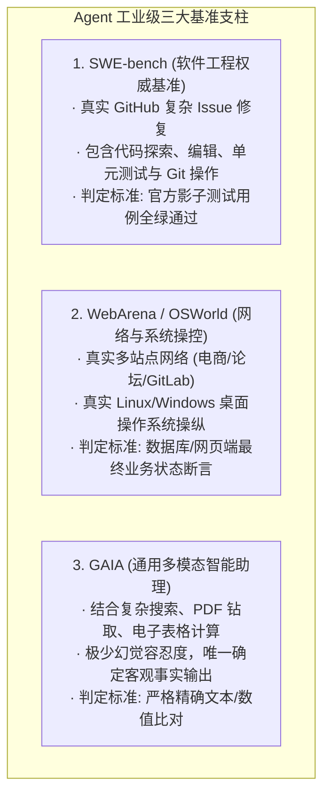
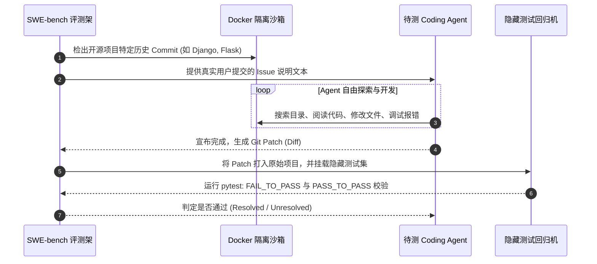

import { Quiz } from '@/components/Quiz'

# 7.2 工业级基准测试全景：SWE-bench、WebArena 与 GAIA

> **本节要点**：全景透视代表当今 AI Agent 最高技术试金石的“三大工业级基准测试”：软件工程圣殿 **SWE-bench**、真实网络与系统操纵标尺 **WebArena / OSWorld**、以及通用复杂任务基准 **GAIA**；剖析构建可复现自动化沙盒评测环境的工程难点与防污染红线。

---

## 1. 试金石体系：衡量 Agent 真实战斗力的大基准

评测大模型的“做题”能力看 MMLU 或 GSM8K；而评测一个具备手脚的智能体（Agent）在真实世界的“干活”能力，则依赖更具物理复杂度的基准测试体系：

---

## 2. 软件研发圣殿：SWE-bench 深度拆解

**SWE-bench** 是由普林斯顿大学于 2023 年底推出的划时代基准，它彻底终结了“用简单 LeetCode 刷题来评估代码能力”的虚假繁荣：

### 为什么 SWE-bench 极其残酷且真实？
1. **代码体量庞大**：项目往往包含数万至数十万行代码，Agent 无法一次性读入上下文，必须自主使用 `grep` 与文件树检索来定位几十个文件中的微小隐患；
2. **双重测试用例校验**：
   * `FAIL_TO_PASS`：原先失败的测试，在打上 Agent 的补丁后必须成功跑通（证明修复了 Bug）；
   * `PASS_TO_PASS`：原先正常通过的历史数百个旧测试，在打上补丁后**依然必须全部保持通过**（证明没有破坏已有功能，无回归 Bug）；
3. **分水岭指标**：
   * 2023 年底：GPT-4 裸奔得分仅 **1.96%**；
   * 2024 年中：结合专用 Harness 框架（如 SWE-agent、Aider）得分攀升至 **15% ~ 25%**；
   * 2025~2026 年：顶尖模型配合深度 ReAct 与代码自愈闭环，在 SWE-bench Verified 上突破 **50%**。

---

## 3. WebArena 与 OSWorld：多模态真实沙盒网络

传统的网页爬虫评测只是被动下载 HTML。而 **WebArena** 搭建了四个完整的真实离线服务：
* **OneStopShop**（基于 Adobe Magento 的全功能电商平台，带购物车、优惠券与结账流程）；
* **GitLab 实例**（真实的代码仓库、Merge Request 与 Issue 追踪）；
* **Reddit 副本**（Postmill 社交论坛）；
* **OpenStreetMap**（全功能交互地图导航）。

Agent 接收到如“在电商网站中找到价格低于 $50 且评价大于 4 星的蓝牙耳机，将其加入购物车并结算到填写地址页面”的任务，必须跨越登录、搜索、翻页、多条件勾选、表单填充等十几个动态交互节点。

---

## 4. GAIA：通用助手的终极珠峰

由 Meta、Hugging Face 等联合推出的 **GAIA (General AI Assistants)** 评测，专门针对真实人类在日常办公中提出的复杂复合难题：

| 难度等级 | 任务特征描述 | 典型任务案例 |
| :--- | :--- | :--- |
| **Level 1** | 单步至多步简单信息检索，无需多模态附件 | “找出 2023 年诺贝尔物理学奖得主中最年长者的出生城市。” |
| **Level 2** | 需要结合长文本 PDF、复杂 Excel 汇总与多重条件计算 | “阅读附件中的财报 PDF 第 15 页表格与第 30 页附注，计算扣除一次性重组费用后的 EBITDA 增速。” |
| **Level 3** | 长程跨模态多工具自主编排（通常涉及音频切片、图像细节比对与代码编写） | “解压音频附件并过滤背景杂音，提取演讲者报出的 6 位密码，用该密码解密加密文档并提取统计数据。” |

> 📌 **人类 vs. AI**：人类专家在 GAIA 上的得分高达 **92%**，而未配置强大工具链的传统 LLM 得分通常不足 **30%**。GAIA 是检验系统工具调度与多模态整合能力最硬核的靶场。

---

## 5. 本节练习与反思

<Quiz
  question="在软件工程基准测试 SWE-bench 中，为什么除了检验'FAIL_TO_PASS'用例之外，还必须强制运行庞大的'PASS_TO_PASS'测试集？"
  options={[
    "确保 Agent 在修复当前 Bug 的同时，没有引入代码回归（Regression），即没有破坏项目原有的其他任何功能",
    "因为运行 PASS_TO_PASS 测试用例可以自动为当前代码库在 GitHub 上刷取更多的 Star",
    "因为 Python 解释器在没有运行历史旧测试时会强制锁死所有的 CPU 线程",
    "为了让测试运行时间延长到 24 小时以上以测试服务器的抗疲劳能力"
  ]}
  correctIndex={0}
  explanation="在真实软件工程中，写出一段修复特定 Bug 的补丁并不难，难的是'不破坏原有数千个既有功能的正常运转'。FAIL_TO_PASS 验证 Bug 是否被消除，PASS_TO_PASS 则死守非破坏性回归防线，只有两者同时全绿才算真正解决了该 Issue。"
/>

<Quiz
  question="WebArena 相比传统的静态网页阅读理解数据集，其最具划时代意义的技术突破是什么？"
  options={[
    "搭建了包含真实电商、论坛、GitLab 与地图的自托管全功能沙盒网络，评测重点在于跨页面连续动态操作与真实环境数据状态变更",
    "将所有网页都翻译为了拉丁文以防止任何考生作弊",
    "完全取消了网络通信协议，所有网页仅通过打印机打印在纸张上供模型扫描",
    "规定所有智能体只能使用纯英文大写字母来填写网页表单"
  ]}
  correctIndex={0}
  explanation="WebArena 摆脱了静态 HTML 问答的局限，构建了真正能够登录、下单、发帖、合并 PR 的交互式虚拟世界。Agent 的每一次点击和输入都会真实改变后台数据库，评测通过直接断言数据库中的订单状态来进行，代表了动态环境交互评测的最高水准。"
/>
