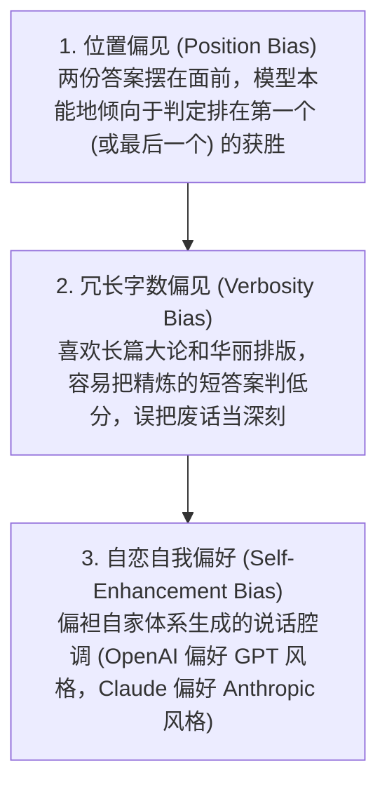
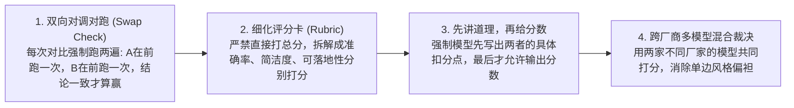

import { Quiz } from '@/components/Quiz'

# 7.3 裁判员模型与偏差校准：LLM-as-a-Judge 落地规范

> 写代码的任务可以用单元测试自动检验，但如果让 Agent 写一份技术选型方案、或者作为客服回复用户咨询，我们怎么客观判断它答得好不好？请技术专家每天人工看上千条对话，人力成本根本撑不住。业内目前普遍采用 **LLM-as-a-Judge（大模型当裁判）**：用更强的模型（如 GPT-4o 或 Claude 3.5）给候选方案打分。但模型当裁判天生带有不少“偏见”：它喜欢长篇大论、倾向判排在前面的选项获胜、甚至偏袒自家模型的说话风格。这一节我们聊聊怎么给裁判模型“去水去偏”。

---

## 1. 为什么开放式任务需要大模型当裁判？

面对技术架构对比、合规咨询或多轮客服这类开放式任务：
* 既没有绝对唯一的标准答案，也无法写自动化单测去断言；
* 人工盲审每天看几百条不仅耗资几万元，而且速度极慢，无法配合研发每日 CI/CD 流水线。

让能力更强的高阶大模型阅读评分标准（Rubric）并打分，成为了自动化评估复杂开放式任务的标配方案。

```mermaid
flowchart LR
    Task[复杂开放任务输入] --> AgentOut[候选 Agent 生成的分析报告]
    AgentOut & Rubric[细分评分标准卡片] --> Judge[大模型裁判 (GPT-4o / Claude)]
    Judge --> Reason[先输出打分理由与优劣比对]
    Reason --> FinalScore[最终输出结构化分值与评级]
```

---

## 2. 裁判模型的“三大偏见”

模型并不是绝对客观的黑铁法官，它在评判时有三处非常明显的毛病：



### 1. 位置偏见（Position Bias）有多严重？
在把模型 A 和模型 B 的回答放在一起做“成对对比”（Pairwise）时：
把 A 放在前面、B 放在后面，裁判可能判 A 赢；**但只要你偷偷把输入顺序颠倒，把 B 放在前面，裁判又经常判定第一位的 B 赢！** 这种因排位产生的胜率偏差能高达 20% 以上。

### 2. 冗长字数偏见（Verbosity Bias）
大模型天然是“字数外貌协会”：如果候选人 A 用三句干练的代码直接讲透本质，而候选人 B 堆砌了 2000 字毫无实质的客套排比和假大空背景，未经提示词校准的裁判模型经常给候选人 B 判高分。

---

## 3. 生产环境的四道校准防线

为了让裁判打分靠得住，工程上必须加上四道紧箍咒：



---

## 4. 最小实战：带位置对调校准的双向裁判器

```typescript
import { OpenAI } from 'openai';

export class CalibratedJudge {
  private client = new OpenAI();

  async compare(prompt: string, answerA: string, answerB: string) {
    // 第 1 轮：A 放在前，B 放在后
    const res1 = await this.judgeOnce(prompt, answerA, answerB);

    // 第 2 轮：位置颠倒，B 放在前，A 放在后
    const res2 = await this.judgeOnce(prompt, answerB, answerA);

    // 校准判定：两轮评判必须自洽，排除排位干扰
    const res2Normalized = res2.winner === 'first' ? 'second' : res2.winner === 'second' ? 'first' : 'tie';

    if (res1.winner === res2Normalized && res1.winner !== 'tie') {
      const winner = res1.winner === 'first' ? 'Model A 获胜' : 'Model B 获胜';
      return { winner, confident: true, reason: res1.reason };
    }

    // 颠倒位置后结论反转，说明两者差距不大或模型产生排位摇摆，判定平局
    return { winner: '平手 (Tie)', confident: false, reason: '受到位置顺序干扰，双方水平无显著差距' };
  }

  private async judgeOnce(p: string, first: string, second: string) {
    const res = await this.client.chat.completions.create({
      model: 'gpt-4o',
      response_format: { type: 'json_object' },
      messages: [{
        role: 'system',
        content: `你是一名严苛的中立裁判。重点评估精准度与精炼度，严禁偏袒字数冗长的回答！
先在 reason 字段写出对比分析，最后在 winner 字段输出 'first'、'second' 或 'tie'。格式必须为合法 JSON。`
      }, {
        role: 'user',
        content: `【任务】: ${p}\n\n【回答 1】:\n${first}\n\n【回答 2】:\n${second}`
      }]
    });
    return JSON.parse(res.choices[0].message.content || '{}');
  }
}
```

---

## 5. 随堂检验

<Quiz
  question="在利用 LLM-as-a-Judge（大模型作为裁判）进行两份回答的成对对比（Pairwise Comparison）时，为什么要强制进行‘双向位置对调校验’（Swap Calibration）？"
  options={[
    {
      text: "A. 大模型在面对长输入时存在明显的位置偏见，常常无意识偏向排在首位（或末位）的候选回答",
      isCorrect: true,
      explanation: "位置偏见（Position Bias）是 LLM 裁判的典型缺陷。只有在 A/B 顺序对调后模型依然一致判定胜出，才能排除排位先后造成的虚假高分。"
    },
    {
      text: "B. 因为对调位置可以把每次调用的 Token 消耗彻底降为 0",
      isCorrect: false,
      explanation: "对调相当于请求两次，增加了调用开销，但换取了客观公信力。"
    },
    {
      text: "C. 这样可以完全防止黑客对服务器发动 DDoS 网络攻击",
      isCorrect: false,
      explanation: "这是评估算法层面的去偏设计，与网络层安全防护无关。"
    },
    {
      text: "D. 因为操作系统的文件系统不支持按正向字母表顺序读取文件",
      isCorrect: false,
      explanation: "这纯粹是多模态大模型的自回归注意力偏见，与文件系统毫无关系。"
    }
  ]}
/>

---

## 延伸阅读

* 《AI Agents in Depth: Design Principles and Engineering Practice》（李博杰，2026）第 7.3 节。
* [Agent 核心架构速查手册](/reference/agent-core-architecture)
* 下一节：[7.4 可观测性与 OpenTelemetry 轨迹追踪](/ch07-evaluation/04-observability-and-opentelemetry)
