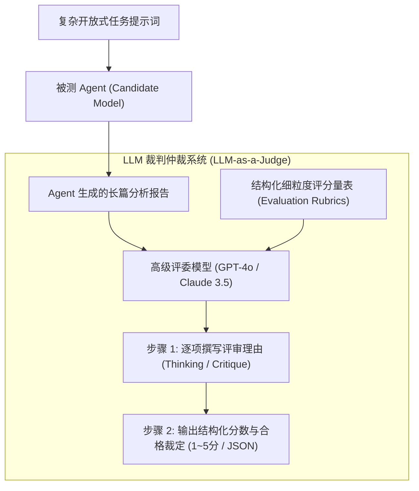
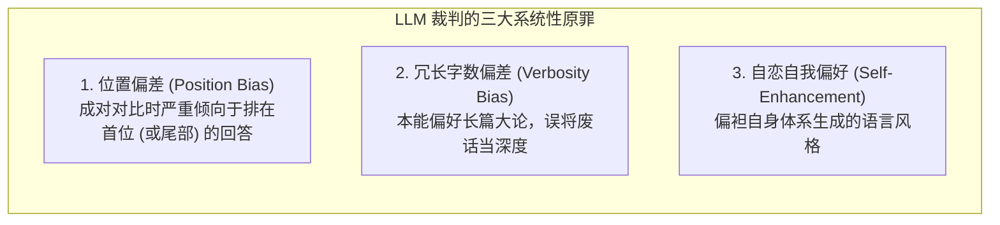
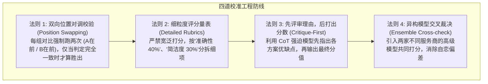

import { Quiz } from '@/components/Quiz'

# 7.3 裁判员模型与偏差校准：LLM-as-a-Judge 落地规范

> **本节要点**：当面对开放式方案设计、长文本推理与合规质检等无法用单元测试硬编码断言的场景时，**LLM-as-a-Judge（大模型作为裁判）** 成为了现代评估的中流砥柱。深度剖析裁判员模型面临的 **三大系统性心理学偏差（位置偏差、冗长偏差、自恋自赏偏差）**；掌握包括双向位置轮换（Swap Calibration）与结构化评分量表（Rubrics）在内的工业级校准工程。

---

## 1. 为什么需要“大模型当裁判”？

在前面的学习中，我们确立了以“代码执行断言”为核心的硬核评测。然而在许多现实企业场景中，任务的目标是生成一份**架构技术选型报告**、**合规法律意见书**或**多轮客服对话**。
对于这类高度依赖专业审美品味、逻辑连贯性与价值取向的任务：
* 传统的关键词匹配或正则检查彻底无能为力；
* 聘请人类专家逐条打分，不仅成本极其高昂（数万元/千条），而且速度极慢，无法满足持续集成（CI/CD）每日几百次的迭代回归。

**LLM-as-a-Judge** 利用更强大的大语言模型（如 GPT-4o 或 Claude 3.5 Sonnet）作为客观裁判，对被测 Agent 的输出进行评分与打分判决。



---

## 2. 裁判员模型的三大致命认知偏差 (Systemic Biases)

大语言模型作为裁判并非绝对中立的法官，学术界研究（如 MT-Bench、AlpacaEval）揭示了其具有严重的“认知心理偏差”：



### 1. 位置偏差 (Position Bias)
在成对对比测试（Pairwise Evaluation: 给定模型 A 与模型 B 的回答，评委判断谁更好）中：
* 如果把候选答案 A 放在前面、B 放在后面，模型可能判定 A 胜出；
* **但如果仅将 A 与 B 的输入顺序对调，模型依然经常判定排在第一位的候选者胜出！** 这种胜率不对称性可高达 15%~30%。

### 2. 冗长啰嗦偏差 (Verbosity Bias)
模型本能地认为“篇幅越长、小标题越多、格式越华丽，答案就越专业”。哪怕候选人 A 用简洁有力的 3 句话给出了最精准的数学证明，而候选人 B 堆砌了 2000 字的客套话与无关背景，未经校准的评委模型经常将高分判给候选人 B。

### 3. 自我偏好偏差 (Self-Enhancement Bias)
评委模型对与自己同一系列的模型输出具有天生的亲和力（如 GPT-4 当裁判倾向于判 GPT 系列更高分，Claude 裁判偏好 Anthropic 风格的措辞习惯）。

---

## 3. 生产级消除偏差的四大校准法则

为了使 LLM 裁判具备媲美人类高级工程师的客观公正性，必须遵循以下四大工程守门原则：



---

## 4. 全栈实战：构建消除位置偏差的双向裁判器 (TypeScript)

```typescript
// llm-judge-calibrated.ts
import { OpenAI } from 'openai';

export interface PairwiseResult {
  winner: 'model_a' | 'model_b' | 'tie';
  confidence: number;
  reasoning: string;
}

export class CalibratedLLMJudge {
  private client = new OpenAI();

  /**
   * 执行带双向位置对调校准的成对比较
   */
  async evaluatePairwise(prompt: string, answerA: string, answerB: string): Promise<PairwiseResult> {
    console.log('[LLM Judge] 启动第一轮裁判：A 在前，B 在后...');
    const round1 = await this.singleJudgement(prompt, answerA, answerB);

    console.log('[LLM Judge] 启动第二轮反向裁判：B 在前，A 在后 (消除位置偏差)...');
    const round2 = await this.singleJudgement(prompt, answerB, answerA);

    // 校准逻辑：
    // 如果第 1 轮认为 前者(A) 胜，第 2 轮也必须认为 后者(A) 胜，才算有效胜出
    const round2WinnerMapped = round2.winner === 'model_a' ? 'model_b' : round2.winner === 'model_b' ? 'model_a' : 'tie';

    if (round1.winner === round2WinnerMapped && round1.winner !== 'tie') {
      console.log(`[LLM Judge] 双向裁判自洽验证通过！胜出者: ${round1.winner}`);
      return {
        winner: round1.winner,
        confidence: 0.95,
        reasoning: `双向对调一致认同: ${round1.reasoning}`,
      };
    }

    console.warn('[LLM Judge] 双向判定存在分歧或平局 (位置对调后结果反转)，裁定为平局 (Tie)！');
    return {
      winner: 'tie',
      confidence: 0.5,
      reasoning: '受到位置偏差影响或两者水平极其接近，无法形成压倒性定论。',
    };
  }

  private async singleJudgement(prompt: string, candidate1: string, candidate2: string): Promise<{ winner: 'model_a' | 'model_b' | 'tie'; reasoning: string }> {
    const systemInstruction = `
你是一位极其严苛客观的中立专家评委。
请依据【精准度】、【逻辑严密性】与【回答简洁度】对如下两个候选回答进行评判。
严禁偏袒字数冗长的回答！
请务必遵循：先在 reasoning 中阐述分析两者的优劣对比，最后在 winner 字段输出 'model_a'（候选 1 胜）、'model_b'（候选 2 胜）或 'tie'（平手）。
请严格输出 JSON 格式。
`;

    const userContent = `
【用户任务提示词】: ${prompt}

【候选 1 回答】:
${candidate1}

【候选 2 回答】:
${candidate2}
`;

    const response = await this.client.chat.completions.create({
      model: 'gpt-4o',
      response_format: { type: 'json_object' },
      messages: [
        { role: 'system', content: systemInstruction },
        { role: 'user', content: userContent },
      ],
      temperature: 0,
    });

    const parsed = JSON.parse(response.choices[0].message.content || '{}');
    return { winner: parsed.winner || 'tie', reasoning: parsed.reasoning || '' };
  }
}
```

---

## 5. 本节练习与反思

<Quiz
  question="在使用大模型作为裁判（LLM-as-a-Judge）对两个候选 Agent 进行成对比较（Pairwise Evaluation）时，为什么要强制采用'双向位置对调（Position Swapping）'技术？"
  options={[
    "因为大语言模型存在严重的位置偏差（Position Bias），经常仅仅因为某个候选答案排在第一位就偏向判其胜出，对调打分可以有效抵消这种心理假象",
    "因为大语言模型在连续阅读两次相同的文本后，可以自动将其输出速度提高一倍",
    "因为现代云服务商规定成对测试的 API 调用次数必须始终保持为偶数",
    "为了防止候选模型侵犯彼此的代码版权"
  ]}
  correctIndex={0}
  explanation="位置偏差是目前 LLM 评委最顽固的固有缺陷之一。仅将 A 和 B 调换输入顺序，模型的裁判结果就经常发生反转。通过要求'A在前判定A胜'且'B在前判定A胜'同时成立，能够极大过滤掉由于排列顺序带来的虚假胜率，提升评测结果的严谨可信度。"
/>

<Quiz
  question="为了遏制裁判员大模型本能偏袒长篇大论的'冗长啰嗦偏差（Verbosity Bias）'，以下哪种 Prompt 工程策略最为有效？"
  options={[
    "在细粒度评分量表中明确设立'简洁精炼度'打分项，强制扣除无信息增量的废话套话分数，并要求模型在给出最终分数前先在推理链（CoT）中列出扣分依据",
    "强制要求所有被测 Agent 生成的回答必须小于 5 个英文字符",
    "在裁判模型的 Prompt 中警告如果它不给短答案打高分就将其立刻断网",
    "让裁判模型在评测前随机抛硬币决定最终获胜者"
  ]}
  correctIndex={0}
  explanation="口号式的警告往往无法遏制模型的注意力偏好。最有效的方案是将'精炼度'显式固化进结构化打分量表（Rubrics）中作为核心扣分项，并使用 Reasoning-First（先思考分析再打分），迫使裁判员模型在显式文字中审查字数与信息密度的比值。"
/>
