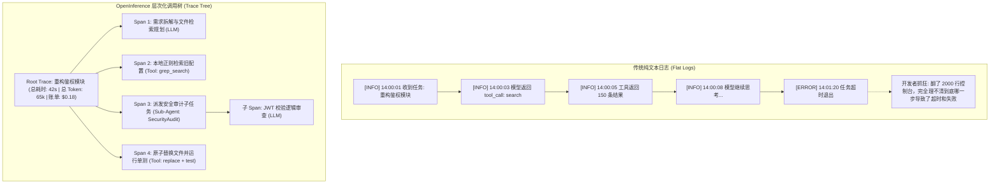
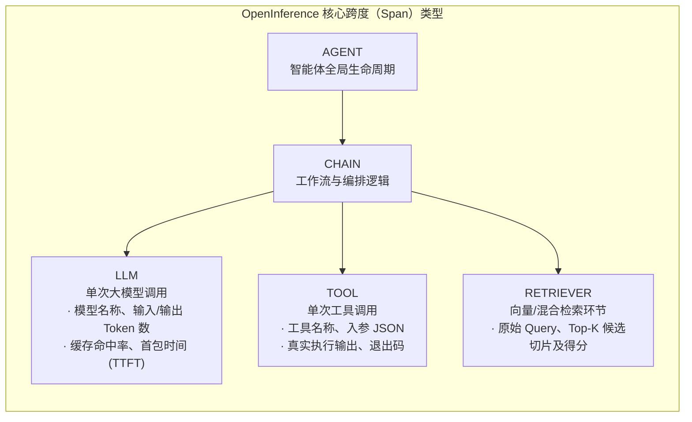

import { Quiz } from '@/components/Quiz'

# 7.4 生产级可观测性：OpenInference 追踪与成本监控

> 很多人把 Agent 扔上生产环境后，最害怕两件事：第一是半夜收到几百美元的 API 账单，查出来发现 Agent 陷入死循环调用同一个工具转了 50 圈；第二是用户报了个“生成失败”，你翻看后端日志，发现只有一万行混在一起的文本 `[INFO] calling model...`，根本不知道到底是哪一次工具传错参数还是模型理解跑偏了。在多轮交互、带工具调用的复杂 Agent 系统里，传统靠 `grep` 文本日志排障的做法彻底失效了。这一节我们聊聊怎么用 **OpenInference** 和 **OpenTelemetry** 搭建一套像分布式微服务调用链一样的 Agent 可观测性体系。

---

## 1. 为什么传统日志在 Agent 面前彻底抓瞎？

开发普通 Web 后端时，排查接口报错很简单：拿 `request_id` 搜一下日志，找到抛出 500 的堆栈信息，直接定位到某一行代码就能修。

但自主 Agent 执行一个看似简单的任务（比如“帮我重构用户鉴权模块”），底层行为完全是一棵复杂的执行树：
* 先由主模型拆解任务，输出初始规划；
* 连续调用了十几次文件检索、终端执行和代码写入；
* 中途还并行派生了两个子 Agent 去分别做漏洞审计和单测编写；
* 经历了 20 多轮 ReAct 循环后，任务突然抛错终止。

这时候如果你手里只有一份平铺直叙的文本日志（Flat Log）：



没有层级化的 Trace 和 Span，你根本看不清哪一步耗时最长、哪个工具输出了超长脏数据、或者哪一轮模型开始思维漂移。

---

## 2. 行业标准数据模型：OpenInference 规范

为了避免每家 Agent 框架都自己发明一套私有追踪格式，云原生计算基金会（CNCF）的 OpenTelemetry 社区孵化了 **OpenInference** 语义规范。

它在标准的微服务 Trace 基础上，专门定义了 Agent 特有的几类核心跨度（Span）：



### 生产环境必须采集的核心字段
每一个上报到追踪系统（如 Langfuse、Arize Phoenix、Datadog）的 Span，通常需要打上这些标准属性：
* `openinference.span.kind`：指定跨度类型（`LLM`、`TOOL`、`AGENT`、`CHAIN`）；
* `llm.model_name`：底层模型名（如 `gpt-4o-2024-08-06` 或 `claude-3-5-sonnet`）；
* `llm.token_count.prompt` 与 `llm.token_count.completion`：精确记录输入与输出 Token；
* `llm.cost`：单次调用按官方单价折算出来的精确美元金额；
* `tool.name` 与 `tool.parameters`：调用的工具名称以及完整的入参 JSON。

---

## 3. 生产运维（AgentOps）的四大黄金指标

监控微服务通常看四个黄金信号（延迟、流量、错误、饱和度）。换到自主 Agent 系统，关注点必须切到与**资金、循环、交付**直接挂钩的指标上：

| 监控指标 | 核心观测内容 | 建议告警阈值 | 常见翻车原因 |
| :--- | :--- | :--- | :--- |
| **1. 任务完成率 (Success Rate)** | 物理终态断言通过率、用户采纳反馈 | **跌破 85%** 立即告警 | 外部第三方 API 挂死、底层模型版本静默变更 |
| **2. 循环发散度 (Loop / Step Count)** | 单次任务经历的 ReAct 循环轮次 | **单任务步骤 > 20 轮** | 模型陷入“报错-重试-同样报错”的死循环 |
| **3. Token 成本熔断 (Cost Guardrail)** | 单次任务累计消耗的 Token 与折算费用 | **单次任务花费 > $1.50** | 工具一次性把 5MB 日志无截断塞进上下文，撑爆 Token |
| **4. 延迟与首包时间 (TTFT & Latency)** | P95 端到端总耗时、流式输出首包延迟 | **P95 总耗时 > 60 秒** | 工具缺少超时中断保护、死锁等待子进程退出 |

---

## 4. 实战：写一个轻量级工具调用追踪器 (TypeScript)

在 Node.js 中，我们可以封装一个轻量的执行切面，让每一次工具调用都自动生成带有耗时、出入参和状态的 Trace 记录：

```typescript
// agent-tracer.ts

export interface SpanRecord {
  traceId: string;
  spanId: string;
  name: string;
  kind: 'AGENT' | 'LLM' | 'TOOL';
  startTime: number;
  endTime?: number;
  durationMs?: number;
  attributes: Record<string, any>;
  status: 'OK' | 'ERROR';
  errorMessage?: string;
}

export class AgentTracer {
  private spans: SpanRecord[] = [];

  /**
   * 包装工具执行，自动捕获耗时、入参及执行结果
   */
  async traceToolExecution<T>(
    traceId: string,
    toolName: string,
    args: Record<string, any>,
    fn: () => Promise<T>
  ): Promise<T> {
    const spanId = `span_${Math.random().toString(36).slice(2, 9)}`;
    const startTime = Date.now();

    const span: SpanRecord = {
      traceId,
      spanId,
      name: `tool:${toolName}`,
      kind: 'TOOL',
      startTime,
      attributes: {
        'tool.name': toolName,
        'tool.parameters': JSON.stringify(args),
      },
      status: 'OK',
    };

    try {
      const result = await fn();
      span.endTime = Date.now();
      span.durationMs = span.endTime - startTime;
      span.attributes['tool.result_length'] = JSON.stringify(result).length;
      this.exportSpan(span);
      return result;
    } catch (err: any) {
      span.endTime = Date.now();
      span.durationMs = span.endTime - startTime;
      span.status = 'ERROR';
      span.errorMessage = err.message;
      this.exportSpan(span);
      throw err;
    }
  }

  private exportSpan(span: SpanRecord) {
    this.spans.push(span);
    console.log(
      `📊 [Telemetry] 上报 Span: [${span.kind}] ${span.name} | 耗时: ${span.durationMs}ms | 状态: ${span.status}`
    );
  }
}
```

---

## 5. 第 7 章总结：如何给 Agent 建立可靠的质检与监控网？

学完这一章，我们可以把 Agent 评测与运维的核心思路梳理清楚：
1. **不要看字面说得多好听，只看环境终态（7.1）**：文本相似度（BLEU/ROUGE）根本测不出 Agent 的干活能力。必须用沙盒跑测试用例、检查端口和文件，看客观物理状态是否达成；
2. **基准测试必须结合真实考场（7.2）**：LeetCode 跑分再高，也不如在 SWE-bench 解决实际 Issue、在 WebArena 跑完电商全流程能说明问题；
3. **模型当裁判要防偏见（7.3）**：开放式主观任务可以用 LLM-as-a-Judge，但要时刻提防位置偏见、字数偏见和自研模型偏好，必须配合双向打乱和严格细化的评分标尺；
4. **线上必须做链路追踪与成本硬熔断（7.4）**：用 OpenInference 将长任务拆成清晰的调用树，给执行轮次和 Token 花费设好红线，杜绝半夜死循环烧干账单。

---

## 6. 自测练习

<Quiz
  question="在生产环境中，为什么必须将工具调用（Tool Execution）单独作为一个子 Span 记录，而不是直接混在任务日志大文本里？"
  options={[
    "可以单独统计每个工具的耗时、入参体积、成功率和返回值长度，一旦线上变慢或报错能一眼定位出瓶颈",
    "因为单独记录子 Span 可以让大模型厂商免除当月的网络通信费",
    "因为云原生社区强制规定不拆分子 Span 会导致操作系统拒绝分配端口",
    "为了让每次工具调用的脚本都能自动被编译成汇编指令执行"
  ]}
  correctIndex={0}
  explanation="在复杂的自主循环中，任务耗时长可能是模型慢，也可能是某个文件检索工具在无头绪扫描。将其拆分成独立 Span 后，开发者在链路瀑布图上一看就能清楚到底卡在哪个具体调用上。"
/>

<Quiz
  question="在 Agent 生产运维监控中，给单次任务设置'最大循环执行轮次（Step Count）'的核心原因是什么？"
  options={[
    "防止模型因为工具报错或入参歧义陷入'反复尝试相同错误'的无限死循环，避免在后台默默烧干 API 预算",
    "因为大语言模型在连续回答超过 20 轮后会自动重置神经网络权重",
    "为了让 Agent 每次回答的轮次都能凑成单数以符合排版美感",
    "因为 Linux 操作系统只允许一个进程在一生中发起最多 20 次网络请求"
  ]}
  correctIndex={0}
  explanation="死循环是自主 Agent 最常见的翻车行为（比如找不到文件就反复用同样的命令查）。限制最大步数并设置发散告警，是防止 API 账单爆表最基本的安全底线。"
/>
