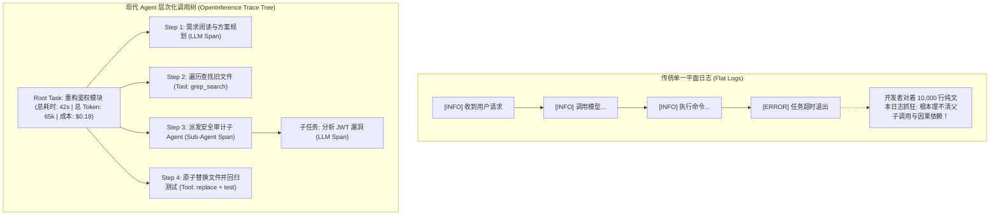
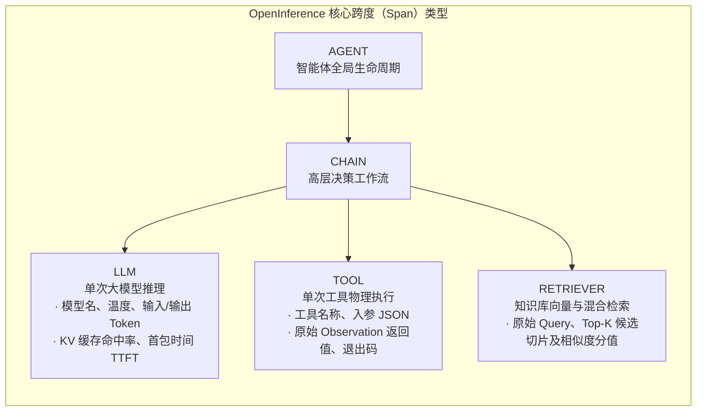

import { Quiz } from '@/components/Quiz'

# 7.4 生产级可观测性：OpenInference 追踪与成本监控

> **本节要点**：当 Agent 陷入 20 轮连续死循环、或者默默消耗了几十美元 Token 却交付了一团糟时，缺乏可观测性等于在暗夜里开快车。深度掌握基于 **OpenTelemetry** 与 **OpenInference** 的调用树（Trace & Spans）标准模型；构建覆盖 **任务完成率、端到端延迟、Token 消耗与工具故障率** 的四大生产级黄金监控指标体系。

---

## 1. 黑盒困境：为什么传统日志在 Agent 时代崩溃？

在传统的 Web 服务中，排查 Bug 通常很简单：
* 一个 HTTP 请求进入，查看对应的链路日志 `request_id`，若出现 HTTP 500，直接定位到某一行抛出的异常堆栈即可。

然而在自主 Agent 系统中，一次端到端的任务（例如“帮我重构用户鉴权模块”）：
* 内部包含数十次串联的 LLM 自回归推理；
* 触发了十几次本地文件读写与终端命令执行；
* 派生出了 2 个并发运行的子智能体（Sub-Agents）；
* 如果最终结果失败了，**排查到底是哪一轮循环偏离了方向、是哪个工具返回了脏数据、还是模型的注意力在中途发生了漂移**，传统日志根本无从下手。



---

## 2. 行业标准数据模型：OpenInference 规范

为了让不同框架（LangChain、LlamaIndex、自研 Agent 引擎）的追踪数据能够统一汇入 **Langfuse**、**Arize Phoenix**、**Datadog** 或 **Jaeger**，云原生基金会（CNCF）的 OpenTelemetry 社区制定了 **OpenInference 语义约定**：



### 关键语义元数据字段
每一个记录在追踪系统中的 Span，必须携带严谨的结构化标签（Attributes）：
*   `openinference.span.kind`: `LLM` / `TOOL` / `AGENT` / `CHAIN`；
*   `llm.model_name`: `gpt-4o-2024-08-06`；
*   `llm.token_count.prompt`: 输入 Token 数量；
*   `llm.token_count.completion`: 输出 Token 数量；
*   `llm.cost`: 单次调用基于官方单价换算出的精确美元成本（如 `$0.0034`）；
*   `tool.name`: `replace_file_content`。

---

## 3. AgentOps 四大黄金监控信号 (The 4 Golden Signals)

在生产级 Agent 运维（AgentOps）看板中，架构师必须实时监控以下四大核心仪表盘：

| 黄金信号 | 监测核心指标 | 生产告警触发阈值 | 典型故障病因 |
| :--- | :--- | :--- | :--- |
| **1. 任务完成率 (Success Rate)** | 终态断言通过率、用户满意打分 | 跌破 **85%** 立即告警 | 外部依赖 API 挂死、底层模型版本发生静默变更 |
| **2. 循环发散度 (Loop & Step Count)** | 单次任务经历的 ReAct 循环轮次 | 单任务步骤 > **25 轮** | 模型陷入“报错-重试-再次相同报错”的无意识死循环 |
| **3. Token 成本熔断 (Cost Guardrail)** | 单任务平均 Token 消耗与美元成本 | 单次任务消耗突破 **$1.50** | 工具输出未做分页截断，一次性将 50MB 垃圾日志塞入 Context |
| **4. 延迟与首包时间 (TTFT & Latency)** | P95/P99 端到端耗时、流式首包时间 | P95 端到端耗时 > **60 秒** | 网络重试过多、工具缺少硬超时熔断机制 |

---

## 4. 全栈实战：构建带 OpenInference 追踪装饰器的执行器 (TypeScript)

下面我们演示如何在 Node.js 中通过面向切面（AOP）或上下文追踪的方式，捕获工具调用的全量可观测性指标：

```typescript
// agent-tracer.ts

export interface SpanRecord {
  traceId: string;
  spanId: string;
  name: string;
  kind: 'AGENT' | 'LLM' | 'TOOL';
  startTime: number;
  endTime?: number;
  durationMs?: number;
  attributes: Record<string, any>;
  status: 'OK' | 'ERROR';
  errorMessage?: string;
}

export class AgentTracer {
  private spans: SpanRecord[] = [];

  /**
   * 为工具执行打上 OpenInference 追踪 Span
   */
  async traceToolExecution<T>(
    traceId: string,
    toolName: string,
    args: Record<string, any>,
    fn: () => Promise<T>
  ): Promise<T> {
    const spanId = `span_${Math.random().toString(36).slice(2, 9)}`;
    const startTime = Date.now();

    const span: SpanRecord = {
      traceId,
      spanId,
      name: `tool:${toolName}`,
      kind: 'TOOL',
      startTime,
      attributes: {
        'tool.name': toolName,
        'tool.parameters': JSON.stringify(args),
      },
      status: 'OK',
    };

    try {
      const result = await fn();
      span.endTime = Date.now();
      span.durationMs = span.endTime - startTime;
      span.attributes['tool.result_length'] = JSON.stringify(result).length;
      this.exportSpan(span);
      return result;
    } catch (err: any) {
      span.endTime = Date.now();
      span.durationMs = span.endTime - startTime;
      span.status = 'ERROR';
      span.errorMessage = err.message;
      this.exportSpan(span);
      throw err;
    }
  }

  private exportSpan(span: SpanRecord) {
    this.spans.push(span);
    console.log(
      `📊 [Telemetry] Span 已上报: [${span.kind}] ${span.name} | 耗时: ${span.durationMs}ms | 状态: ${span.status}`
    );
  }
}
```

---

## 5. 第 7 章知识体系全景回顾与综合自测

经过本章的洗礼，我们构筑了科学严密、可量化度量的现代 Agent 质量工程护城河：
1. **7.1 评测危机与终态断言**：认清了自然语言相似度指标在行动领域的彻底失效，确立了物理环境终态断言的试金石地位；
2. **7.2 工业级基准测试全景**：横向对比了 SWE-bench、WebArena 与 GAIA，吃透了可复现沙盒评测与回归用例的双重检验；
3. **7.3 裁判员模型与偏差校准**：深入分析了 LLM-as-a-Judge 的位置偏差与字数偏好，掌握了双向对调与精细 Rubric 的校准工程；
4. **7.4 生产级可观测性**：基于 OpenTelemetry / OpenInference 搭建了树状追踪架构，确立了四大黄金监控指标与硬成本预算熔断。

---

## 6. 本节练习与反思

<Quiz
  question="在生产环境中，为什么在记录 Agent 追踪数据（Trace）时，必须将每次工具调用（Tool Execution）单独作为一个独立的子 Span 进行记录，而不是直接混在整个会话的日志大串里？"
  options={[
    "便于对具体工具的耗时、入参体积、成功率和返回值长度进行精确的统计分析，能够一眼看清整个长任务的耗时瓶颈和具体故障点",
    "因为单独记录子 Span 可以让所有的外部数据库免收每月的电费账单",
    "因为云原生基金会规定任何不使用子 Span 的程序都会被操作系统内核自动终止",
    "为了让每一次工具调用的代码都能自动被翻译为汇编语言执行"
  ]}
  correctIndex={0}
  explanation="在复杂的 ReAct 循环中，任务耗时长或报错可能是由于大模型推理慢，也可能是某个特定的 Shell 命令挂死。通过分级的层次化 Span 记录，架构师可以在调用瀑布图中秒级定位是哪个工具、传了什么参数导致了延迟飙升或抛出异常。"
/>

<Quiz
  question="在 AgentOps 生产级运维中，针对'单次任务经历的 ReAct 循环轮次（Step Count）'设置上限并进行实时监控的核心目的是什么？"
  options={[
    "防止 Agent 因为环境未知报错或工具入参歧义陷入'不断尝试相同错误'的无限死循环，避免耗尽上下文并造成灾难性的资金成本穿透",
    "因为现代大语言模型在连续回答超过 30 轮后会自动格式化自身的神经网络权重",
    "为了强迫 Agent 在回答问题时必须使用单数轮次以满足数学对称性",
    "因为操作系统只允许单个进程在一生中创建最多 10 个网络连接"
  ]}
  correctIndex={0}
  explanation="死循环是 Agent 系统最常见的失控行为（例如反复 grep 同一个不存在的文件或反复输入相同的错误指令）。硬限制最大轮次（如上限 25 轮）并设立发散告警，是防止 API 账单爆表和系统资源被永久占用的终极安全阀。"
/>
