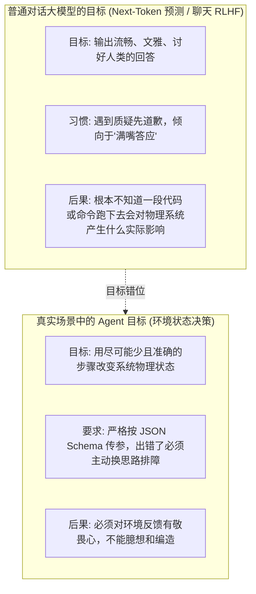
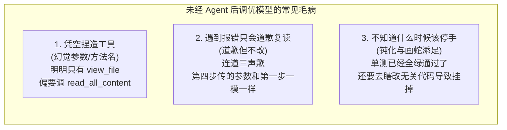
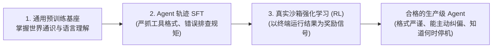

import { Quiz } from '@/components/Quiz'

# 8.1 通用模型的行动缺陷：为什么聊天厉害的模型做不好 Agent？

> 很多团队刚开始做 Agent 时都有过类似的经历：选了一个在各路榜单上答题跑分奇高的大模型，给它写好了提示词、塞了几个工具接口，满怀期待地让它去改代码或者查数据库。结果一跑起来让人大跌眼镜——它要么自己造了个不存在的函数名，要么一遇到报错就疯狂向用户道歉，下一轮原封不动把同样的错误参数又传了一遍。很多人纳闷：它平时跟人聊天引经据典头头是道，怎么一放进真实系统里干活就像个刚入职的实习生一样手忙脚乱？这一节我们聊聊通用大模型做 Agent 时的天然短板，以及为什么专用的后训练（Post-Training）必不可少。

---

## 1. 根子出在训练目标上：预测下一个词 vs. 在真实世界里做决策

通用大模型无论是在预训练阶段还是后期的聊天对齐阶段，核心目标都是**“生成读起来顺畅、礼貌、让人舒服的文本”**。

这和 Agent 在系统里干活的目标存在本质冲突：

普通模型如果答错了，最多是说了一句让人觉得有点荒谬的话；但 Agent 如果传错了一个命令，可能就把服务器上的数据库删了，或者在死循环里把公司的 API 额度一次性刷爆。

---

## 2. 通用模型做 Agent 时的三大典型翻车现场

如果直接拿没做过动作调优的通用基座模型来当 Agent 用，你会频繁踩到这三个坑：

### 1. 凭空捏造工具与残缺参数（Tool Hallucination）
你在系统提示词里明确声明了 5 个可用工具，参数格式必须是严格的 JSON。
但通用模型写着写着，可能自己发明了一个听起来很合理的工具名（比如把 `grep_search` 擅自写成 `search_in_codebase`），或者在输出 JSON 时少闭合了一个花括号。
对人类读者来说，少个括号不影响阅读；但对后端的 `JSON.parse` 来说，直接抛出语法异常导致流程中断。

### 2. 报错后沦为“道歉复读机”
当工具真实返回报错（例如 `Error: File not found`）时：
* 聊天模型在人类反馈强化学习（RLHF）中被训练成了“极有礼貌的侍者”；
* 它会立刻反思：“非常抱歉，我刚才给错了路径，现在重新为您查询……”；
* 但在下一步调用中，**它常常又把那个错误的文件路径一模一样地传进去了**！
因为它虽然嘴上道歉了，但在它的概率分布里，并没有建立起“这个入参刚才引起了物理报错，下一次探索必须换一个全新路径”的因果决策链。

### 3. 不知道何时该停手（Stopping Awareness 缺失）
很多模型不知道任务到底在哪个物理时刻算“大功告成”。
有时候它明明已经改好了代码、跑通了全部单测，但因为缺乏终态意识，它还想继续“表现”一下，顺手去重构了旁边几个文件，结果引发了循环依赖或语法错误，把本来已经成功的任务亲手搞砸。

---

## 3. 为什么必须专门做 Agent 后训练？

要想让模型从一个“只会引经据典的文学家”变成一个“靠谱的工程师”，不能单靠前端写又臭又长的提示词，而必须让它在后台经历专门的 **Agent 后训练（Agent Post-Training）**：

1. **SFT 阶段（立规矩）**：喂给模型成千上万条包含正确工具调用的真实日志，训练它严格输出标准的 JSON、并在遇到特定报错时第一步应该如何用备选方案排查；
2. **强化学习阶段（练实战）**：把模型放进 Docker 沙箱里，给它真实的 Issue 和报错环境，让它自己去试错。单测通过就给高分奖励，死循环或编造工具就扣分惩罚。只有在真实的执行反馈中被“摔打”过的模型，才会自发涌现出多步规划、回溯撤销和细致排查的真正行动力。

---

## 4. 自测练习

<Quiz
  question="为什么经过普通对话强化学习（RLHF）训练的聊天模型，在遇到工具报错时很容易陷入'道歉但不改'的死循环？"
  options={[
    "因为普通 RLHF 主要奖励模型的礼貌态度和语言流畅度，从未针对'重复错误参数导致物理失败'进行惩罚，模型嘴上习惯道歉，但因果推理上没有建立避坑经验",
    "因为大模型在输出中文'抱歉'两个字时，底层的注意力头会被系统强制屏蔽",
    "因为终端操作系统一旦检测到礼貌用语，就会拒绝接收任何后续指令",
    "因为所有主流开源工具的源码都禁止模型使用相同的参数重试"
  ]}
  correctIndex={0}
  explanation="聊天对齐（RLHF）教会了模型遇到不顺先道歉、说话要客气，但没有训练它在物理环境报错后的探索策略。必须让模型在真实沙箱的反馈中经历强化学习，才能学会根据具体的错误堆栈动态调整下一步行动。"
/>

<Quiz
  question="在 Agent 执行任务时，'终止意识缺失（Lack of Stopping Awareness）'通常会表现出什么行为？"
  options={[
    "核心代码修改完成且测试已经全部通过后，模型依旧无法停机，继续自作主张修改其他无关文件，最终引入新的隐患甚至导致整个任务失败",
    "模型在读取完第一个文件后就会立刻格式化本地磁盘",
    "模型会强制将系统的语言设置全部修改为世界语",
    "模型会连续向用户发送 50 条相同格式的欢迎消息"
  ]}
  correctIndex={0}
  explanation="很多未经专有行动调优的模型缺乏准确的'完工'判断力。单测全绿原本意味着可以退出并向用户交付，但它容易继续画蛇添足，去格式化代码或修改配置文件，反而把原本已经跑通的现场破坏掉。"
/>
