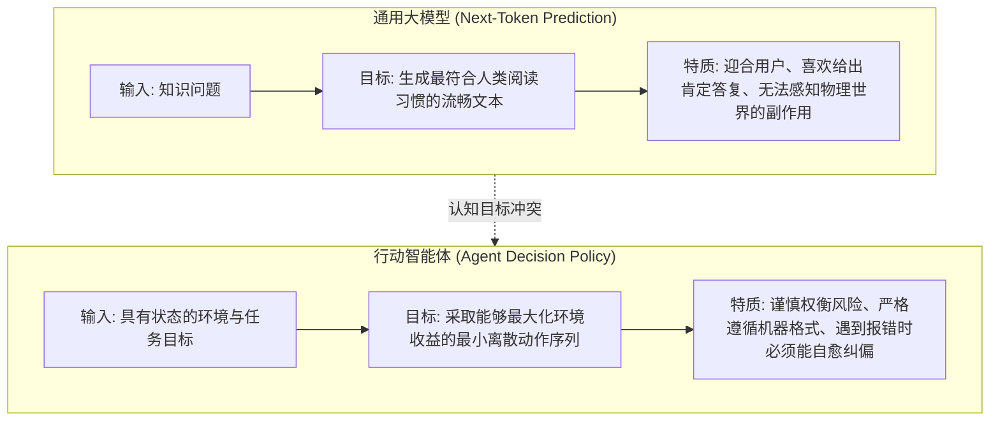
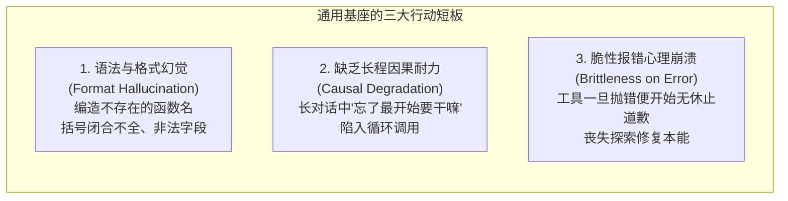
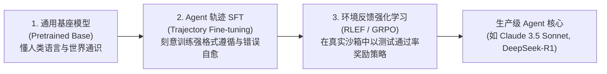

import { Quiz } from '@/components/Quiz'

# 8.1 通用模型的行动缺陷：从文本续写到行动决策的认知鸿沟

> **本节要点**：为什么在公开问答榜单上跑分极高的通用大模型，一进入真实的 Agent 工具调用场景就频频翻车？深度透视预训练目标（Next-Token Prediction）与行动决策目标之间的本质冲突；剖析通用模型在工具格式遵循、长程因果一致性与环境容错自愈上的三大硬伤；明确 Agent 专用模型后训练（Post-Training）的必要性。

---

## 1. 目标错位：文本续写 vs. 物理行动决策

所有主流大语言模型在预训练阶段的核心优化目标都是**因果语言建模（Next-Token Prediction）**：
```text
Loss = - Σ log P( token_t | token_<t )
```
模型被训练为**预测人类互联网文本中最可能出现的下一个词**。然而，这与智能体（Agent）所处决策环境的目标函数存在巨大的认知鸿沟：



---

## 2. 通用模型作为 Agent 时的三大天然顽疾

如果未经专门的 Agent 后训练，直接拿通用基座模型进行复杂工具交互，系统会迅速暴露三大软肋：



### 2.1 格式与工具幻觉 (Tool Hallucination)
通用模型在面对系统注入的 10 个工具时，极其容易凭空捏造不存在的函数（如系统只提供了 `view_file`，模型却自作聪明调用 `open_file_and_display`），或者输出无法通过 JSON.parse 校验的残缺入参。

### 2.2 错误反思的“道歉复读机”死循环
当工具返回一个真实报错（如 `Error: File not found`）时：
* 经过 RLHF 对齐的人类聊天模型具有极强的“讨好型人格”；
* 它会立刻输出：“非常抱歉给您带来了不便，我犯了一个错误，接下来我将重新为您查询……”
* 但在下一轮循环中，**它依然传入一模一样的错误参数，再次撞墙报错**，直至耗尽最大重试轮次。

### 2.3 状态漂移与终止钝化 (Lack of Stopping Awareness)
通用模型无法准确判定“任务到底在哪个物理时刻算彻底完成”。
它常常在已经成功修复 Bug、测试全绿之后，依然停不下来，继续自作主张去格式化其他无关代码，最终引入新的编译错误破坏现场。

---

## 3. 后训练的战略价值：从概率预测器锻造为马尔可夫决策策略

要让模型成为真正的“数字员工”，必须经历专门的 **Agent 模型后训练（Agent Post-Training）**：



*   **SFT 阶段（教规矩）**：教会模型严格输出标准的 Tool Call 格式，在遇到常见报错时立刻启动二分法排查；
*   **强化学习阶段（练智谋）**：让模型在数万个沙箱测试中自我对弈试错，自发涌现出跨步骤规划、回溯撤销与深度思考（Long Thinking Chain）的超级能力。

---

## 4. 本节练习与反思

<Quiz
  question="为什么纯粹以人类问答喜好度对齐（标准 RLHF）的通用大模型，在遇到工具执行报错时经常退化为'道歉复读机'而无法自愈？"
  options={[
    "因为标准 RLHF 极度鼓励模型展现礼貌与谦卑的语言态度，但从未在训练阶段惩罚'重复相同错误操作'的物理因果失败",
    "因为大语言模型只要连续说两次'抱歉'，其神经网络的参数就会自动退化为纯随机矩阵",
    "因为现代操作系统的终端在接收到礼貌用语时会自动切断网络通信",
    "因为开源社区所有的错误处理代码均被设置为了商业保密状态"
  ]}
  correctIndex={0}
  explanation="通用对齐（RLHF）奖励的是'礼貌顺从、没有攻击性'的语言表现，模型学会了用标准客套话推卸责任并道歉。然而在 Agent 环境中，代码和系统不相信眼泪，唯有改变参数、重构逻辑才能打破死循环。这必须通过专用的 Agent 后训练让模型学会对抗挫折。"
/>

<Quiz
  question="在 Agent 场景中，'终止意识钝化（Lack of Stopping Awareness）'通常会导致什么严重的系统后果？"
  options={[
    "模型在已经成功达成业务目标且全绿通过后无法果断停机，继续无意义地自作主张修改其他代码，最终引入意外 Bug 导致任务翻车",
    "会导致所有的物理服务器风扇立刻倒转并损坏主机箱硬件",
    "会使得模型在执行完第一个步骤后自动把所有上下文发送给竞争对手公司",
    "会导致整台计算机的系统时钟倒退 20 年"
  ]}
  correctIndex={0}
  explanation="终止意识是行动决策中最关键的一环。钝化的模型不知道何时叫停，常常在完成主要目标后又画蛇添足地'优化'配置文件或重命名变量，最终亲手破坏原本通过的测试，甚至陷入无限消耗 Token 的无效劳动中。"
/>
