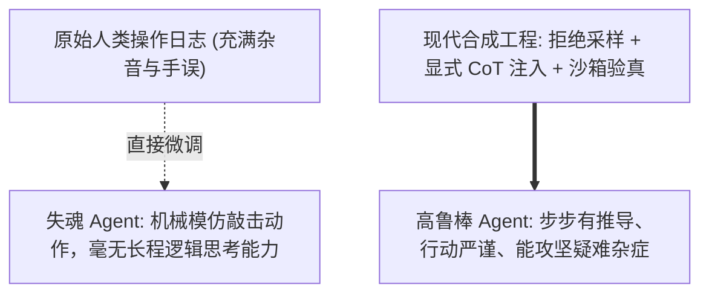
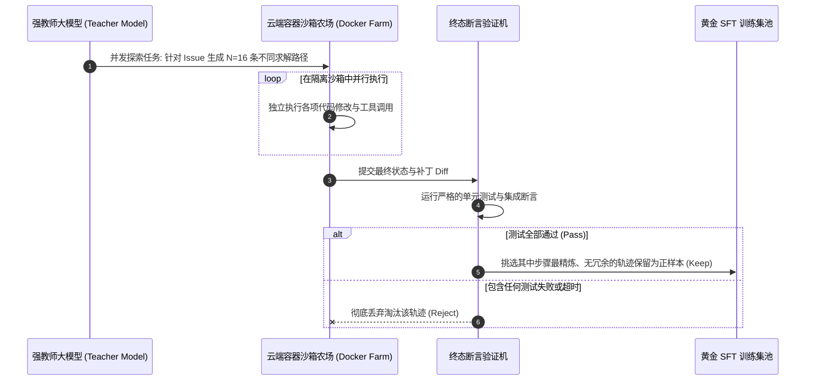
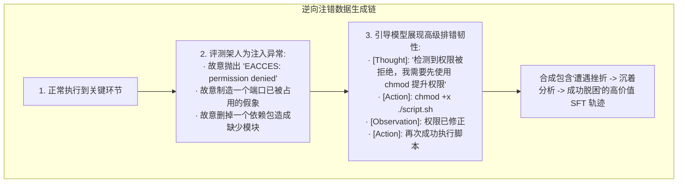

import { Quiz } from '@/components/Quiz'

# 8.2 Agent SFT 数据工程：拒绝采样与自愈轨迹合成

> **本节要点**：高质量的监督微调数据（SFT Data）是赋予模型 Agent 基因的决定性原料。解密为什么真实人类日志无法直接作为 SFT 语料；深度掌握基于沙箱环境验证的 **拒绝采样（Rejection Sampling / Best-of-N）** 黄金管道；掌握 **自愈纠偏轨迹合成（Self-Correction Trajectory Augmentation）**，让模型在面对真实报错时拥有极强的抗挫折弹性。

---

## 1. 数据的质量决定智商：为什么人类日志不可直接拿来 SFT？

很多人直觉上认为：只要把人类高级程序员在终端中敲命令的全部 Bash 历史日志记录下来，直接微调大模型，就能训出顶尖的 Coding Agent。
在实践中，这种做法被证明是**极其灾难的**：
1. **充斥无效肌肉记忆与打字手误**：人类敲错命令后按 Ctrl+C、中途去倒水离开 20 分钟、不小心按出 `ls` 10 次等无意义动作大量混杂；
2. **缺乏显式因果推理（Missing Internal Thoughts）**：人类工程师在敲击 `git cherry-pick` 之前，大脑中已经完成了对版本图的深思熟虑，但这个“思考过程”**根本没有留在终端日志里**！直接微调会让模型只学到表象的机械动作，却丢失了最核心的决策灵魂。



---

## 2. 拒绝采样（Rejection Sampling）：用沙箱作为最终审判者

**拒绝采样（Best-of-N Rejection Sampling）** 是当今工业界合成万级高质量 Agent 轨迹的标准范式：



### 拒绝采样的三大过滤法则
1. **物理确定性验收**：坚决不用模糊的 LLM-as-a-Judge 决定，必须由客观测试套件的 `exit code === 0` 作为正样本的准入绿灯；
2. **剔除冗余徘徊**：在所有跑通测试的轨迹中，按“总 Token 消耗与步骤轮次”排序，优先保留最优雅精炼的路径，惩罚反复无常的多余步骤；
3. **格式绝对合规**：必须确保每一轮 Tool Call 的 JSON Schema 百分之百符合标准，格式有任何微小瑕疵的样本直接全盘剔除。

---

## 3. 逆向注错工程：让模型学会“绝处逢生”的自愈轨迹

在现实生产中，最优秀的工程师绝不是“永远不写 Bug 的人”，而是“**当编译器和线上抛出诡异报错时，能够顺藤摸瓜秒级定位并修复的人**”。

如果 SFT 数据集中全都是顺风顺水、一次通过的“假完美轨迹”，模型在部署到生产时一旦遇到未知异常就会直接呆住或无限道歉。
因此，顶级实验室会采用**主动逆向注错（Fault Injection & Self-Correction Pairs）**技术：



这种包含“逆境反弹”的轨迹数据，能够极大增强模型的**认知韧性（Resilience）**，彻底戒掉无意义道歉的恶习。

---

## 4. 数据协议结构：标准 Agent SFT 对话格式

```json
{
  "trajectory_id": "traj_swe_django_0481",
  "system": "你是一个严谨的资深全栈开发智能体，具备自主使用工具排查和修复代码的能力。",
  "messages": [
    {
      "role": "user",
      "content": "在执行 python manage.py migrate 时出现循环外键依赖死锁，请定位并修复。"
    },
    {
      "role": "assistant",
      "thought": "我需要先复现这个死锁异常。首先调用 grep 查找涉及外键定义的核心模型文件。",
      "tool_calls": [
        {
          "name": "grep_search",
          "arguments": { "pattern": "models.ForeignKey", "searchDir": "apps/auth" }
        }
      ]
    },
    {
      "role": "tool",
      "name": "grep_search",
      "content": "apps/auth/models.py:42: user = models.ForeignKey('Profile')\napps/auth/models.py:88: profile = models.ForeignKey('User')"
    },
    {
      "role": "assistant",
      "thought": "找到了两个互为外键的双向强依赖。应当引入中间代理模型或设置 swappable 解耦。我将使用 replace_file_content 修正 models.py。",
      "tool_calls": [
        {
          "name": "replace_file_content",
          "arguments": {
            "filePath": "apps/auth/models.py",
            "targetContent": "profile = models.ForeignKey('User')",
            "replacementContent": "profile = models.ForeignKey('User', null=True, on_delete=models.SET_NULL)"
          }
        }
      ]
    }
  ]
}
```

---

## 5. 本节练习与反思

<Quiz
  question="在为 Agent 构建高质量 SFT（监督微调）训练数据时，为什么'拒绝采样（Rejection Sampling）'坚持使用自动化沙箱测试全绿（Exit Code 0）作为准入门槛，而不是依赖人工或者大模型评委的打分？"
  options={[
    "自动化测试提供了绝对客观、物理确定且可规模化并行的真理标准，杜绝了主观审美偏差与虚假的'嘴炮型'假阳性代码",
    "因为现代 Linux 操作系统禁止任何人使用手指在键盘上给代码打分",
    "因为大语言模型在没有沙箱执行时会自动触发国际黑客攻击警报",
    "为了确保所有的正样本代码都能被完全加密并禁止被人类阅读"
  ]}
  correctIndex={0}
  explanation="代码与工具调用的正确性是绝对确定的物理事实，不以任何人的主观意志为转移。测试用例全部通过是代码有效的唯一铁证。基于沙箱测试运行的拒绝采样能够自动剔除所有无法通过编译或破坏了业务逻辑的坏数据，构建极度纯净的训练集。"
/>

<Quiz
  question="在 SFT 轨迹数据合成中，'逆向主动注错（Fault Injection & Self-Correction）'的核心目的与收益是什么？"
  options={[
    "迫使模型在训练中学习如何面对真实环境报错（如权限拒绝、网络抖动、依赖缺失），从而掌握利用工具排查纠偏与自愈脱困的强大韧性",
    "故意把训练服务器的显卡风扇弄坏，用来测试显卡在高温下的算力衰减程度",
    "让模型学会用各种恶意的病毒代码去破坏用户的真实操作系统",
    "降低大模型的中文理解能力以提升英文代码生成的专注度"
  ]}
  correctIndex={0}
  explanation="如果训练数据中所有任务都是一次性顺利成功，模型在生产环境面对真实报错时就会惊慌失措并陷入无限道歉。主动注入错误并提供正确的自愈示范，才能让模型学会观察错误堆栈、调整策略并最终把测试跑绿。"
/>
