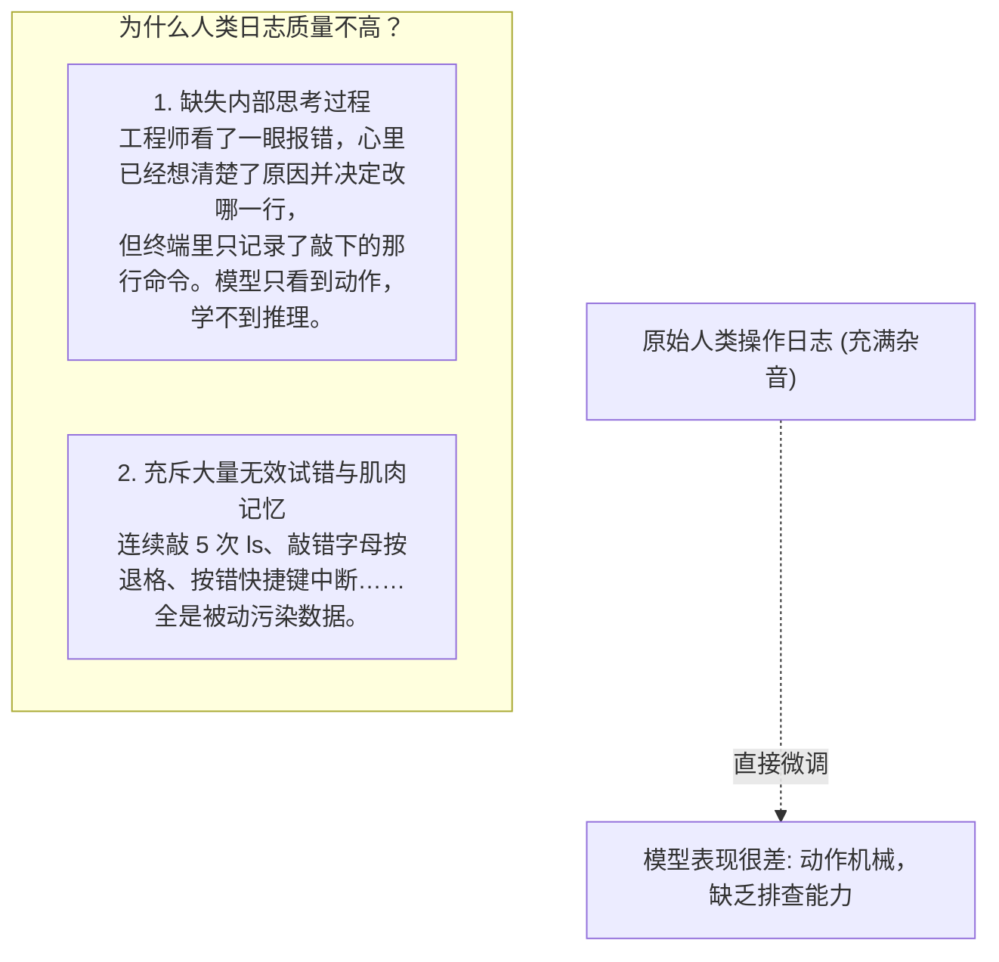
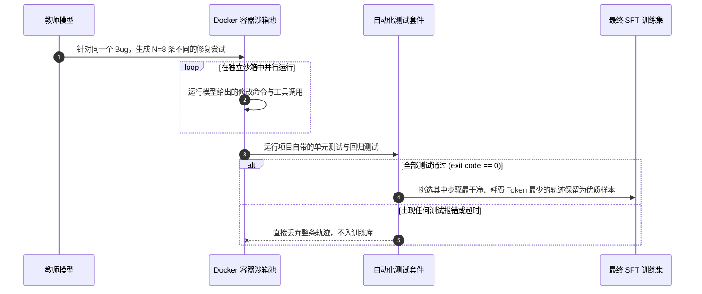
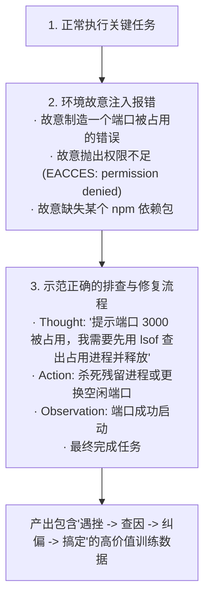

import { Quiz } from '@/components/Quiz'

# 8.2 Agent SFT 数据工程：拒绝采样与自愈轨迹合成

> 想要微调一个能干活的 Agent，很多人第一反应是：“把资深程序员日常敲终端的 Bash 历史全录下来，拿去微调大模型不就行了？”实际做过的人都知道，这种数据喂进去基本是灾难。程序员在终端里敲错命令、疯狂按 Ctrl+C、开个网页查资料发呆二十分钟，这些操作全成了噪音；更致命的是，程序员在敲命令前脑子里的思考过程，终端日志里压根没有。做 Agent 的 SFT（监督微调），核心不在于收集更多人类操作录像，而在于**如何用沙箱自动化合成高质量、带思考过程、且能自主排错的真实轨迹**。这一节我们聊聊拒绝采样与自愈轨迹的构建工程。

---

## 1. 为什么人类工程师的终端日志不能直接拿来做微调？

直接把人类敲命令的原始日志当成训练语料，会遇到两个难以解决的问题：



真正高质量的 Agent 训练数据，必须满足三点：
* **有完整的思考链路（Thought）**：每一步调用工具前，清楚写明为什么调这个工具、预期拿到什么；
* **环境反馈真实准确（Observation）**：工具真实的输出结果是什么，不能靠凭空编造；
* **终态必须能跑通**：修改后的代码必须通过测试用例，结果必须可验证。

---

## 2. 拒绝采样（Best-of-N Rejection Sampling）：让沙箱当质检员

在工业界，合成万级别的高质量 Agent 轨迹最常用的方法是**拒绝采样**：用能力更强的模型（如 Claude 3.5 或 GPT-4o）针对同一个任务并发生成多条路径，全部扔进 Docker 沙箱里跑，只留下那些真正跑通测试的优质样本。



### 拒绝采样的样本筛选标准
1. **测试结果全绿是唯一底线**：不管模型中间推理说得多天花乱坠，只要单测没过或者返回非零退出码，整条数据坚决抛弃；
2. **剔除多余的犹豫步骤**：如果两条轨迹都能修好 Bug，一条用了 3 步，另一条反复改来改去用了 15 步，优先保留步数更少、Token 更省的那一条；
3. **严格校验工具入参格式**：必须保证所有的工具入参都能被标准的 JSON 解析器无缝读取，任何格式不规范的直接过滤。

---

## 3. 逆向注错：让模型学会“绝处逢生”的排障能力

在真实开发中，从来没有哪个程序员是一次性把代码写好且零报错的。**区分新手和老手的关键，在于遇到编译器或环境报错时能不能迅速定位原因并修好。**

如果 SFT 训练集里全都是顺风顺水、一次通过的“完美轨迹”，模型上线后一旦遇到未知报错就会瞬间崩溃，开始不停地向用户道歉。

为了让模型具备真正的自愈能力，顶尖团队会在合成数据时采用**逆向注错（Fault Injection & Self-Correction）**：



让模型在训练时就见识过成千上万种真实报错，它在生产环境遇到网络抖动、文件权限受限或依赖缺失时，就不会慌慌张张地道歉，而是会像经验丰富的老程序员一样，顺着错误提示一步步找原因并修复。

---

## 4. 标准的 Agent SFT 数据格式示例

一条合格的 Agent 训练样本通常包含明确的思考过程与工具调用：

```json
{
  "trajectory_id": "traj_auth_foreign_key_fix",
  "messages": [
    {
      "role": "user",
      "content": "执行数据库迁移时提示 User 和 Profile 模型存在循环外键依赖，请定位并修改。"
    },
    {
      "role": "assistant",
      "thought": "首先需要查到这两个模型的具体定义位置，用 grep 搜索包含 ForeignKey 的定义行。",
      "tool_calls": [
        {
          "name": "grep_search",
          "arguments": { "pattern": "ForeignKey", "searchDir": "src/models" }
        }
      ]
    },
    {
      "role": "tool",
      "name": "grep_search",
      "content": "src/models/user.py:15: profile = models.ForeignKey('Profile')\nsrc/models/profile.py:22: user = models.ForeignKey('User')"
    },
    {
      "role": "assistant",
      "thought": "两个模型互为外键导致了循环锁。应该在 Profile 端将外键设为可空（null=True）来解耦。使用 replace_file_content 进行修改。",
      "tool_calls": [
        {
          "name": "replace_file_content",
          "arguments": {
            "filePath": "src/models/profile.py",
            "targetContent": "user = models.ForeignKey('User')",
            "replacementContent": "user = models.ForeignKey('User', null=True, on_delete=models.SET_NULL)"
          }
        }
      ]
    }
  ]
}
```

---

## 5. 自测练习

<Quiz
  question="在为 Agent 准备 SFT（监督微调）训练数据时，为什么业界普遍推崇使用沙箱自动化测试（Exit Code 0）来做样本过滤，而不是找人工逐条打分？"
  options={[
    "自动化测试能提供绝对客观、可大规模并发验证的真理标准，杜绝了人工打分的主观偏差和看走眼，能自动过滤掉所有逻辑不通或破坏业务的无效代码",
    "因为现代云服务器禁止人类管理员查看训练日志",
    "因为大语言模型在没有人类打分时训练速度会自动提升 100 倍",
    "为了保证所有的训练数据都由纯汇编代码构成"
  ]}
  correctIndex={0}
  explanation="代码能不能跑通、单测能不能全绿，是一个客观物理事实。通过 Docker 沙箱跑自动化单测，能够以极低边际成本清洗出数万条确定有效的优质轨迹，避免把残缺或有 Bug 的代码塞进训练集。"
/>

<Quiz
  question="在合成 Agent 训练数据时，为什么要故意注入错误并合成'自愈纠偏轨迹'（Self-Correction）？"
  options={[
    "让模型在训练中学习如何应对真实系统报错（如权限受限、端口占用、依赖缺失），培养通过阅读错误信息主动定位并尝试新方案的排障韧性",
    "为了测试服务器在受到恶意代码攻击时的物理温度承受上限",
    "为了降低大模型对自然语言的理解能力以节省显存",
    "为了让 Agent 在每次任务失败后自动向管理员发送求助邮件"
  ]}
  correctIndex={0}
  explanation="如果训练数据中全是顺风顺水一次通过的样本，模型在生产环境一旦遭遇非预期报错就会手足无措。提前让模型学习'遇到错误-分析日志-换命令修复'的自愈轨迹，模型才能具备真正的实战韧性。"
/>
