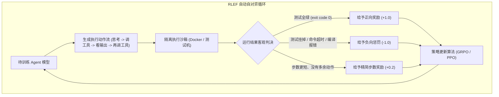
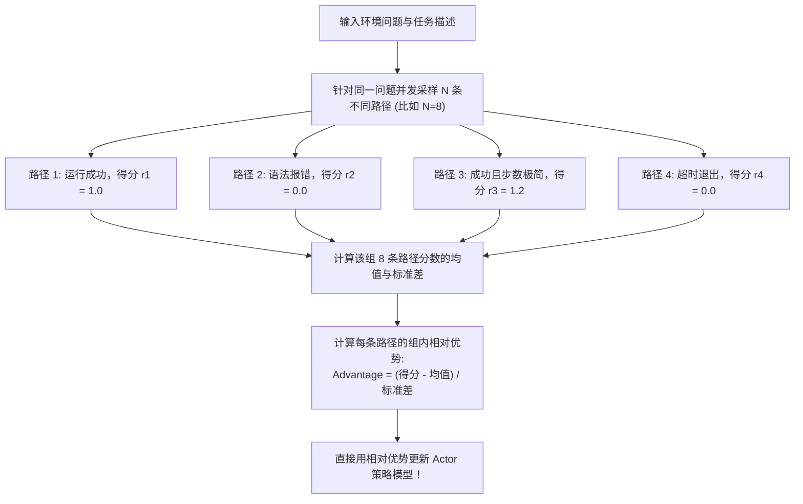
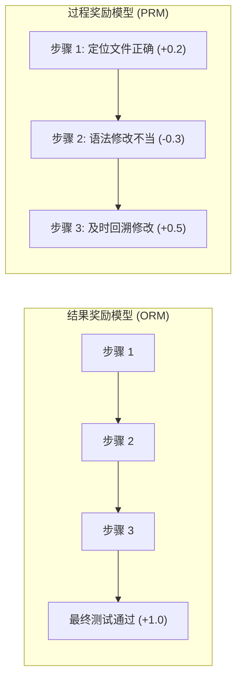
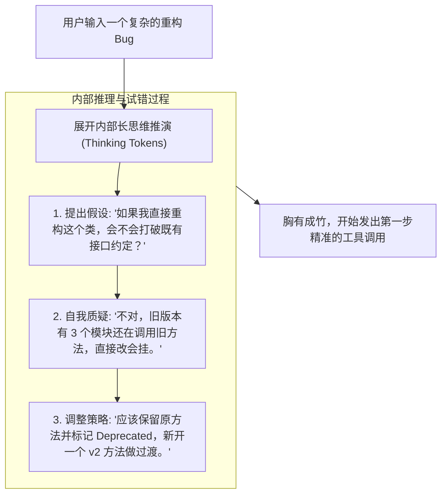

import { Quiz } from '@/components/Quiz'

# 8.3 环境反馈强化学习：GRPO、过程奖励与推理期扩展

> 如果说 SFT（监督微调）是让模型学会看懂工具入参、按标准格式写 JSON，那么 **强化学习（RL）** 才是真正让 Agent 具备复杂规划和多步攻坚能力的试金石。传统的对话模型靠人工标注打分（RLHF），但代码和系统操作对就是对、错就是错，根本不需要人为主观评价。这一节我们来看看以沙箱运行结果为导向的 **RLEF**、DeepSeek 采用的 **GRPO** 算法，以及如何通过在推理阶段“多想一会”（Test-Time Compute）来解决原本搞不定的复杂工程问题。

---

## 1. 从人工偏好打分（RLHF）转向沙箱真实反馈（RLEF）

在做聊天机器人时，通常使用 **RLHF（基于人类偏好的强化学习）**：让人类标注员对比两个回答，挑出一个更顺眼、更有礼貌的。

但对于要进系统干活的 Agent 来说，人工肉眼打分既慢又不靠谱——一段复杂的并发处理代码，标注员很难肉眼看出是否藏着竞态条件（Race Condition）。

因此，Agent 的强化学习全面转向了 **RLEF（基于环境反馈的强化学习）**：把模型丢进隔离的 Docker 容器里，让它自己敲命令改代码，直接用客观的终端运行结果当成奖惩信号：

这种模式最大的好处是**不需要人肉标注**，只要手头有成千上万个带单测的开源项目或真实 Bug 仓库，就能让集群昼夜不停地自我试错和进化。

---

## 2. 为什么 GRPO 能把强化学习门槛打下来？

做大规模强化学习时，经典的 **PPO（近端策略优化）** 算法有一个让工程师非常头疼的问题：它需要同时在显存里加载两套大模型——一个是负责干活的 Actor 模型，另一个是负责给动作打分的 Critic（价值网络）。两个模型体量相当，显存占用直接翻倍。

DeepSeek-R1 采用的 **GRPO（群组相对策略优化）** 核心思想非常直接：**彻底扔掉单独的 Critic 价值模型！**

### GRPO 的工程优势
1. **显存直接减半**：不再需要加载几十 GB 的独立 Critic 模型，省下来的显存可以用来跑更大的上下文或更大的 Batch Size；
2. **组内相对评价自然抗噪**：如果某个任务极其困难，8 条路径普遍得分不高，GRPO 会挑出组内相对最好、排查最有逻辑的路径进行激励，而不会因为绝对分数低而全盘惩罚；
3. **极高并发吞吐**：天然适合结合容器沙箱进行大规模批量并发推演。

---

## 3. 结果奖励（ORM）vs. 过程奖励（PRM）

在给模型设计奖惩机制时，有两种不同的设计路线：

| 对比维度 | 结果奖励 (ORM) | 过程奖励 (PRM) |
| :--- | :--- | :--- |
| **打分时机** | 任务全部跑完后，根据最终结果打一次分 | 模型每敲一步命令、每思考一段，实时给单步打分 |
| **工程实现难度** | **极低**（直接拿终端的 `exit code` 是否为 0 判断） | 极高（需要细粒度定义每一步什么样的思考算及格） |
| **长任务引导效果** | 如果任务长达 30 步，中途哪一步立功很难归因（信用分配难题） | 像导航软件一样实时纠偏，防止中途跑偏 |
| **当前工业实践** | **目前绝对主流**，配合高并发采样让模型自己探索 | 顶尖团队攻坚方向，主要用于形式化数学定理与严谨算法推导 |

---

## 4. 推理阶段扩展（Test-Time Compute）：让模型多想一会

过去大家觉得大模型聪明程度完全取决于预训练参数量（模型越大越聪明）。但随着推理模型的演进，业内发现了一个新规律：**在推理执行前给模型分配更多的思考 Token，任务成功率会大幅攀升。**

传统模型拿到任务立刻慌忙调用工具，而经过强化学习调优后的推理模型，会先在内部展开一段详细的思考推演：

这就是所谓的 **Test-Time Compute Scaling**。在实际工程中，面对复杂的架构设计或排障任务，宁愿让模型在后台默默多推演 20 秒，也比让它毛手毛脚立刻敲错几个破坏性命令要强得多。

---

## 5. 自测练习

<Quiz
  question="在 Agent 强化学习训练中，DeepSeek 提出的 GRPO（群组相对策略优化）相比传统的 PPO，最核心的改进是什么？"
  options={[
    "完全取消了需要占用海量显存的独立 Critic（价值网络），通过针对同一个 Prompt 采样一组候选轨迹并计算组内相对优势来更新策略",
    "取消了模型的注意力机制，改为使用经典的循环神经网络（RNN）训练",
    "不再使用显卡进行训练，全部转移至 CPU 进行浮点运算",
    "强制要求每一次环境交互必须在 1 毫秒以内完成"
  ]}
  correctIndex={0}
  explanation="PPO 通常需要常驻两套大模型（Actor 和 Critic），显存和计算成本极高。GRPO 直接对同一问题并发采样多条候选轨迹（如 8 条），计算组内分数的均值和标准差得出相对优势，省去了 Critic 网络的显存占用。"
/>

<Quiz
  question="在 Agent 解决复杂工程难题时，'Test-Time Compute Scaling（推理阶段算力扩展）'的核心逻辑是什么？"
  options={[
    "允许模型在调用物理工具前，自发消耗更多 Token 进行长思维链（Long CoT）的方案推演、边界假设与自我纠偏，用更多的推理思考时间换取更高的决策正确率",
    "通过在运行时对客户端计算机进行超频来加快网络响应速度",
    "要求模型在收到问题后跳过所有中间思考，必须在 10 毫秒内给出最终代码",
    "将所有的测试用例全部隐藏起来以降低模型的计算负担"
  ]}
  correctIndex={0}
  explanation="很多复杂的代码与架构难题无法一步到位。Test-Time Compute 允许模型在幕后进行多条路径的自我推演与推翻重来，充分排查隐患后再输出工具调用，显著降低了在真实系统里的试错翻车率。"
/>
