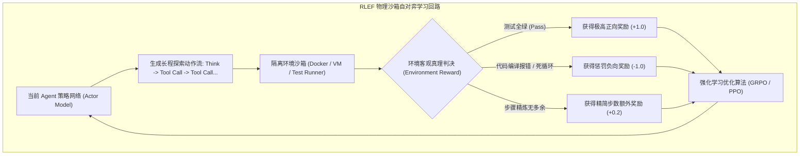
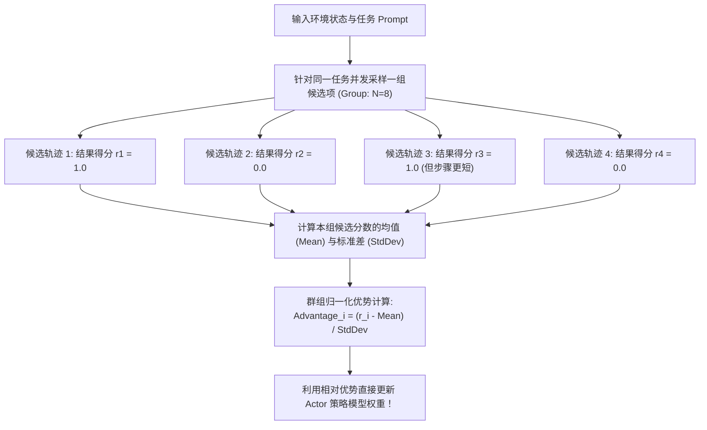
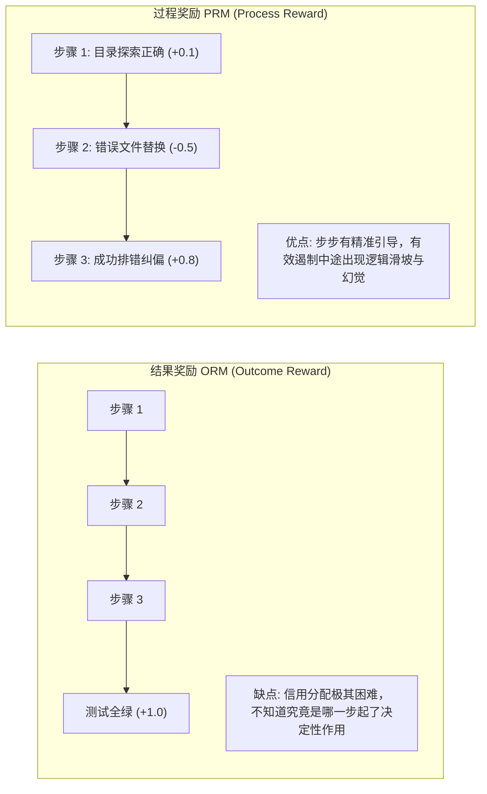
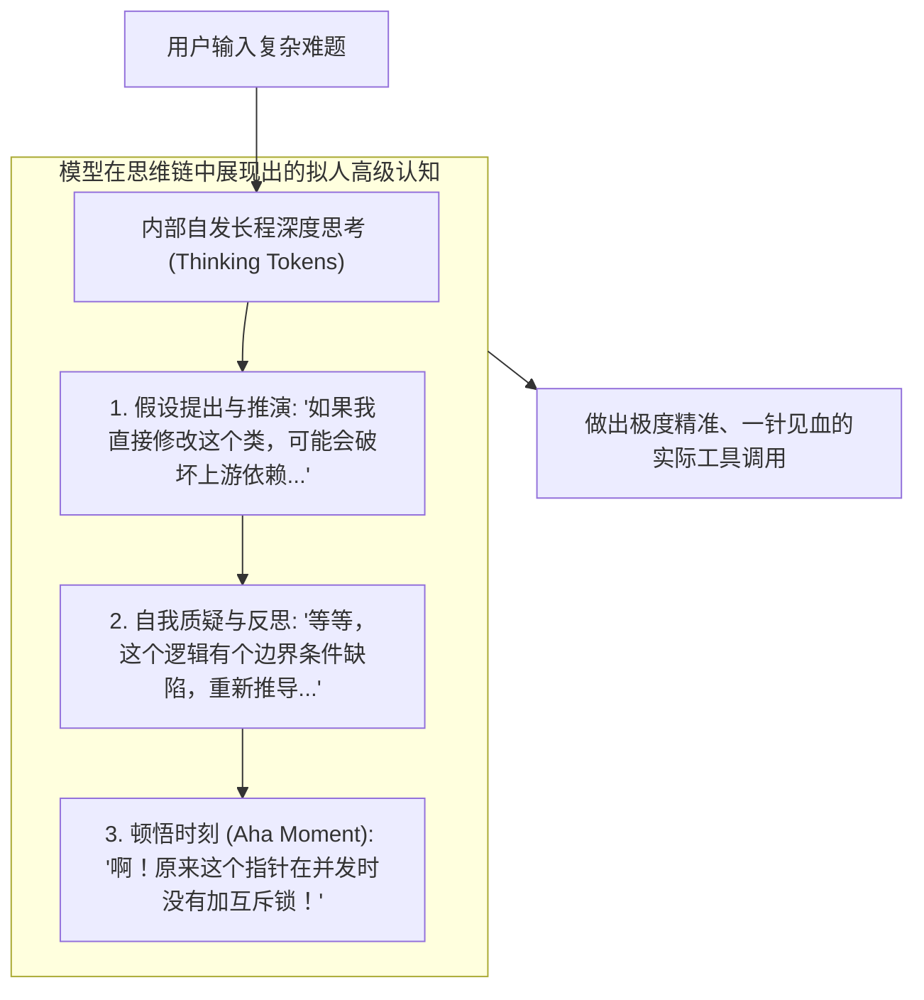

import { Quiz } from '@/components/Quiz'

# 8.3 环境反馈强化学习：GRPO、过程奖励 PRM 与思维链扩展

> **本节要点**：如果说 SFT 是给模型打基础，那么 **强化学习（RL）** 则是让 Agent 诞生“顿悟思维”与“深谋远虑”的关键跃迁。深入剖析以环境客观物理真理为奖励的 **RLEF（Reinforcement Learning from Environmental Feedback）**；解密 DeepSeek-R1 背后的 **GRPO（群组相对策略优化）** 算法；对比结果奖励（ORM）与过程奖励（PRM）；掌握 **推理阶段扩展（Test-Time Compute Scaling）** 与长思维链（Long CoT）的涌现原理。

---

## 1. 范式进化：从人类喜好 RLHF 到环境真理 RLEF

传统的聊天模型强化学习主要依赖 **RLHF（基于人类反馈的强化学习）**：
* 依赖标注员对两个回答进行喜好比较（“哪个回答听起来更亲切得体”）；
* 这在物理行动世界中是致命的，因为人类标注员无法一眼看出一段复杂的并发代码是否隐藏内存泄漏。

**RLEF（基于环境反馈的强化学习）** 将人类从评估链条中解脱出来，直接让模型在真实的**物理与代码沙箱中自我试错**：



---

## 2. 算法破局：GRPO（群组相对策略优化）机制解密

在传统强化学习中，**PPO（Proximal Policy Optimization）** 算法需要同时维护一个庞大的 Critic（价值评估网络），该 Critic 模型占用与策略模型同等体量的显存，导致超大模型的强化学习训练成本居高不下。

DeepSeek-R1 提出的 **GRPO（Group Relative Policy Optimization）** 彻底终结了这一痛点：**它完全抛弃了独立的 Critic 价值网络！**



```text
GRPO 优势公式：
Advantage_i = (Reward_i - Mean(Rewards_group)) / (StdDev(Rewards_group) + ε)
```

### GRPO 的三大突破优势
1. **节省近 50% 训练显存**：省去了庞大的 Critic 模型的加载与前向反向传播，使百亿甚至千亿级模型在单台集群上直接进行全量强化学习成为现实；
2. **群组相对自校准**：即使某一批任务整体非常困难导致绝对分数偏低，算法依旧能识别出组内“相对最好”的探索分支并给予正向激励；
3. **极度适配长程决策**：极高吞吐的并发采样天然契合多步骤 Agent 任务的大规模探索。

---

## 3. 奖励塑形：结果奖励 (ORM) vs. 过程奖励 (PRM)

如何给 Agent 记功？学术界探索出两种截然不同的奖励流派：



| 维度 | 结果奖励模型 (ORM) | 过程奖励模型 (PRM) |
| :--- | :--- | :--- |
| **打分时机** | 任务彻底终结时统一打分 | 每一次思考（Thought）与工具调用时单步打分 |
| **数据标注成本** | **极低**（直接获取终端 `exit code` 即可） | 极高（需要细粒度判断每一步是否符合最优解） |
| **长程推理引导** | 弱（遇到 30 步复杂长任务容易因稀疏奖励迷失） | **极强**（像灯塔一样实时修正模型的探索路径） |
| **业界工业落地** | 目前的主流首选（配合大量采样自发探索） | 顶尖实验室攻坚方向（数学证明与复杂算法） |

---

## 4. 推理阶段扩展 (Test-Time Compute Scaling) 与“顿悟”涌现

随着 OpenAI o1 与 DeepSeek-R1 的诞生，AI 发展进入了第二曲线：**Test-Time Compute Scaling（推理阶段算力扩展定律）**。

传统的 Agent 接收到任务后立刻匆忙调用工具；而具备强大强化学习后训练的模型，在行动前会产生**成千上万 Token 的长长内部思维链（Long CoT）**：



> 📈 **Scaling 结论**：给大模型在推理时消耗更多的思考 Token（让它多想 30 秒），其在真实工程难题上的解决成功率呈指数级提升。**思考时间，正在成为与训练算力平起平坐的全新生产力维度！**

---

## 5. 本节练习与反思

<Quiz
  question="在 Agent 强化学习中，DeepSeek 提出的 GRPO（群组相对策略优化）相比传统的 PPO 算法，其最关键的架构精简是什么？"
  options={[
    "彻底抛弃了需要占用庞大显存的独立 Critic（价值评估）网络，通过对同一任务并发采样一组候选并计算组内相对优势进行更新",
    "取消了所有的反向传播计算，模型仅依靠纯随机扰动来更新权重",
    "强制要求每次强化学习训练只能在单个树莓派微型计算机上执行",
    "将所有的文本 Token 强制转化为黑白点阵图像进行视觉卷积"
  ]}
  correctIndex={0}
  explanation="PPO 算法通常需要同时载入 Actor 模型和等体量的 Critic 价值模型，在超大模型上显存开销极大。GRPO 算法极其优雅地通过群组并发采样（如针对同一题目采样 8 个输出），利用组内分数的均值与标准差归一化计算出相对优势（Advantage），在免除 Critic 模型的同时极大稳定了强化学习训练。"
/>

<Quiz
  question="什么是大模型推理阶段的'Test-Time Compute Scaling（推理阶段算力扩展）'？"
  options={[
    "在模型接收到任务时，允许其在输出最终行动前自发消耗更多的 Token 进行内部长思维链（Long CoT）假设推演与自我纠错，从而大幅换取最终任务成功率的提升",
    "在模型生成代码的同时，让用户在键盘上以更快的速度敲击回车键",
    "通过在运行时自动给显卡的核心温度超频到 120 摄氏度以上来加快计算",
    "要求大模型必须在 5 毫秒内无论对错立即给出第一个回答"
  ]}
  correctIndex={0}
  explanation="传统的自回归模型在听到问题后必须立刻吐出答案，缺乏推演时间。Test-Time Compute Scaling 允许模型在幕后展开深思熟虑（如 OpenAI o1 / DeepSeek-R1 的思考过程），在生成思考 token 的过程中完成多路径假设、自我质疑与反思修正，极大突破了单次决策的智慧上限。"
/>
