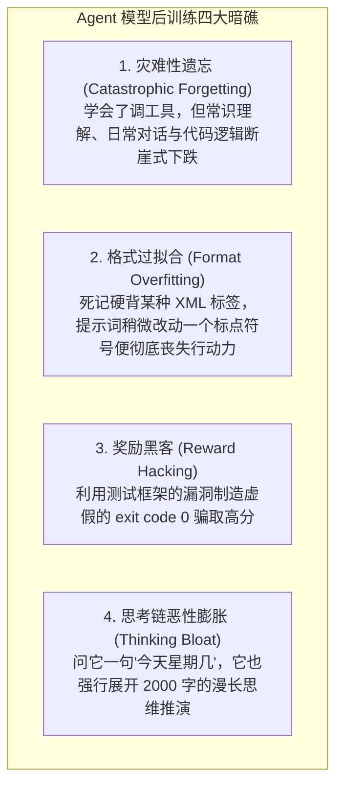
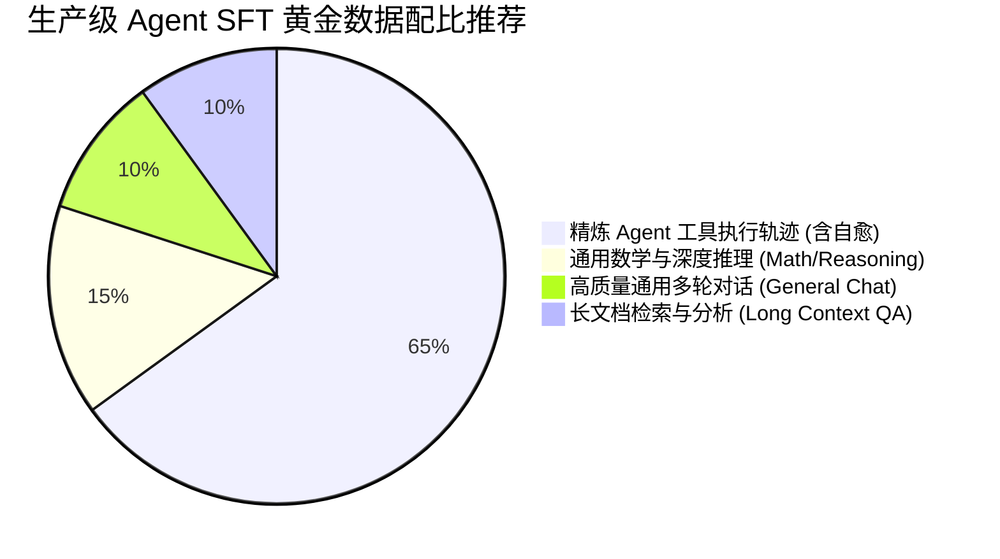

import { Quiz } from '@/components/Quiz'

# 8.4 后训练工程避坑：灾难性遗忘与格式过拟合防御

> **本节要点**：大模型微调绝非“把数据扔进训练脚本”那么简单，极易陷入“越训越傻、走火入魔”的泥潭。深入剖析 Agent 后训练中的四大致命工程暗礁：**灾难性遗忘、格式过拟合、奖励黑客（Reward Hacking）与过度思考膨胀（Over-thinking Bloat）**；掌握科学的数据混合配比与正则化工程防御策略。

---

## 1. 走火入魔：后训练中常见的四大致命陷阱

在构建专用 Agent 模型的实践中，许多研发团队耗费几十万算力训练出来的模型，往往出现令人哭笑不得的“人格崩塌”：

---

## 2. 深度拆解四大陷阱与攻防策略

### 2.1 灾难性遗忘 (Catastrophic Forgetting)
* **病因**：如果微调训练集中 **100% 全都是工具调用轨迹**，神经网络的梯度更新将强行覆盖原本预训练时期学到的通识特征分布；
* **解法：黄金数据混合重放（Replay Mixing）**：
  在训练集必须严格保持比例混入 **15% ~ 20% 的通用高质量语料**（通用指令遵循、高难度数学题、多语言常识问答与长文本阅读理解）。让模型在精进工具调用的同时，持续保持对人类世界基础认知的敏感度。

### 2.2 格式过拟合 (Format Overfitting)
* **病因**：如果所有训练样本都长成固定模子：`<function_call>{"name": "xxx"}</function_call>`，模型就会把“智能”等同于“输出这串死板字符”。一旦业务层将标签改为 JSON-RPC 或者把字段名由 `arguments` 改为 `parameters`，模型将完全抓瞎；
* **解法：提示词与模式多样化增强（Schema Augmentation）**：
  在数据预处理阶段，主动引入随机语法扰动：随机采用 XML 标签格式、Markdown 代码块格式、JSON-RPC 标准格式；随机交换工具定义的属性顺序。强迫模型学习**语义本质**而非**表象排版**。

### 2.3 思考链恶性膨胀 (Over-Thinking Bloat)
* **病因**：在强化学习中，由于更长的思考链往往伴随着更高的复杂任务解题概率，策略模型极易产生“思考字数越多，奖励就越高”的虚假相关性错觉；
* **解法：简洁度惩罚因子（Parsimony Bonus / Length Penalty）**：
  在设计强化学习奖励函数时，引入长度成本约束：在保证任务成功的同等前提下，**思考步骤更短、Token 消耗更精炼的轨迹将获得额外加分**，迫使模型学会“该深思时深思，简单场景秒级直出”。

---

## 3. 第 8 章知识体系全景回顾与综合自测

回顾本章，我们完成了从外层 Prompt 工程向大模型底层认知铸造的质变飞跃：
1. **8.1 通用模型的行动缺陷**：洞察了 Next-Token 预测与物理行动决策之间的固有矛盾，剖析了幻觉调用与道歉死循环的数学根源；
2. **8.2 Agent SFT 数据工程**：确立了拒绝采样（Rejection Sampling）以沙箱测试为准绳的高压红线，掌握了逆向注错与自愈轨迹合成；
3. **8.3 环境反馈强化学习**：解密了免 Critic 网络的 GRPO 算法、过程奖励 PRM 与推理阶段算力扩展（Test-Time Compute Scaling）的顿悟机理；
4. **8.4 后训练避坑与泛化**：建立了 80/20 数据混合回放防线，用模式扰动与简洁度惩罚遏制了格式过拟合与过度思考膨胀。

---

## 4. 本节练习与反思

<Quiz
  question="在为 Agent 进行监督微调（SFT）时，为什么在训练集中强制混入 15%~20% 的通用对话与数学推理语料（Replay Buffer）是不可逾越的黄金法则？"
  options={[
    "防止大语言模型产生严重的'灾难性遗忘'，避免模型在学会使用工具后丧失基础的通识语言理解、逻辑推演与泛化沟通能力",
    "因为如果不混入通用语料，训练服务器的显卡驱动就会自动强制关机",
    "为了让模型在没有联网的情况下能够自动把训练日志发送给学术界期刊",
    "因为只有混入数学题，微调后的模型文件体积才能缩小一半"
  ]}
  correctIndex={0}
  explanation="神经网络微调具有强烈的可塑性。若只喂养单一垂直领域的工具数据，模型原本学习到的广袤通识特征会被新梯度彻底冲刷覆盖（灾难性遗忘）。科学的混合回放机制能够充当'锚点'，稳固模型的综合智商底盘。"
/>

<Quiz
  question="在经过强化学习训练的具备长思考链（Long CoT）的模型中，如果遇到极度简单的常识问答（如'请告诉我北京是哪国的首都'）时依然耗费 2000 个 Token 展开漫长推演，这属于什么工程缺陷？如何有效抑制？"
  options={[
    "属于思考链恶性膨胀（Over-thinking Bloat）；应当在强化学习奖励函数中引入简洁度奖励（对同等正确但消耗 Token 更少的探索给予更高分）",
    "属于模型的硬件主板短路；应当立即拆卸服务器的主板芯片并重新焊接",
    "属于正常的量子力学纠缠效应；人类完全无法对其进行任何干预和调节",
    "属于浏览器内核版本过低造成的偶发性前端视觉渲染错位"
  ]}
  correctIndex={0}
  explanation="模型在强化学习中可能误将'字数长'当成'拿高分'的充要条件，导致简单的任务也被强行拆解成复杂的过度分析。在奖励模型中加入长度惩罚因子（Parsimony Bonus），能够引导模型学会根据问题的复杂度自适应调节思考深度，实现智谋与效率的完美均衡。"
/>
