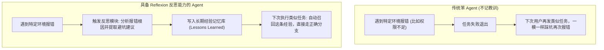
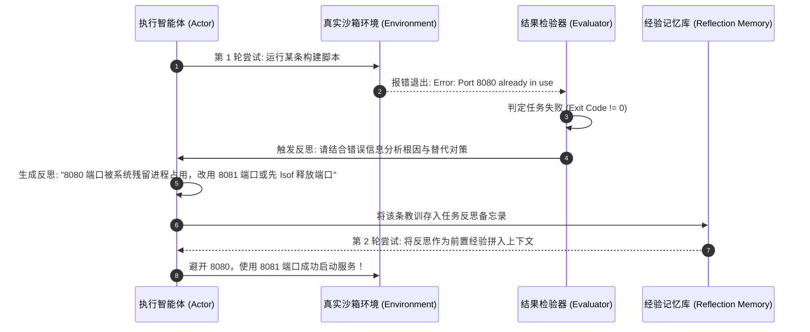

import { Quiz } from '@/components/Quiz'

# 9.1 在线自适应与 Reflexion 框架：从失败经验中提炼教训

> 线上业务环境是随时变化的：第三方 API 随时可能更改字段、内部数据库随时可能加索引、项目依赖库升级后某个方法可能就废弃了。如果每遇到一次环境变化或排障失败，就要把大模型拉下来重新微调一次权重，不仅成本高昂，时间上也完全来不及。我们更希望 Agent 能像一个有悟性的工程师：**同一条水沟绝不掉进去两次**——今天在某个特定命令上踩了坑，当场总结出经验教训并记在备忘录里，下次再遇到类似场景直接绕过。这一节我们聊聊不需要修改模型权重的自适应机制：**Reflexion 语言反思框架**。

---

## 1. 为什么不能靠频繁微调来适应环境变化？

很多人觉得模型做错了就要去微调。但在实际工程落地中，依赖微调来解决线上日常小问题有三个致命缺点：
1. **周期太慢**：收集数据、清洗轨迹、微调测试至少要几个小时到几天，无法解决线上分钟级的排障需求；
2. **算力成本高**：动用 GPU 集群跑微调账单昂贵，针对一个小错误微调很不划算；
3. **有遗忘风险**：高频针对特定小场景微调，极易导致原本正常的通用理解能力被冲刷受损。

因此，业界更推崇**“外挂经验记忆库”**：模型的底层权重保持不动，通过在外部捕获报错、生成自然语言反思，并作为上下文经验注入给下一次尝试：



---

## 2. Reflexion 框架的核心执行闭环

**Reflexion 框架** 的核心思想非常朴素：在“尝试”与“重试”之间插入一个显式的“语言反思（Verbal Reflection）”步骤。



### 为什么自然语言反思比纯数字奖励更管用？
* **信息密度高**：强化学习给一个 `-1.0` 的惩罚分数，模型不知道中途十几个动作到底哪一个做错了；而语言反思用一句话直接点明：“*挂掉是因为 8080 端口冲突，下一步应该换个端口*”，直接提供可执行的具体替代方案；
* **即时生效**：只要把反思文字作为上下文喂给模型，下一个 Token 就能改变决策行为，不需要经过梯度反向传播。

---

## 3. 实战：写一个带反思沉淀的执行调度器 (TypeScript)

在 Node.js 中，我们可以通过一个简单的包装类，在任务执行失败时自动调用反思提示词，并将教训注入下一轮会话：

```typescript
// reflexion-harness.ts
import { OpenAI } from 'openai';

export class ReflexionHarness {
  private client = new OpenAI();
  private lessonMemory: string[] = [];

  /**
   * 当任务失败时，让模型输出简短精炼的避坑反思
   */
  async generateLesson(
    taskGoal: string,
    failedActions: string,
    errorMessage: string
  ): Promise<string> {
    const prompt = `
你是一位经验丰富的排障专家。刚才执行任务遇到了报错，请帮助总结经验。
【任务目标】: ${taskGoal}
【此前执行的动作序列】:
${failedActions}
【环境报错信息】:
${errorMessage}

请用 2 句话回答：
1. 刚才失败的核心原因是什么？
2. 下一次执行时，应该采取什么具体方案来绕过这个坑？
`;

    const res = await this.client.chat.completions.create({
      model: 'gpt-4o',
      messages: [{ role: 'user', content: prompt }],
      temperature: 0.2,
    });

    const lesson = res.choices[0].message.content?.trim() || '未提取出有效教训';
    this.lessonMemory.push(lesson);
    console.log('💡 [经验总结] 已沉淀避坑指南:', lesson);
    return lesson;
  }

  /**
   * 将积累的历史经验注入给后续任务的系统上下文
   */
  getInjectedLessons(): string {
    if (this.lessonMemory.length === 0) return '';
    return `
【历史踩坑教训备忘】：
${this.lessonMemory.map((item, idx) => `[经验 ${idx + 1}] ${item}`).join('\n')}
请在本次任务中主动参考上述经验，避免重复犯错！
`;
  }
}
```

---

## 4. 自测练习

<Quiz
  question="在 Agent 自适应场景中，相比于单纯给模型一个负向数字评分（如 -1.0），Reflexion 框架采用'自然语言反思（Verbal Reflection）'的核心优势是什么？"
  options={[
    "自然语言反思能直接指出失败的具体原因（如参数错误或环境依赖缺失）并给出替代方案，直接注入 Prompt 就能在下一轮即刻生效，无需耗费算力重训权重",
    "因为自然语言反思可以使服务器的 CPU 频率永久突破物理极限",
    "因为现代 Linux 终端只支持识别英文自然语言，不支持解析数字状态码",
    "因为自然语言反思能够让大模型脱离网络连接在本地无感运行"
  ]}
  correctIndex={0}
  explanation="纯数值惩罚非常抽象，模型在经历多步复杂操作后根本无法归因是哪一步出了问题；而自然语言反思直接点出根因和解法，作为前置上下文注入后，模型在下一轮调用时能直接绕开已知陷阱。"
/>

<Quiz
  question="为什么线上 Agent 遇到日常环境 Bug 时，不建议采用'每次出问题就微调一次模型'的策略？"
  options={[
    "微调准备数据和训练评测的周期较长且算力成本高昂，高频微调还容易引发灾难性遗忘，无法应对线上突发的敏捷自适应需求",
    "因为大语言模型在微调 3 次以上后会被开源许可证强制下线",
    "因为微调只能修改模型的输出字号，无法影响模型的推理逻辑",
    "因为现代云服务商禁止用户在服务器上运行任何形式的微调任务"
  ]}
  correctIndex={0}
  explanation="微调是一项重型工程，需要重新做全量回归测试防止模型基础能力退化。面对线上特定接口字段变动或突发小故障，通过外挂反思记忆与规则库进行上下文在线适应，成本更低且见效更快。"
/>
