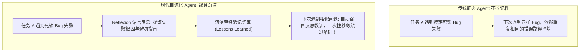

import { Quiz } from '@/components/Quiz'

# 9.1 在线自适应与 Reflexion 框架：从失败经验中提炼认知

> **本节要点**：为什么离线微调（Fine-Tuning）无法跟上真实世界的瞬息万变？掌握不修改模型权重即可实现在线终身学习的 **Reflexion 语言反思框架**；剖析“行动-评估-语言反思-记忆存储”的认知自适应闭环；学会如何将单次任务的惨痛挫败转化为指导未来决策的显式知识资本。

---

## 1. 静态权重 vs. 动态现实：终身自进化的必然性

任何通过离线预训练和 SFT 固化的神经网络权重，在部署到生产环境的一瞬间，就已经开始“过时”：
* 外部三方服务（如 Stripe、AWS）随时在发布破坏性 API 升级；
* 企业的私有代码库每天产生数千次提交，架构与命名规范持续演变；
* 面对从未见过的诡异环境 Bug，我们不可能每解决一个问题就耗费几十万美元重新微调一次基础模型。

**自进化智能体（Self-Improving Agent）** 的核心思想是：**在不触碰模型底层参数的前提下，通过外部记忆与自省反思循环，实现类似人类工程师的“吃一堑、长一智”！**



---

## 2. 经典基石：Reflexion 框架深度解析

由东北大学与 MIT 提出的 **Reflexion 框架**，是现代智能体反思机制的理论源头：

```mermaid
sequenceDiagram
    autonumber
    participant Actor as 行动执行主体 (Actor Agent)
    participant Env as 真实物理环境沙箱 (Environment)
    participant Evaluator as 评估判决器 (Evaluator)
    participant SelfReflector as 反思思考器 (Self-Reflection)
    participant Memory as 长期反思记忆缓冲区 (Memory Buffer)

    Actor->>Env: 执行第 t 轮尝试 (Trajectory: Action 1, 2, 3...)
    Env-->>Evaluator: 返回物理终态与测试结果
    Evaluator->>Evaluator: 计算标量奖励与失败判定 (Fail)
    
    Evaluator->>SelfReflector: 触发反思: "任务失败，请结合报错分析根本诱因"
    SelfReflector->>SelfReflector: 生成语言反思 (Verbal Self-Reflection):<br/>"我错在未等待异步 Promise 完成就去读取 DOM 属性..."
    SelfReflector->>Memory: 将反思文本追加写入短/长期记忆槽 (Append Memory)
    
    Memory-->>Actor: 在第 t+1 轮尝试时，将历史反思作为上下文前缀注入 Prompt
    Actor->>Env: 基于反思修正动作序列，成功跑通任务！
```

### 语言反思（Verbal Reflection）相比标量梯度的碾压级优势：
*   **富语义信息量（Rich Semantic Density）**：纯强化学习只返回一个数字标量（如 `-1.0`），模型需要海量试错才能猜出到底是哪个动作被惩罚；而语言反思用人类自然语言一针见血指明：“*失败原因是在第 14 行少写了 await，解决方案是使用 async/await 重构*”；
*   **零显卡重训成本**：无需任何反向传播求导，文本反思即写即用、跨模型通用。

---

## 3. 全栈实战：构建带自省纠错的 Reflexion 调度器 (TypeScript)

```typescript
// reflexion-harness.ts
import { OpenAI } from 'openai';

export class ReflexionHarness {
  private client = new OpenAI();
  private reflectionMemory: string[] = [];

  /**
   * 引导模型对失败轨迹展开结构化语言反思
   */
  async generateReflection(taskPrompt: string, failedTrajectory: string, errorOutput: string): Promise<string> {
    const prompt = `
你是一位极其擅长复盘总结的资深系统架构师。
【原任务目标】: ${taskPrompt}

【此前执行的失败动作轨迹】:
${failedTrajectory}

【最终环境报错堆栈】:
${errorOutput}

请进行深度自省反思，以简短精炼的 2~3 句话总结：
1. 本次执行的核心错误假设是什么？
2. 导致失败的根本技术原因是什么？
3. 在下一次尝试中，必须采取什么全新的替代方案以避免再次踩坑？
`;

    const res = await this.client.chat.completions.create({
      model: 'gpt-4o',
      messages: [{ role: 'user', content: prompt }],
      temperature: 0.2,
    });

    const reflection = res.choices[0].message.content?.trim() || '未生成明确反思';
    this.reflectionMemory.push(reflection);
    console.log('💡 [Reflexion] 新沉淀教训:', reflection);
    return reflection;
  }

  /**
   * 获取注入下一轮尝试的前缀上下文
   */
  getInjectedReflectionContext(): string {
    if (this.reflectionMemory.length === 0) return '';
    return `
【历史失败教训与反思指南】：
${this.reflectionMemory.map((r, i) => `[教训 ${i + 1}] ${r}`).join('\n')}
请在本次行动中坚决遵守上述反思，严禁重复上述已知错误！
`;
  }
}
```

---

## 4. 本节练习与反思

<Quiz
  question="在 Agent 终生演进体系中，相比于传统的标量强化学习（如仅给一个 -1.0 分数），Reflexion 框架采用'语言反思（Verbal Reflection）'的核心优势是什么？"
  options={[
    "语言反思能够用高信息密度的语义精确指出失败的根本机理和具体的避坑替代方案，无需昂贵算力重训模型权重即可在下一轮秒级生效",
    "因为自然语言反思能够永久物理消除大语言模型服务器的电费开销",
    "因为所有的现代操作系统只允许读取由大模型自我生成的英文反思",
    "因为语言反思能够自动给当前运行的计算机内存增加 64GB 硬件空间"
  ]}
  correctIndex={0}
  explanation="纯数值标量奖励极其稀疏，模型在长程任务中很难归因究竟是几十步中的哪一步导致了扣分；而基于自然语言的反思具备极高的信息带宽，能一针见血地指出错误假设并提出可落地的具体方案，直接注入下一轮 Prompt 实现即刻进化。"
/>

<Quiz
  question="为什么我们不能依赖'每次发现新问题就对大模型进行一次 LoRA 微调'来作为企业级 Agent 适应日常业务变更的主要手段？"
  options={[
    "微调的周期长、硬件成本高昂，且高频微调极易导致模型原有通用能力的退化与灾难性遗忘，无法满足分钟级在线业务自适应的要求",
    "因为 LoRA 微调算法已经被国际开源基金会正式宣布永久废除",
    "因为大语言模型在微调超过三次之后就无法再通过互联网发送数据",
    "因为微调只能用于修改模型的输出语种，无法改变模型的任何技术判断"
  ]}
  correctIndex={0}
  explanation="微调是一项重型工程（需要收集清洗数据集、配置超参数、执行评测防遗忘），根本无法应对日常生产中高频突发的小 Bug。将教训转化为结构化规则与外部反思记忆，是兼顾极低成本、极高敏捷度与系统稳定性的工业级解法。"
/>
