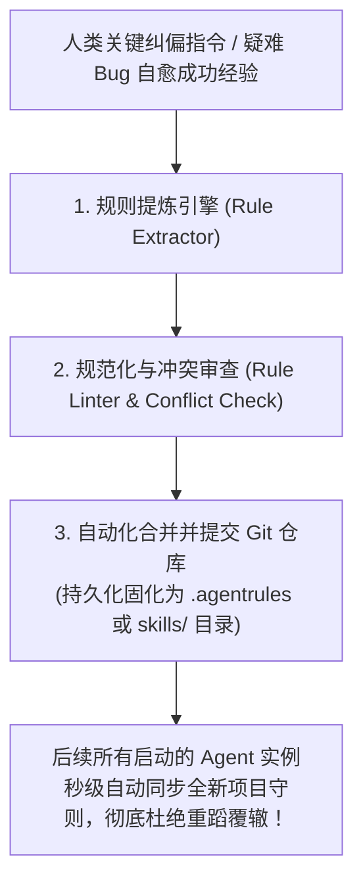
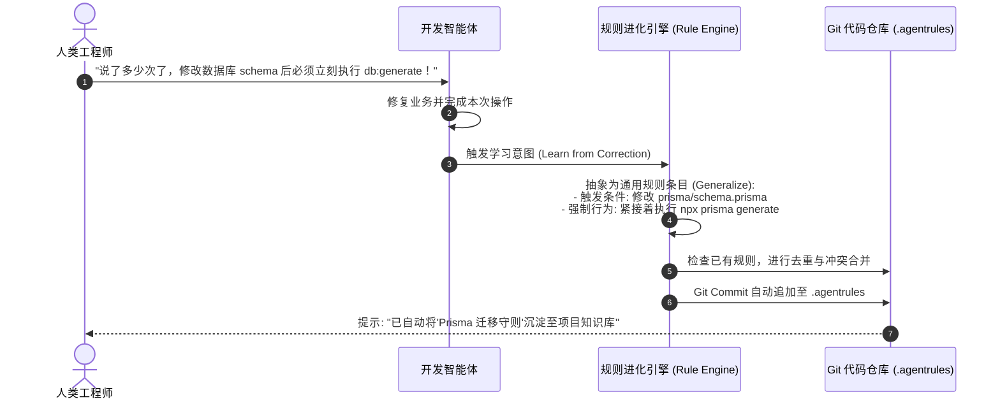
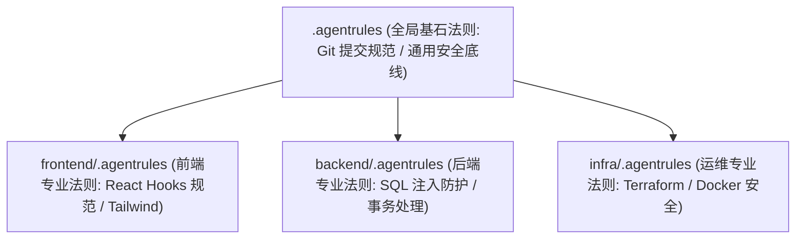

import { Quiz } from '@/components/Quiz'

# 9.2 规则自进化与技能库积累：将教训固化为可执行工程资产

> **本节要点**：单次任务中的反思如果仅停留在临时 Context 中，会话一结束便荡然无存。掌握将动态反思沉淀为静态工程资产的 **规则自进化流水线（Automated Rules Evolution）**；深度拆解工业界 `.agentrules` 与 **Agent Skills** 的标准规范；攻克规则库冲突消歧与多层级分层分发机制。

---

## 1. 从“过眼云烟”到“立字为据”：知识资产的持久化

很多开发者抱怨自己的 Coding Agent：
> *“我昨天明明已经告诉过它‘在写 React 组件时禁止使用内联样式，必须使用 Tailwind CSS’，为什么今天开一个新窗口提问，它又在那里写 inline style？！”*

这是因为**单次会话的上下文（Context）是短暂且孤立的**。
要让智能体真正具备“组织级经验传承”，必须将成功踩坑的经验从短期对话中剥离出来，**写入项目根目录下的版本受控代码资产中**（如 `.cursorrules`、`AGENTS.md` 或标准化的 `skills/` 目录）。

---

## 2. 规则自进化三步闭环流水线 (The Rules Evolution Loop)

智能体自我沉淀规则不能无节制地乱写，必须遵循严谨的“三步提炼-消歧-合并”闭环：

### 规则提炼的三大质量原则
1. **去语境化与泛化（Context Generalization）**：剔除特定会话的人称代词（如“你昨天说……”），提取为适用于所有团队成员的客观客观工程断言；
2. **声明精确的触发场景（Trigger Scopes）**：严禁无脑追加全局规则。必须标明“仅在修改 `src/components/**/*.tsx` 时生效”；
3. **正反例对照（Do & Don't Examples）**：每条规则附带 3 行正确的代码示范与 3 行错误反例，大幅降低模型理解歧义。

---

## 3. 分层分发架构：防止规则库撑爆上下文

随着项目日积月累，团队沉淀的规则可能达到上百条。如果每一轮会话都把几万字的规则文档塞进 System Prompt，将再次引发 Token 浪费与注意力稀释。
现代系统采用**目录拓扑分层分发机制（Hierarchical Rule Dispatching）**：

*   当 Agent 在 `frontend/` 目录下操作时，调度器**只动态挂载全局规则与前端子规则**，后端规则保持静默；
*   按需加载使单次任务的规则开销始终被精确控制在 500 Token 以内，既保持了纪律性，又维持了极致的敏捷与低成本。

---

## 4. 本节练习与反思

<Quiz
  question="在为开发团队部署 Coding Agent 时，将人类在对话中的关键工程纠偏（如代码风格、架构规范）沉淀为项目根目录下的 .agentrules 文件，其最核心的工程价值是什么？"
  options={[
    "使得宝贵的人工纠偏经验能够作为静态代码资产跨会话、跨团队成员永久传承，避免后续新打开的 Agent 窗口不断犯下完全相同的低级错误",
    "能够让所有的 JavaScript 代码在没有安装 Node.js 的情况下直接在微波炉上运行",
    "使得项目在提交到 GitHub 后自动获得微软公司的全额投资",
    "可以彻底删除项目中的所有 TypeScript 类型声明文件以提高打字速度"
  ]}
  correctIndex={0}
  explanation="会话窗口具有一次性和易逝性。将教训沉淀在项目的版本控制文件（如 .agentrules / AGENTS.md）中，相当于为整个项目建立了活的'智能体员工培训手册'，使得任何新实例启动时都能立即继承团队历史积累的最佳实践。"
/>

<Quiz
  question="当团队长期沉淀了上百条业务规则时，为什么强烈反对将所有规则无条件塞进全局 System Prompt 中？"
  options={[
    "会严重撑爆上下文窗口、大幅增加首包延迟与调用成本，同时大量无关领域的规则会稀释模型的注意力，导致决策准确率下降",
    "因为大语言模型在阅读超过 10 条规则时会自动向当地消防局拨打火警电话",
    "因为操作系统的磁盘驱动器不支持存储超过 50 个汉字的规则文档",
    "因为规则数量过多会导致当前代码编辑器的语法高亮功能彻底损坏"
  ]}
  correctIndex={0}
  explanation="规则爆炸同样会带来注意力稀释和 KV Cache 击穿。采用分层按需挂载（如前端目录只挂前端规则，修改 SQL 时才动态检索挂载数据库规范），是确保 Agent 既守规矩又保持轻盈高效的必备架构手段。"
/>
