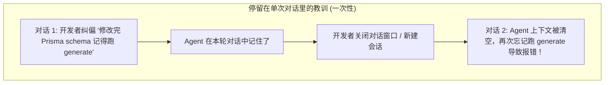
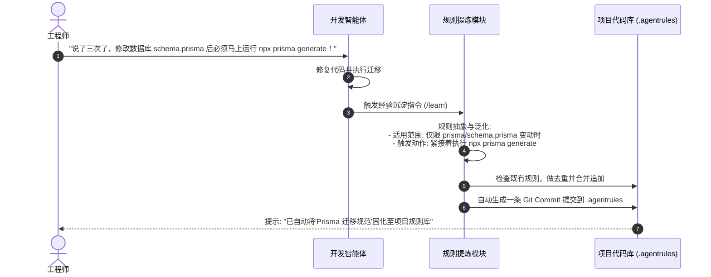
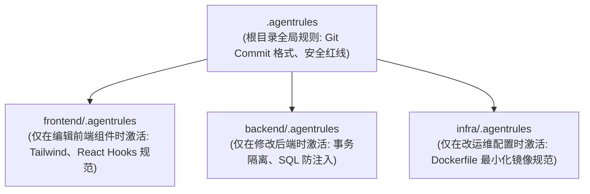

import { Quiz } from '@/components/Quiz'

# 9.2 规则自进化与技能库积累：把口头叮嘱沉淀为代码资产

> 很多用过 AI 编程工具的工程师都遇到过这种憋屈事：你昨天刚在聊天框里严厉叮嘱它“写前端组件绝对不准用内联样式，统一用 Tailwind CSS”，它满口答应“好的我记住了”；结果今天新开一个对话窗口，它又在那大模大样地写 `style={{ color: 'red' }}`。原因很简单：会话窗口是临时的，窗口一关，上下文灰飞烟灭。要想让 Agent 真正像团队里的正式员工一样“越用越顺手”，必须把对话中的纠偏和规范持久化到项目的版本管理中（比如 `.cursorrules`、`AGENTS.md` 或 `skills/` 目录）。这一节我们聊聊怎么让 Agent 自动把教训提炼成项目资产。

---

## 1. 为什么“口头提醒”对新会话永远无效？

在单次对话中，Agent 的记忆只能维持在当前上下文窗口里：

真正靠谱的经验沉淀，必须走**“提炼 -> 写入文件 -> Git 版本受控”**的链路：
把规则以 Markdown 或 YAML 的形式，直接提交进团队的代码仓库中。这样不仅当前项目的新会话能读到，其他拉取了代码的同事启动 Agent 时也能自动遵守这套规范。

---

## 2. 规则自进化的三步闭环

让 Agent 自动总结规则不能无脑乱写，否则代码库里很快就会充斥一堆互相矛盾、含糊不清的废话。一般需要经过这三个步骤：

### 写好一条项目规则的核心要素
1. **明确生效范围（Scope）**：不要搞无差别的全局规则。标清楚这条规则只对 `src/components/**/*.tsx` 生效，还是对所有文件生效；
2. **剔除特定语境代词**：把“我刚才告诉过你不要……”改成客观陈述：“在修改用户鉴权相关代码时，必须保留 JWT 刷新逻辑”；
3. **附带正反例（Do & Don't）**：给出 3 行正确示范和 3 行反例，大模型对代码例子的理解远比抽象的形容词准确得多。

---

## 3. 避免规则膨胀：按目录分层挂载

团队合作几个月后，项目沉淀的规范可能多达几十条。如果每次启动 Agent 都把上万字的规则全部硬塞进系统提示词，会带来两个严重问题：
* **Token 浪费与延迟飙升**：首包时间明显变慢，API 账单蹭蹭涨；
* **注意力稀释**：规则太多，模型反而会挑三拣四，抓不住当前操作的重点。

解决办法是**按项目目录做分层加载**：

* 当 Agent 在修改 `frontend/` 下的文件时，调度层只给它挂载根目录规则与前端规则，后端的几千字规则保持静默；
* 每次任务注入的规则严格控制在 500 Token 以内，既能守住规矩，又不会拖慢响应速度。

---

## 4. 自测练习

<Quiz
  question="在团队协作开发中，将工程师对 Agent 的日常纠偏沉淀为代码库中的 `.agentrules` 或 `AGENTS.md` 文件，最直接的好处是什么？"
  options={[
    "让规则作为版本受控的工程资产跨会话、跨团队成员持续生效，避免每次新开对话窗口时 Agent 都重复犯下已纠正过的低级错误",
    "可以让原本需要付费的云端大模型自动转为免费版本",
    "能够让所有的 Python 代码在没有解释器的情况下直接在浏览器运行",
    "能够自动把团队所有人的工资条直接同步给代码仓库所有者"
  ]}
  correctIndex={0}
  explanation="对话历史是短暂且易逝的。将其固化为项目根目录下的规则文件，相当于为当前仓库配备了一份永久的'智能体员工操作守则'，所有新启动的 Agent 实例都能一键继承团队踩坑总结出的规范。"
/>

<Quiz
  question="当项目里沉淀的规则逐渐增多时，为什么要采用'按目录分层挂载'而不是把全部规则无脑塞进 System Prompt？"
  options={[
    "避免过长规则撑爆上下文并造成严重的注意力稀释，让模型在改前端时只关注前端规范，既节省了 Token 成本，又提升了遵循指令的精准度",
    "因为大语言模型只要读取超过 20 行文字就会自动断开网络连接",
    "因为操作系统禁止单个 Markdown 文件的体积超过 1KB",
    "为了防止代码高亮插件因规则文件太长而发生崩溃"
  ]}
  correctIndex={0}
  explanation="如果每次请求都把全量规则（前端、后端、数据库、运维）全部塞给模型，不仅浪费上下文和增加延迟，还会因为无关噪音过多导致模型抓不住重点。按目录或任务类型按需挂载规则，是保持系统轻量与专注的关键手段。"
/>
