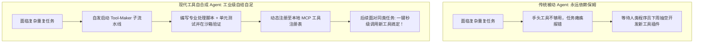
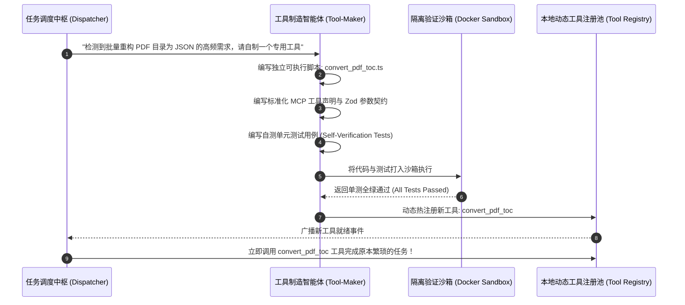

import { Quiz } from '@/components/Quiz'

# 9.3 工具自合成与技能涌现：从工具使用者跃迁为工具创造者

> **本节要点**：人类文明演进的终极分水岭在于“不仅会使用自然界现成的木棍，更懂得将黑曜石打磨成锋利的石斧”。掌握 Agent 从被动的 **工具使用者（Tool User）** 跨越为主动的 **工具创造者（Tool Maker）** 的技术全景；深度剖析 **Tool-Making & Tool-Using 双阶段流水线**；构建包含自动编写、沙箱自测与动态注册的自合成工具工厂。

---

## 1. 终极跃迁：从“调用别人给的 API”到“自己造轮子”

在过去，Agent 的能力边界被人类工程师预设的工具集合死死框定：
* 如果工程师只给它提供了 `grep` 和 `curl`，遇到需要批量解析数百个特殊格式的二进制日志时，Agent 只能在终端中笨拙地反复尝试上百次；
* 这种重复劳动极度浪费 Token，且极易出错。

**工具自合成范式（LATM: LLMs as Tool Makers）** 将自主性推向了前所未有的顶峰：
当 Agent 意识到手头缺乏称手的工具、或者某项高频操作需要被标准化时，**它会自发编写一段高质量的代码脚本，为其定义标准的入参 Schema，在沙箱中跑通单元测试，并将其永久注册为一个全新的本地工具！**



---

## 2. 工具自合成四步流水线 (The Tool-Making Pipeline)



### 生产级自制工具的准入四铁律
1. **沙箱强制闭环断言**：新工具必须自带不少于 3 组涵盖正常与边界异常的单元测试，必须在隔离沙箱中 `exit code === 0` 通过方可准入；
2. **纯函数与无害副作用**：自制工具严禁包含写入未知网络或提权的危险操作，必须经过静态 AST 安全扫描；
3. **元数据自动生成（Auto-Documentation）**：自动生成详尽的 Tool Description，清晰阐述该工具的输入、输出、最佳适用场景与限制条件；
4. **命名空间隔离（Namespace Isolation）**：自制工具打上 `custom_*` 前缀，与系统核心基石工具（如 `run_command`）严格区分，防止同名恶意覆盖劫持。

---

## 3. 全栈实战：动态工具工厂与沙箱热注册 (TypeScript)

```typescript
// dynamic-tool-factory.ts
import * as fs from 'fs/promises';
import { exec } from 'child_process';
import { promisify } from 'util';

const execAsync = promisify(exec);

export interface SyntheticToolSpec {
  name: string;
  description: string;
  scriptContent: string;
  testContent: string;
}

export class DynamicToolFactory {
  private static readonly TOOLS_DIR = './custom_tools';

  /**
   * 制造并热注册一个全新工具
   */
  static async makeAndRegisterTool(spec: SyntheticToolSpec): Promise<{ success: boolean; message: string }> {
    const { name, description, scriptContent, testContent } = spec;
    const toolDir = `${this.TOOLS_DIR}/${name}`;

    try {
      await fs.mkdir(toolDir, { recursive: true });

      // 1. 写入工具实现与测试脚本
      await fs.writeFile(`${toolDir}/index.ts`, scriptContent, 'utf-8');
      await fs.writeFile(`${toolDir}/index.test.ts`, testContent, 'utf-8');

      // 2. 在沙箱环境中运行自测用例
      console.log(`🧪 [Tool Factory] 正在对自制工具 ${name} 执行安全回归测试...`);
      const { stdout } = await execAsync(`npx ts-node ${toolDir}/index.test.ts`, { timeout: 15000 });

      // 3. 校验通过，正式挂载进入可用工具索引
      console.log(`✅ [Tool Factory] 工具 ${name} 通过全量自测验证！已成功热挂载。`);
      return {
        success: true,
        message: `自制工具 ${name} 已通过沙箱测试并成功热注册，可在后续推理中直接作为函数调用。`,
      };
    } catch (err: any) {
      // 若测试失败，清理残留废弃物
      await fs.rm(toolDir, { recursive: true, force: true });
      return {
        success: false,
        message: `自制工具 ${name} 未能通过自测验证，已回滚废弃！错误信息: ${err.message}`,
      };
    }
  }
}
```

---

## 4. 本节练习与反思

<Quiz
  question="在 Agent 自进化架构中，从'使用工具（Tool-Using）'跃迁为'创造工具（Tool-Making）'的最本质区别是什么？"
  options={[
    "智能体能够根据特定新场景的痛点，自发编写独立的代码函数与单元测试，在沙箱验证后将其注册为可供未来持续复用的新工具，实现了能力的永久性滚雪球积累",
    "创造工具意味着智能体必须拥有从铁矿石中冶炼金属制造实体螺丝刀的能力",
    "创造工具能够让大语言模型完全摆脱对任何计算机硬件与电力的依赖",
    "创造工具意味着大模型可以自动为自己申请合法的人类国籍和身份证件"
  ]}
  correctIndex={0}
  explanation="工具制造是认知能力的重大飞跃。智能体不再局限于人类提前给定的固定 API，而是能针对高频复杂任务自主抽象出通用函数库（如 Voyager 模式），并将其持久化为技能积木，让后续更复杂的任务能直接站在新工具的肩膀上。"
/>

<Quiz
  question="为什么由 Agent 自主合成的新工具（Synthetic Tools）必须强制通过沙箱单元测试（Self-Verification Tests）方可允许注册入库？"
  options={[
    "防止大模型生成的代码存在语法报错、死循环或逻辑缺陷，确保动态加入工具池的新函数百分之百可用且不会污染后续其他任务的决策环境",
    "因为现代操作系统的软件版权法严格禁止未经过测试的代码被保存在硬盘上",
    "因为没有单元测试的代码会自动导致机房的空调跳闸断电",
    "为了让大模型在写单元测试的过程中自动把模型版本升级为最高配置"
  ]}
  correctIndex={0}
  explanation="未经验证的代码就是潜在的地雷。如果 Agent 制造了一个存在语法错误或死循环的破损工具并放入系统，后续一旦被其他任务调度，将引发灾难性的级联崩溃。强制在隔离沙箱中测试全绿是保证工具库高纯度演进的底线防线。"
/>
