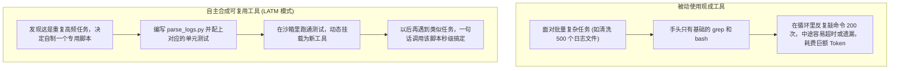
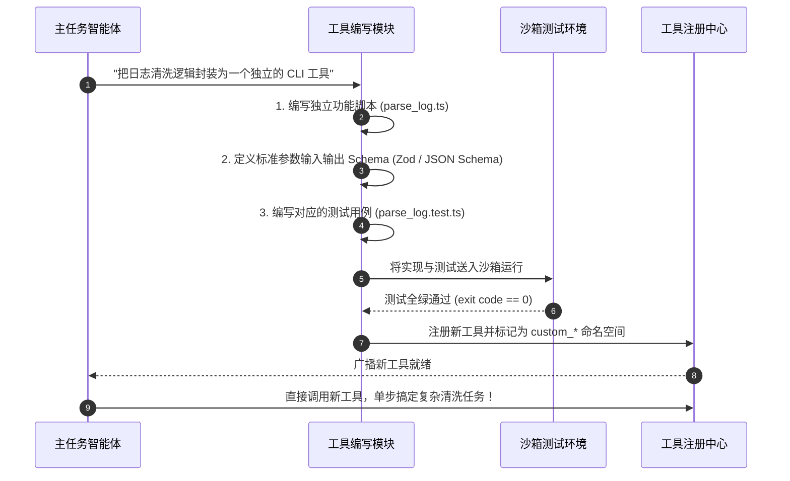

import { Quiz } from '@/components/Quiz'

# 9.3 工具自合成：从使用现成接口到自己写辅助脚本

> 很多时候我们使用 Agent，都是开发者提前给它定义好一堆工具（比如 `grep`、`view_file`、`curl`）。但如果任务遇到一个高频又繁琐的重复操作——比如要把 200 个格式各异的日志文件清洗成统一的 JSON 表格——如果让 Agent 每次都用底层的命令行慢慢折腾几十轮，不仅费时费 Token，还很容易中途翻车。一个真正熟练的程序员面对这种事，通常会花十分钟写个 Python 辅助脚本，跑通测试后放在项目的 `scripts/` 目录里随时调用。Agent 也完全可以拥有这种“自己造工具”的能力（学术界常称为 LATM 或 Voyager 模式）。这一节我们聊聊工具自合成的落地流程与安全防线。

---

## 1. 为什么 Agent 需要“自己写工具”？

如果 Agent 只能被动使用人类预先写好的 API，它的能力边界就会被锁死：



这种模式把“长程脆弱的任务探索”变成了“一次性编写、永久稳定复用”的代码资产，就像把临时手写的一段逻辑封装成了一个标准函数库。

---

## 2. 工具自合成的标准四步流程

让 Agent 自己造轮子，最怕它写出死循环或者带安全隐患的脚本。因此必须走通严格的准入机制：



### 自制工具的准入准则
1. **测试全绿才能入库**：新生成的代码必须自带至少 2~3 个单元测试用例，并在独立子进程/沙箱里跑通，杜绝把带 Bug 的脚本挂进工具池；
2. **严格设置执行超时**：自制工具必须配有强制超时时间（如 15 秒），防止脚本内写出死循环导致整个主进程挂死；
3. **命名空间隔离**：自制工具统一加前缀（如 `custom_*`），绝对不允许覆盖系统内置的核心工具（如 `run_command`、`view_file`）；
4. **生成清晰的使用文档**：写清楚工具的适用场景、输入字段含义和常见反例，确保后续任务能正确理解并调用。

---

## 3. 实战：动态工具工厂与沙箱验证 (TypeScript)

在 Node.js 中，我们可以实现一个简单的工具制造工厂：

```typescript
// dynamic-tool-factory.ts
import * as fs from 'fs/promises';
import { exec } from 'child_process';
import { promisify } from 'util';

const execAsync = promisify(exec);

export interface SyntheticToolSpec {
  name: string;
  description: string;
  scriptContent: string;
  testContent: string;
}

export class DynamicToolFactory {
  private static readonly TOOLS_DIR = './custom_tools';

  /**
   * 编写并测试自制工具，测试通过后动态挂载
   */
  static async makeAndRegisterTool(spec: SyntheticToolSpec): Promise<{ success: boolean; message: string }> {
    const { name, description, scriptContent, testContent } = spec;
    const toolDir = `${this.TOOLS_DIR}/${name}`;

    try {
      await fs.mkdir(toolDir, { recursive: true });

      // 1. 写入工具实现与自测试脚本
      await fs.writeFile(`${toolDir}/index.ts`, scriptContent, 'utf-8');
      await fs.writeFile(`${toolDir}/index.test.ts`, testContent, 'utf-8');

      // 2. 在隔离子进程中跑测试，设置 15 秒硬超时
      console.log(`🧪 [Tool Factory] 正在对自制工具 ${name} 运行单元测试...`);
      await execAsync(`npx ts-node ${toolDir}/index.test.ts`, { timeout: 15000 });

      // 3. 测试通过，正式挂载
      console.log(`✅ [Tool Factory] 工具 ${name} 自测全部通过，已成功注册！`);
      return {
        success: true,
        message: `自制工具 ${name} 测试通过并成功挂载，后续任务可直接调用。`,
      };
    } catch (err: any) {
      // 若测试失败，清理残留文件，坚决不准带病入库
      await fs.rm(toolDir, { recursive: true, force: true });
      return {
        success: false,
        message: `自制工具 ${name} 未能通过自测，已回滚废弃。原因: ${err.message}`,
      };
    }
  }
}
```

---

## 4. 自测练习

<Quiz
  question="在 Agent 自进化体系中，'自合成工具（Tool-Making）'相比每次临时执行多步命令，最核心的工程价值是什么？"
  options={[
    "针对高频复杂的重复逻辑，自主编写独立脚本并封装成可复用工具，把原本需要几十轮脆弱尝试的长任务沉淀为确定性的标准能力，大幅节约 Token 并提升稳定性",
    "让模型不需要任何计算机硬件就可以在纸上自动运行代码",
    "完全消除操作系统中的所有文件读写权限限制",
    "让所有的云端 API 都免除网络请求延迟"
  ]}
  correctIndex={0}
  explanation="面对批量或高频复杂操作，临时多轮交互既慢又容易出错。自主编写辅助脚本、测试通过后作为工具持久化沉淀，能让 Agent 的能力像滚雪球一样不断增强，后续同类任务一步即可完成。"
/>

<Quiz
  question="为什么由 Agent 自主合成的新工具在正式注册进入可用工具池之前，必须在沙箱中强制跑通单元测试？"
  options={[
    "确保模型生成的脚本没有语法错误、死循环或逻辑漏洞，防止有缺陷的工具被注册后污染全局工具库并导致后续任务崩溃",
    "因为现代操作系统的文件系统不允许保存未测试的文件",
    "为了让编写测试脚本的过程降低当前服务器的内存消耗",
    "因为开源协议规定没有测试用例的代码会自动被编译器删除"
  ]}
  correctIndex={0}
  explanation="未经验证的代码是潜在的地雷。如果生成的工具存在死循环或语法错误，一旦挂载进工具池被其他会话调用，会引发连锁崩溃。在沙箱里跑通单元测试并加超时保护，是保证工具池干净可靠的底线。"
/>
