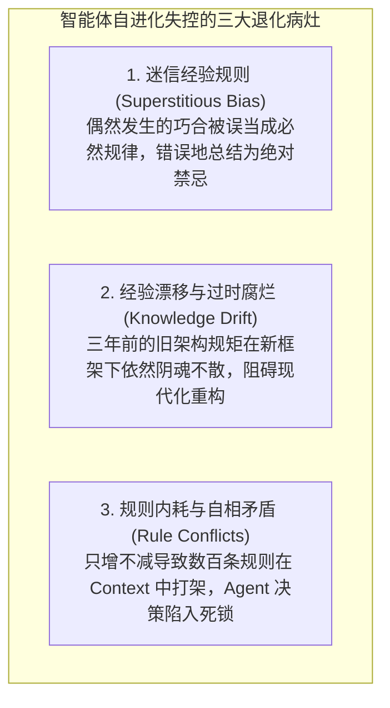
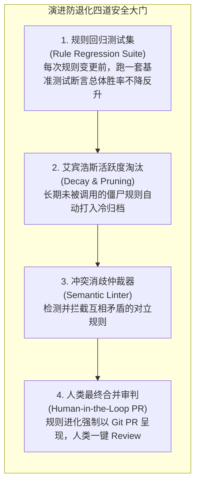

import { Quiz } from '@/components/Quiz'

# 9.4 演进安全缰绳：经验漂移、迷信规则与知识防退化

> **本节要点**：自进化是一把锋利的双刃剑——如果放任系统无监督地“自我学习”，系统不仅不会变聪明，反而极易沉淀出有害的“迷信偏见”甚至陷入认知崩塌。深入解密 **迷信规则（Superstitious Rules）** 与 **经验漂移（Experience Drift）** 的形成机理；构建覆盖 **规则回归基准测试、访问频次衰减修剪与人类 PR 守门** 的演进安全缰绳。

---

## 1. 走火入魔：自进化失控的三大退化病灶

生物界演化的本质是优胜劣汰，但如果没有严格的“自然选择压力”，错误的基因突变就会扩散并导致种群退化。
在 Agent 长期自进化系统中，失控的自我学习通常导致三大致命病灶：

### 什么是“迷信规则”（Superstitious Rule）？
在行为心理学中，给鸽子随机投喂食物，鸽子会误以为“自己刚才朝左转头”是获得食物的原因，从而疯狂重复转头动作（斯金纳鸽子实验）。
在大模型自进化中同样如此：
* Agent 某次执行 `npm install` 偶然遇到网络丢包超时；
* 恰好在重试时，模型下意识加了一个无关参数 `--verbose`，此时刚好网络恢复并顺利安装成功；
* 未经审查的自省模块兴奋地总结：“*注意！在本项目中执行 npm install 必须始终添加 --verbose，否则网络必定超时！*”
* 这条**荒谬的伪科学迷信**被固化在 `.agentrules` 中，造成长期的系统内耗与认知污染。

---

## 2. 演进安全缰绳：四道防退化工程屏障

为了防止 Agent “越学越偏、走火入魔”，生产级系统必须设立四道严密的安全缰绳：

### 核心防线 1：规则回归测试集 (Rule Regression Suite)
就像修改业务代码必须跑单测一样，**修改 `.agentrules` 规则文件本身同样必须跑“元评测（Meta-Eval）”！**
* 维护一套包含 20 个典型历史难题的基准集；
* 当 Agent 提议新增一条规则时，评测框架在挂载新规则的环境下跑这 20 个测试；
* 如果新规则使得其中原本正常的 3 个测试发生了红灯回归（Regression），系统**直接自动否决并打回该规则**！

### 核心防线 2：知识 PR 机制 (PR-style Evolution)
严禁 Agent 在没有人类监督的前提下，静默、隐蔽地覆写系统的主干规则。
所有的规则新增、修改与废弃，必须打包为一个**标准的 Git Pull Request**。人类架构师只需在上班时花两分钟审查：“这条新规则是不是由于一次偶然超时导致的迷信总结？”，确认无误后点击 Merge。

---

## 3. 第 9 章知识体系全景回顾与综合自测

回顾本章，我们真正为 Agent 注入了穿越周期的终身自适应生命力：
1. **9.1 在线自适应与 Reflexion**：摆脱了重型微调的桎梏，掌握了高信息密度的语言反思与零样本在线进化；
2. **9.2 规则与技能持久化**：建立了三步提炼闭环，将瞬时反思固化为 `.agentrules` 与 Agent Skills 等版本可控的工程资产；
3. **9.3 工具自合成（Tool-Making）**：见证了智能体从“工具使用者”向“工具创造者”的质变，实现了自动化沙箱自验与动态热注册；
4. **9.4 演进安全与防漂移**：筑牢了回归测试、活跃度修剪与人类 PR 守门四大缰绳，确保系统在持续进化中永不走火入魔。

---

## 4. 本节练习与反思

<Quiz
  question="在 Agent 自进化系统中，什么是'迷信规则（Superstitious Rule）'？如何有效根除这种错误的知识积累？"
  options={[
    "Agent 将一次偶然成功的无因果关系操作（如碰巧网络恢复时加的一个无关参数）误当成必须遵守的绝对规律；应通过规则回归测试集与人类 PR 审核进行因果验证与过滤",
    "是指智能体在遇到困难时自发在代码注释中祈祷好运的代码编写习惯",
    "是指所有的开源大模型在出厂时被故意注入的神秘学咒语",
    "是指大语言模型在计算浮点数时会自动把圆周率近似为整数 3 的错误现象"
  ]}
  correctIndex={0}
  explanation="迷信规则是认知系统常见的'因果混淆'产物。偶然巧合与核心解题动作往往混合在一起。建立多用例的规则回归测试套件（验证去掉该规则是否真的会失败），并配合人类工程师的常识审查（Human PR），是杜绝伪科学规则污染知识库的最强手段。"
/>

<Quiz
  question="为什么在现代企业级生产环境中，强烈要求智能体自主沉淀的新规则和自制工具必须以'Git Pull Request'的形式提交由人类审批？"
  options={[
    "保留人类在重大认知与系统权限变更上的终极控制权（Human-in-the-loop），提供清晰的版本追溯、代码审查与一键回滚能力，守住生产安全底线",
    "因为 GitHub 规定如果一个项目每天没有产生 PR 就会被直接注销账号",
    "因为大语言模型生成的代码只能以 PR 形式存在，无法被保存为本地磁盘文件",
    "为了让全体研发人员每天必须强制在 GitHub 上打卡考勤"
  ]}
  correctIndex={0}
  explanation="代码资产与系统规则直接关系到线上业务的生死。将 Agent 的进化提议纳入人类最成熟的 Git PR 协作工作流，既充分释放了 Agent 发现问题并提炼方案的主动性，又确保了人类专家的把关与可控性，是目前最稳健的人机协同落地形态。"
/>
