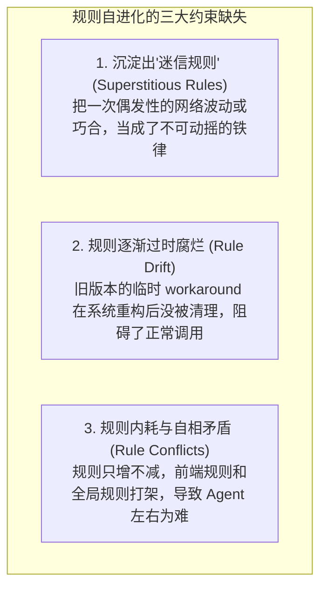
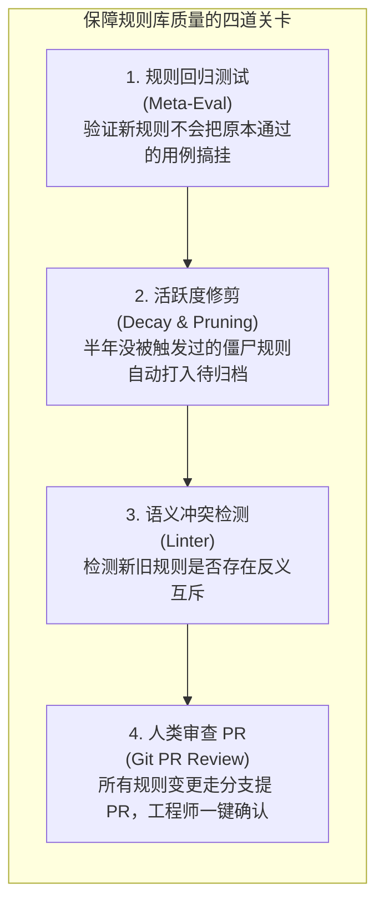

import { Quiz } from '@/components/Quiz'

# 9.4 演进安全与防漂移：迷信规则与经验老化

> 很多团队听了“自进化”觉得很酷，恨不得让 Agent 每天跑完任务后自己往 `.agentrules` 里随便写新规则。但如果不加管控，用不了两个月，项目里的规则库就会彻底变成一团乱麻：有的规则是把偶然的巧合当成了绝对真理（比如某次网络卡顿碰巧加了个参数跑通了，就硬性规定以后每次都要加）；有的规则还停留在两年前的旧框架上，在新版本里不仅没用反而帮倒忙；甚至多条规则互相矛盾打架。自进化必须有约束，否则系统不是越来越聪明，而是越来越神经质。这一节我们聊聊怎么给 Agent 的自进化加一道安全防线。

---

## 1. 缺乏约束的自进化会导致哪些典型毛病？

放任模型自动沉淀经验，最常见的三个问题是：

### 什么是“迷信规则”？
这在程序员日常调试中非常普遍：
* 某次执行 `npm install` 刚好赶上公司内部代理抖动抛错；
* 工程师重试时随手加了一个无关紧要的参数 `npm install --verbose`，恰巧此时网络恢复了，安装顺利跑通；
* 如果 Agent 的总结机制没有逻辑甄别能力，它就会记录一条规则：“*注意：在本项目中安装依赖必须始终加上 `--verbose`，否则一定会超时报错！*”
这条没有任何因果关系的假经验被写进规则库后，不仅污染上下文，还会误导后续每一次依赖安装。

---

## 2. 保证规则库健康的四道工程防线

为了防止规则库越堆越烂，团队在落地自进化时通常会建立四道关卡：

### 核心关卡 1：规则回归测试集（Meta-Eval）
就像修改核心代码要跑单测一样，**修改 `.agentrules` 同样需要跑评测**。
* 仓库里常备 15~20 个典型的历史标准任务（如创建组件、修改配置、运行迁移）；
* 当 Agent 提议新增一条新规则时，评测流水线挂载新规则跑一次基准集；
* 如果新规则导致原本能跑通的任务失败了，说明这条规则太绝对或有副作用，系统自动拒绝采纳。

### 核心关卡 2：规则走 Git PR，由人类工程师把关
绝对不允许 Agent 在无人知晓的情况下直接把规则写入主分支（`main`）。
所有的规则新增与修改，Agent 都必须**新开一个 Git 分支并提交 Pull Request**。工程师在上班喝咖啡时扫一眼 Diff：“这条规则总结得挺准”或者“这是因为刚才网络抖动，不该加为全局规则”，点一下 Approve 或 Reject。把人类专家的常识作为最终的守门员。

---

## 3. 第 9 章总结：如何打造真正有积累的 Agent 系统？

学完这一章，我们可以把 Agent 自适应与自进化的完整图景串起来：
1. **不要总想着重新微调权重（9.1）**：线上业务变化快，重训成本太高。用 Reflexion 语言反思把踩坑教训提取成自然语言，作为上下文外挂给后续任务，见效更快更便宜；
2. **口头提醒无效，必须写入版本管理（9.2）**：会话关闭后临时记忆就丢了。把经验提炼成 `.agentrules`、`AGENTS.md` 或 `skills/` 文件，按目录分层挂载，让整个团队的 Agent 都能继承经验；
3. **高频繁琐操作自己写脚本封装（9.3）**：遇到批量重复任务，引导 Agent 编写独立小工具并在沙箱里跑通单元测试，让长程脆弱探索变成稳定可复用的本地能力；
4. **自进化要防迷信、防老化（9.4）**：必须防范因果混淆产生的迷信规则，配合回归测试与 Git PR 审查机制，让规则库始终保持健康干净。

---

## 4. 自测练习

<Quiz
  question="在 Agent 自进化过程中，什么是'迷信规则（Superstitious Rule）'？"
  options={[
    "Agent 把某次由于偶然巧合（如刚好网络恢复或偶发并发时序）成功的无关操作，错误地当成了完成该任务必须遵守的绝对因果铁律并写入了规则库",
    "指大语言模型在输出代码时自动为变量名添加神秘符号",
    "指所有基于 Transformer 架构的模型在计算浮点数时都会丢失小数点后两位",
    "指开源大模型禁止在宗教节日期间调用工具的特殊现象"
  ]}
  correctIndex={0}
  explanation="迷信规则是典型的'因果混淆'。比如重试某条命令时恰好网络恢复，模型容易把重试时附带的某个无关参数误以为是成功的充要条件，进而沉淀出多余甚至有害的伪规则。"
/>

<Quiz
  question="为什么在企业生产环境中，强烈建议让 Agent 自主沉淀的规则以'Git Pull Request'的形式提交给工程师审查，而不是直接悄悄合入主分支？"
  options={[
    "借助人类工程师的常识和业务判断把关（Human-in-the-loop），防止因果混淆的荒谬规则或过时配置破坏代码库，同时保持清晰的审计记录与回滚能力",
    "因为 GitHub 服务器禁止直接向项目写入 Markdown 格式的文件",
    "为了让大模型在提交 PR 的过程中自动下载最新的显卡驱动",
    "因为没有经过 PR 的规则会导致操作系统的文件锁发生死锁"
  ]}
  correctIndex={0}
  explanation="规则是系统运行的高压线。让 Agent 发挥提炼和归纳的主动性，但把合并确认的控制权留给人类工程师（Human-in-the-loop），是当前最稳健、最符合企业安全规范的做法。"
/>
