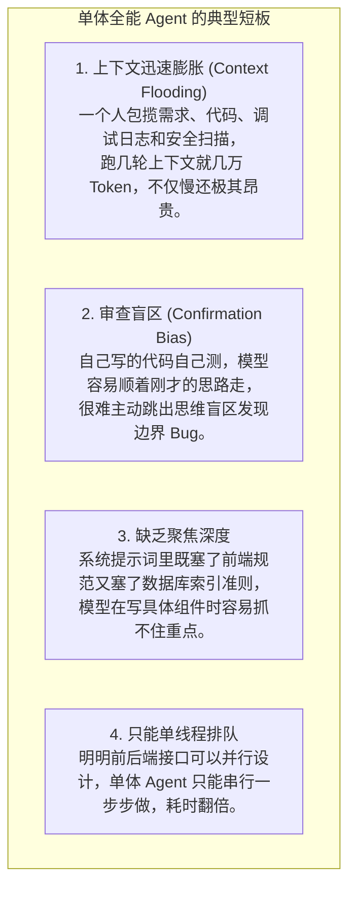
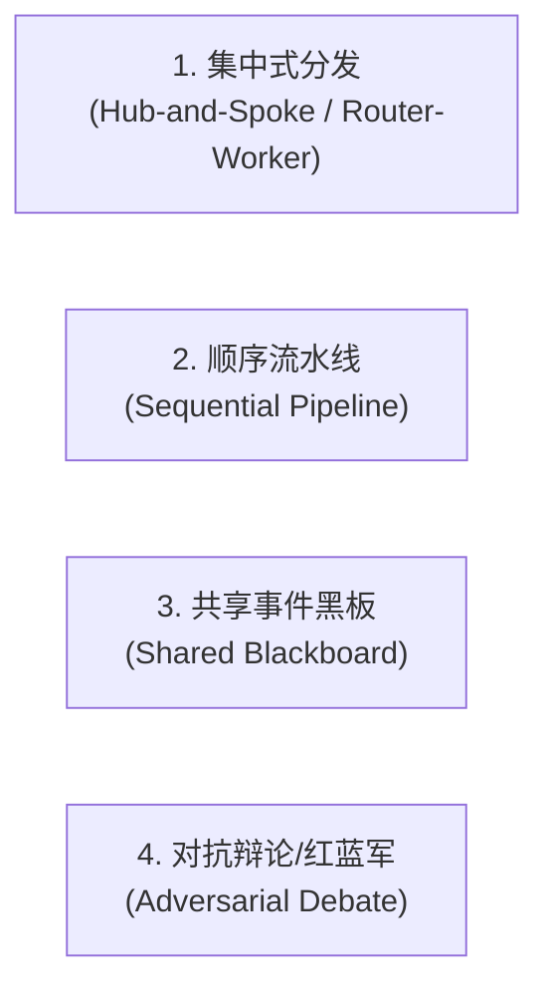
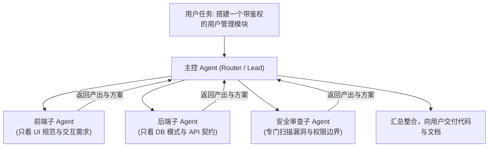

import { Quiz } from '@/components/Quiz'

# 10.1 多智能体通信拓扑：让专职的 Agent 协同干活

> 在实际做复杂项目时，很多人会尝试给一个 Agent 堆很长的提示词，让它“既当全栈工程师、又当安全审计师、还当测试 QA”。但在实际跑起来之后，往往步步维艰：一个 Agent 包揽全部事情，上下文到第 6 轮就彻底被无关日志塞满；更严重的是，自己写的代码自己很难看出逻辑盲区，自审往往形同虚设。解决这个问题的自然思路，就是**团队分工**——让不同的 Agent 各司其职，拥有各自干净独立的上下文，通过特定的通信结构协作。这一节我们聊聊多智能体系统（MAS）的常见通信拓扑与选型依据。

---

## 1. 为什么“单打独斗”的单体 Agent 很难做大任务？

试图靠一个全能的单体 Agent 搞定一个完整的企业级功能，通常会碰壁在以下四个问题上：



**多智能体协作的核心理念是隔离与并行**：把大任务拆成独立职责，每个子 Agent 只拿自己需要的最精简上下文，并发执行，最后交由主控汇总。

---

## 2. 常见的多智能体协同拓扑

根据任务依赖关系和控制权结构，业界常用的多智能体网络结构主要有四种：



### 1. 集中式分发拓扑（Hub-and-Spoke / Router-Worker）
* **工作方式**：一个主控 Agent（Tech Lead）负责全局任务拆解，并发拉起多个轻量的子 Agent（前端、后端、测试）；每个子 Agent 在独立的上下文里干活，干完后把结果回传给主控，由主控汇总验收。
* **最大优势**：**上下文彻底隔离**，子任务之间互不污染，并且天然支持并行。
* **典型场景**：现代代码助手（如 Antigravity / Claude Code 的子任务分发）、复杂系统跨模块重构。



### 2. 顺序流水线拓扑（Sequential Pipeline）
* **工作方式**：类似流水线作业，上游 Agent 的输出直接作为下游 Agent 的输入前缀。比如：`产品经理 Agent (写需求) → 架构师 Agent (出设计) → 程序员 Agent (写代码) → QA Agent (写测试跑用例)`。
* **最佳场景**：标准化 SOP 流水线、固定步骤的自动化发版流程。缺点是下游必须等待上游，整体耗时较长。

### 3. 共享事件黑板拓扑（Shared Blackboard / Event Bus）
* **工作方式**：没有中央管理者，所有 Agent 挂载在同一个共享状态池（Event Bus）上。当状态池出现“新 Issue 创建”事件时，排障 Agent 自发领走；排障完成后在黑板上挂出补丁，测试 Agent 自发监听到并跑自动化测试。
* **最佳场景**：跨系统的异步工作流、大规模仿真模拟环境。

### 4. 对抗辩论与红蓝军（Adversarial Debate / Red-Blue Teaming）
* **工作方式**：让两个 Agent 扮演对立角色。A 负责写方案或代码，B 专门负责找茬挑刺、提攻击向量（比如故意尝试 SQL 注入或并发竞争边界）。
* **最大优势**：**彻底克服大模型的自我盲目自信**。通过专门的“反方视角”，最大化暴露潜在隐患。

---

## 3. 四种拓扑的工程选型权衡

| 架构拓扑 | 控制流确定性 | 并发支持 | Token 开销 | 推荐工程场景 |
| :--- | :--- | :--- | :--- | :--- |
| **集中式分发 (Router-Worker)** | 高（中心调度） | **高（多子 Agent 并行）** | 中等（仅汇总通信） | **开发任务主控分发、复杂调研、模块拆分** |
| **顺序流水线 (Pipeline)** | **极高（单向确定）** | 低（单向串行等待） | 低（单向流转） | **标准 SOP 需求发布、CI/CD 交付流** |
| **共享黑板 (Blackboard)** | 较低（事件驱动涌现） | 极高（事件监听驱动） | 较高（频繁拉取状态） | **虚拟小镇仿真、跨系统异构事件运维** |
| **对抗辩论 (Debate)** | 中等（多轮交锋） | 较低（来回轮流发言） | 较高（多轮争吵） | **关键架构技术选型、高危接口安全代码审计** |

---

## 4. 实战：一个集中式 Router-Workers 调度器 (TypeScript)

在 Node.js 中，我们可以用很简单的并发调用写出一个标准的主从协同模型：

```typescript
// multi-agent-cluster.ts
import { OpenAI } from 'openai';

export interface WorkerResult {
  role: string;
  output: string;
}

export class MultiAgentCluster {
  private client = new OpenAI();

  /**
   * 集中式并发派发与汇总
   */
  async executeComplexProject(taskGoal: string): Promise<string> {
    console.log(`[主控 Agent] 收到任务: "${taskGoal}"，开始并发分发给专业子 Agent...`);

    // 并发拉起两个不同角色的子智能体，上下文完全隔离
    const [frontendResult, backendResult] = await Promise.all([
      this.runWorker(
        'Frontend_Dev',
        '你是一位前端开发专家，请基于需求设计 Next.js 页面结构与交互表单。',
        taskGoal
      ),
      this.runWorker(
        'Backend_Dev',
        '你是一位后端开发专家，请基于需求设计 PostgreSQL 表结构与 REST API 契约。',
        taskGoal
      ),
    ]);

    console.log('[主控 Agent] 子任务全部完成，开始进行最终评审与整合...');

    // 由主控把各方交付物整合为最终一致的实施方案
    return await this.synthesizeResults(taskGoal, [frontendResult, backendResult]);
  }

  private async runWorker(role: string, systemPrompt: string, task: string): Promise<WorkerResult> {
    const res = await this.client.chat.completions.create({
      model: 'gpt-4o-mini',
      messages: [
        { role: 'system', content: systemPrompt },
        { role: 'user', content: task },
      ],
    });
    return { role, output: res.choices[0].message.content || '' };
  }

  private async synthesizeResults(goal: string, results: WorkerResult[]): Promise<string> {
    const prompt = `
项目总体目标: ${goal}

以下是前端与后端工程师分别给出的初步方案：
${results.map((r) => `=== [角色: ${r.role}] ===\n${r.output}`).join('\n\n')}

请作为 Tech Lead 进行统筹，对齐前后端字段命名，解决潜在矛盾，输出统一的工程实现方案。
`;
    const res = await this.client.chat.completions.create({
      model: 'gpt-4o',
      messages: [{ role: 'user', content: prompt }],
    });
    return res.choices[0].message.content || '';
  }
}
```

---

## 5. 自测练习

<Quiz
  question="在进行高危核心代码重构或安全审计时，相比于让单一 Agent 自写自测，引入'对抗辩论/红蓝军（Adversarial Debate）'模式的核心优势是什么？"
  options={[
    "设置天生对立的挑刺角色（一个写代码，一个专门找茬挑漏洞），打破单一模型'自产自销'时的思维定势和盲区，能更高效地挖掘出边界异常和安全死角",
    "让两台服务器互相发送网络包，从而提高机房的整体室温",
    "使模型生成的代码自动免于遵循任何开源协议",
    "因为辩论模式可以在完全不消耗任何 Token 的情况下得出结论"
  ]}
  correctIndex={0}
  explanation="单一模型很容易陷入自我验证的灯下黑——它在写代码时假设了某种条件成立，自己在审查时也会默认接受该假设。引入一个专门负责挑毛病、扮演攻击者的审计 Agent，能有效逼出隐藏的竞态条件和权限漏洞。"
/>

<Quiz
  question="在现代辅助研发工具中，为什么'集中式分发拓扑（Hub-and-Spoke / Router-Worker）'被广泛作为多智能体架构的首选？"
  options={[
    "由主控把控全局目标并将任务切片分发，每个子 Agent 拥有独立干净的上下文且支持并行执行，最后统一由中心汇总，兼顾了可控性、低延迟和上下文隔离",
    "因为集中式拓扑要求所有大模型必须运行在同一台实体计算机的同一核 CPU 上",
    "因为集中式拓扑能够自动替开发者向税务局申报增值税发票",
    "因为集中式拓扑可以保证所有的网络请求在 0 毫秒内瞬间完成"
  ]}
  correctIndex={0}
  explanation="集中式分发架构非常适合软件工程任务：主控把控全局节奏，子 Agent 拿最少的上下文专注干好自己那部分代码，子任务并行跑完后再由主控校验整合，既避免了上下文爆炸，又提升了执行吞吐。"
/>
