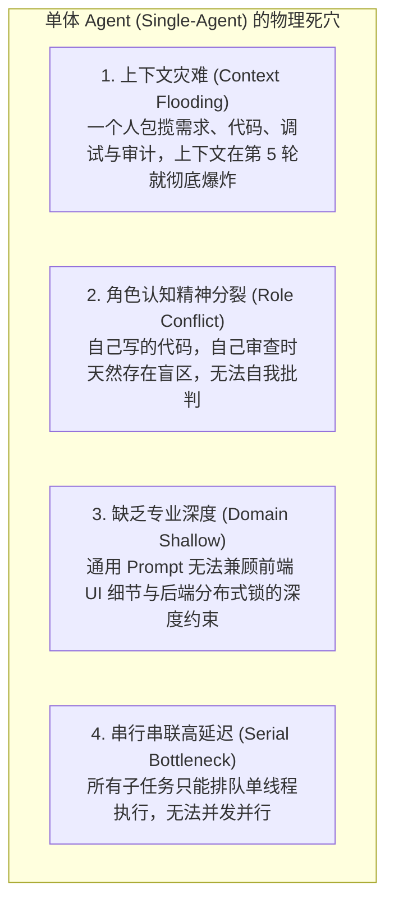
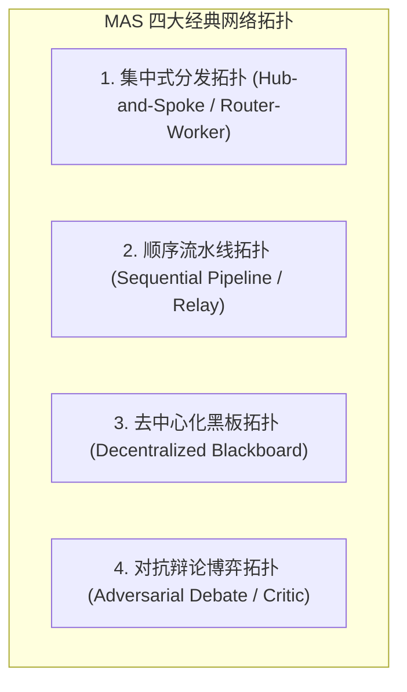
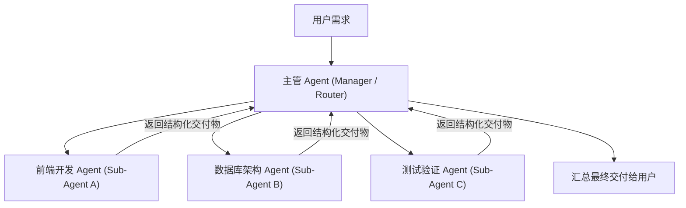

import { Quiz } from '@/components/Quiz'

# 10.1 多智能体通信拓扑与协作范式：集中式、流水线与辩论博弈

> **本节要点**：单打独斗的单体 Agent（Single-Agent）在处理跨领域长程复杂任务时，必然遭遇上下文爆炸与认知过载的物理极限。解密 **多智能体系统（Multi-Agent Systems - MAS）** 的四种经典协同拓扑：**集中式分发（Hub-and-Spoke）、流水线接力（Sequential Pipeline）、黑板协议（Blackboard）与对抗辩论博弈（Adversarial Debate）**；掌握根据任务特征进行拓扑选型的系统工程方法。

---

## 1. 突破单体极限：为什么一个“全能英雄”救不了世界？

在软件工程演化史上，单体巨石应用（Monolith）最终被微服务架构（Microservices）取代；在人类社会中，亚当·斯密的“分工理论”开创了现代工业文明。
AI Agent 的演进完全遵循相同的规律。试图打造一个“既懂前端又懂高并发，既负责写测试又负责找安全漏洞，还能自编自导产品原型”的**全能单体 Agent**，在现实中必然遭遇四大死穴：



**多智能体系统（Multi-Agent Systems - MAS）** 的精髓在于：**将大任务拆解为小工种，每个 Agent 拥有纯净狭窄的专属上下文、专精的提示词角色与专属工具集，彼此通过结构化网络协同运转。**

---

## 2. 四大多智能体协作拓扑全景解密

根据任务的依赖关系与控制流方向，工业界沉淀出了四种经典的多智能体网络拓扑：



### 2.1 集中式分发拓扑 (Hub-and-Spoke / Router-Worker)
*   **架构形态**：由一个核心调度者（Manager / Router）主导全局，动态分析任务并并发分派给多个垂直领域的执行子智能体（Workers），最后汇总收敛；
*   **核心优势**：状态集中受控，不易跑偏，支持多子任务高并发并行；
*   **最佳场景**：复杂调研报告生成、全库多源并发检索、模块化微服务开发。



### 2.2 顺序流水线拓扑 (Sequential Pipeline / Relay)
*   **架构形态**：类似于工业流水线装配车间，上游 Agent 的确定性产出（Artifact）严格作为下游 Agent 的输入前缀；
*   **典型流水线**：`需求澄清 (PM Agent) → 架构设计 (Architect) → 编码实现 (Coder) → 自动化测试 (QA)`；
*   **最佳场景**：标准化 SOP 执行、代码持续集成（CI）交付、合规审批流。

### 2.3 去中心化黑板拓扑 (Decentralized Blackboard)
*   **架构形态**：没有任何中央主管，所有 Agent 共同监听一个全局的**共享状态黑板（Shared Blackboard / Event Bus）**。Agent 根据黑板上当前张贴的状态变更，自发认领属于自己的子任务；
*   **最佳场景**：复杂开放式游戏世界模拟（如斯坦福 Generative Agents 虚拟小镇）、跨系统事件驱动运维。

### 2.4 对抗辩论与红蓝博弈 (Adversarial Debate & Red-Blue Teaming)
*   **架构形态**：引入天生对立的双角色（如 Proposer vs. Reviewer、黑客攻方 vs. 架构防方、正方辩友 vs. 反方辩友）；
*   **认知价值**：**彻底克服大模型的盲目自恋偏见**。在激烈的观点碰撞与事实挑刺中，消除隐藏的系统漏洞与逻辑死角。

---

## 3. 拓扑选型工程决策矩阵

在实际业务架构设计中，必须根据任务特征进行量体裁衣：

| 评估维度 | 集中式 (Hub-and-Spoke) | 流水线 (Pipeline) | 黑板协议 (Blackboard) | 对抗辩论 (Debate) |
| :--- | :--- | :--- | :--- | :--- |
| **控制流可预测性** | 高（中心调度） | **极高（确定性顺序）** | 低（自发涌现） | 中（多轮收敛） |
| **单任务并发度** | **高（多 Worker 并发）** | 低（单向串行） | 极高（事件并发监听） | 低（交替发言） |
| **Token 消耗开销** | 中等（汇总通信） | 低（单向流转） | 较高（广播开销） | 极高（多轮激烈争辩） |
| **推荐适用业务场景** | **研发任务主控分发** | **标准需求发布流水线** | **大规模仿真与多实体交互** | **高危架构决策与安全代码审计** |

---

## 4. 全栈实战：构建集中式 Router-Workers 多智能体集群 (TypeScript)

```typescript
// multi-agent-cluster.ts
import { OpenAI } from 'openai';

export interface WorkerResult {
  role: string;
  output: string;
}

export class MultiAgentCluster {
  private client = new OpenAI();

  /**
   * 集中式并发派发与汇总
   */
  async executeComplexProject(taskGoal: string): Promise<string> {
    console.log(`[Manager Agent] 接收到大型项目需求: "${taskGoal}"，开始并发分派专业子任务...`);

    // 并发启动两个垂直专业子智能体
    const [frontendResult, backendResult] = await Promise.all([
      this.runWorker('Frontend_Dev', '你是一位前端专家，请设计 Next.js 页面结构与交互表单。', taskGoal),
      this.runWorker('Backend_Dev', '你是一位后端专家，请设计 PostgreSQL 表结构与 REST API 规范。', taskGoal),
    ]);

    console.log('[Manager Agent] 各专业子任务已交付，开始执行综合集成审查...');

    // 汇总收敛
    const finalReport = await this.synthesizeResults(taskGoal, [frontendResult, backendResult]);
    return finalReport;
  }

  private async runWorker(role: string, systemPrompt: string, task: string): Promise<WorkerResult> {
    const res = await this.client.chat.completions.create({
      model: 'gpt-4o-mini',
      messages: [
        { role: 'system', content: systemPrompt },
        { role: 'user', content: task },
      ],
    });
    return { role, output: res.choices[0].message.content || '' };
  }

  private async synthesizeResults(goal: string, results: WorkerResult[]): Promise<string> {
    const prompt = `
项目总体目标: ${goal}

以下是下属专业工程师分别交付的子方案：
${results.map((r) => `=== [角色: ${r.role}] ===\n${r.output}`).join('\n\n')}

请作为 Tech Lead 进行全局综合评审，消除前后端接口不一致的矛盾点，输出最终统一的工程实施方案。
`;
    const res = await this.client.chat.completions.create({
      model: 'gpt-4o',
      messages: [{ role: 'user', content: prompt }],
    });
    return res.choices[0].message.content || '';
  }
}
```

---

## 5. 本节练习与反思

<Quiz
  question="在处理大型软件工程重构或复杂安全审计时，相比于使用单个全能 Agent，引入'对抗辩论博弈拓扑（Adversarial Debate / Red-Blue Teaming）'的核心优势是什么？"
  options={[
    "通过建立天生对立的攻防角色（如一名 Agent 负责写代码，另一名专门扮演恶意黑客挑刺），彻底打破单一模型的盲目自信盲区，极大挖掘出深层隐蔽漏洞",
    "因为两台相互争吵的大模型可以让机房的中央空调自动降低能耗",
    "因为辩论模式能够让模型生成的代码自动符合国际著作权法要求",
    "因为辩论模式完全不需要消耗任何互联网带宽"
  ]}
  correctIndex={0}
  explanation="单体模型自编自验往往存在严重的'灯下黑'盲区（自己很难推翻自己刚才设定的前提假设）。引入红蓝对抗，赋予审核者挑刺、找茬的专门动机，能够在激烈交锋中最大化暴露边界异常、竞态条件与安全隐患，大幅提升架构稳健度。"
/>

<Quiz
  question="在多智能体系统（MAS）中，为什么集中式分发拓扑（Hub-and-Spoke / Router-Worker）在现代代码研发辅助平台中被最广泛采用？"
  options={[
    "由中心 Manager 负责全局任务拆解、隔离子 Agent 的上下文窗口并支持并行执行，既能保证任务收敛不失控，又大幅压缩了长任务的端到端耗时",
    "因为集中式拓扑规定所有的子 Agent 必须运行在同一块主板芯片的同一个晶体管上",
    "因为集中式拓扑能够自动让所有的子 Agent 成为拥有人类法律身份的合法注册公司",
    "因为该拓扑能够让计算机在完全断网的情况下访问全球所有云端服务器"
  ]}
  correctIndex={0}
  explanation="集中式拓扑提供了极佳的可控性与并行度。中心主管把控全局目标，将子任务切块分发给轻量子 Agent。每个子 Agent 拥有干净独立的上下文，不受其他模块无关细节干扰，最后由中心汇总验卷，兼顾了秩序、效率与专业度。"
/>
