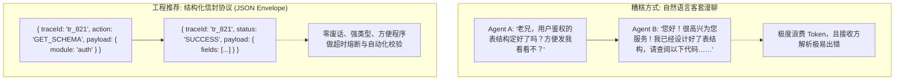
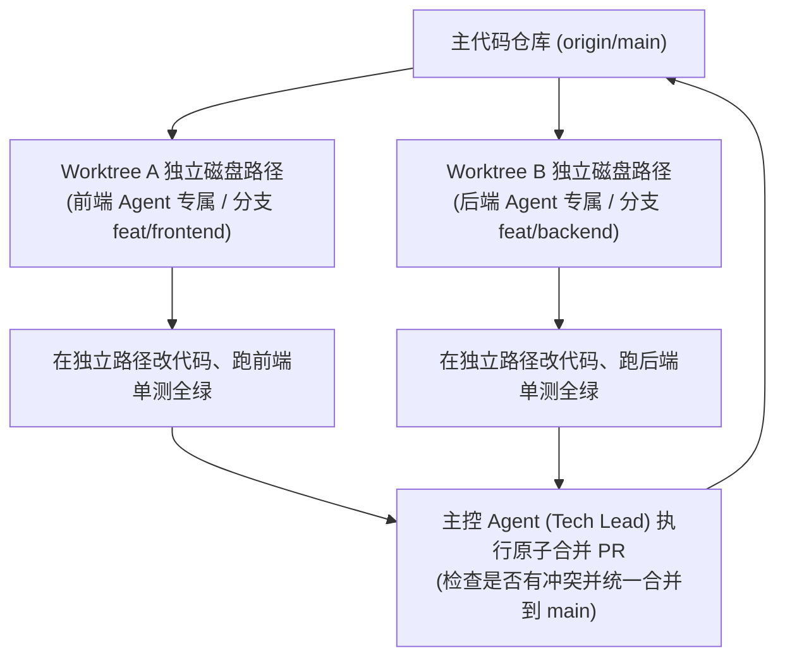

import { Quiz } from '@/components/Quiz'

# 10.2 智能体间通信与死锁防范：结构化协议与工作区隔离

> 如果你在系统里拉起了几个 Agent，直接让它们用纯自然语言互发消息，很快就会遇到两个让人哭笑不得的问题：第一，它们会把大量 Token 浪费在无用的客套寒暄上（“收到亲爱的朋友，很高兴为您效劳，接下来我将……”）；第二，如果两个 Agent 同时在同一个本地文件夹里改同一个文件，后写的会直接把先写的覆盖掉，甚至把正在运行的进程搞崩。智能体多了之后，本质上就是一个微型的分布式系统。这一节我们聊聊怎么用**结构化信封协议**规范通信，以及如何用 **Git Worktree** 隔离文件工作区避免冲突和死锁。

---

## 1. 别让 Agent 用自然语言互相唠嗑：结构化信封协议

很多初学者做多智能体系统，喜欢直接把 Agent A 的自然语言回复作为输入扔给 Agent B。
这种做法在工程上有三个硬伤：
1. **废话太多，白白烧 Token**：对话里充斥着“好的、没问题、感谢告知”等客套话，转手两轮几千 Token 就没了；
2. **状态无法严格机读**：接收方很难用代码断言对方到底有没有完成任务，只能靠大模型再去猜文本含义；
3. **缺少调用上下文**：没有唯一的调用 ID（Request ID），异步回调和超时排查根本无从查起。

在严肃的工程系统里，Agent 之间的通信（A2A: Agent-to-Agent）必须使用**强类型的结构化数据包（信封协议）**：



### 标准信封协议包含的核心字段
* `traceId`：全链路根跟踪 ID，串联起一次长任务里的所有子调用；
* `sender` 与 `recipient`：发送方与接收方的唯一标识符；
* `type`：请求（`REQUEST`）、响应（`RESPONSE`）或单向通知（`EVENT`）；
* `payload`：严格符合 JSON Schema 契约的具体业务数据；
* `timeoutMs`：本次调用的硬超时时间（如 30000ms），到期未返回立即触发熔断。

```typescript
export interface A2AMessageEnvelope<T = any> {
  messageId: string;
  traceId: string;
  sender: string;
  recipient: string;
  type: 'REQUEST' | 'RESPONSE' | 'EVENT';
  action: string;
  payload: T;
  timeoutMs: number;
}
```

---

## 2. 避免代码踩踏：Git Worktree 工作区物理隔离

当前端 Agent 和后端 Agent 同时在本地干活时，最怕两个智能体并发修改同一个文件（比如 `src/routes.ts`）：
* 前端 Agent 刚改完第 30 行路由；
* 后端 Agent 紧接着格式化了整个文件，直接把前端改好的代码覆盖了；
* 结果谁的单测都跑不通，两人在报错里互相“打架”。

解决这个问题的最佳工程实践是**利用 Git 的 Worktree（工作树）做目录隔离**：



### Worktree 隔离的好处
1. **零文件锁冲突**：两个 Agent 跑在操作系统的不同目录，互不抢占文件句柄；
2. **依赖互不污染**：前端装 npm 包不会冲掉后端的临时依赖环境；
3. **原子性提交**：各自在分支上跑通单测后，再由主控或者开发者合并，把冲突收敛到标准的 Git Merge 流程中。

---

## 3. 防范死锁与重试风暴

多智能体只要引入了相互调用，就必须面对分布式系统的老毛病：

### 1. 循环等待导致死锁（Deadlock）
* **场景**：Agent A 在等 Agent B 返回数据模型定义才肯往下写，而 Agent B 又在等 Agent A 确定 API 路径。两个模型都在后台挂起等待，系统永久卡死。
* **解法**：调度器维护全局调用拓扑图，检查是否存在环路依赖；同时**所有跨 Agent 请求必须强制设定超时时间（比如 30 秒）**，一旦超时立刻中断报错，打破死等循环。

### 2. 级联重试风暴（Retry Storm）
* **场景**：某个底层的数据库工具因为网络波动挂了，10 个子 Agent 同时每隔 1 秒死板重试，汹涌的并发流量瞬间把刚有起色的后端彻底打崩。
* **解法**：强制使用**带随机抖动的指数退避（Exponential Backoff with Full Jitter）**，让每次重试的时间随机错开，避免洪峰聚集。

---

## 4. 自测练习

<Quiz
  question="多智能体并发开发同一个代码项目时，为什么强烈建议为每个子 Agent 分配一个独立的 Git Worktree 目录，而不是共用一个物理文件夹？"
  options={[
    "为每个 Agent 提供独立的磁盘工作路径和专属分支，彻底避免了同时修改同一文件导致的代码相互覆盖与文件锁争用，确保各自测试的独立性",
    "因为 Git Worktree 可以将项目所有代码自动转换为免版权的公共领域资源",
    "因为现代操作系统的文件夹一次只能被一个程序打开，否则会抛出硬件故障",
    "为了强制每个 Agent 每天必须多向代码仓库提交 100 次空变更"
  ]}
  correctIndex={0}
  explanation="在同一个物理文件夹里并发写入必然导致脏写冲突。Git Worktree 让每个 Agent 在独立的磁盘目录下修改和运行单测，最后通过标准的分支合并流程统一解决冲突，是保证多智能体并发编码安全的最成熟做法。"
/>

<Quiz
  question="在多智能体系统（MAS）中，为了防止两个 Agent 相互等待对方交付产出从而导致系统永久卡死（死锁），最基础、最关键的防护手段是什么？"
  options={[
    "对所有跨 Agent 的消息请求设置强制性的硬超时时间（Timeout），并配合依赖拓扑环路检测，超时后立即中断并报错熔断",
    "禁止任何 Agent 之间进行任何形式的数据通信",
    "在系统死锁时，要求用户手动重启物理计算机的电源",
    "将所有 Agent 的响应内容限制在 5 个字符以内"
  ]}
  correctIndex={0}
  explanation="防范死锁的黄金法则是破除无限等待。为每一次跨 Agent 调用设置明确的超时阈值（如 30 秒硬中断），并在调度层检查依赖图是否存在环路，能从根本上避免系统因相互依赖而永久挂起。"
/>
