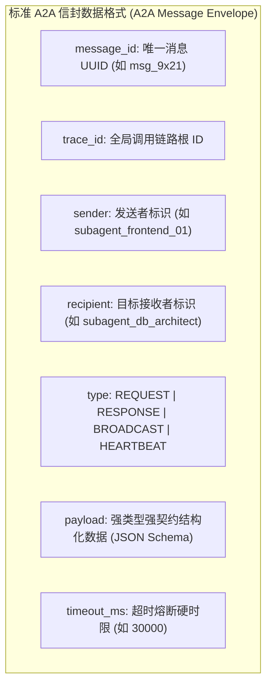
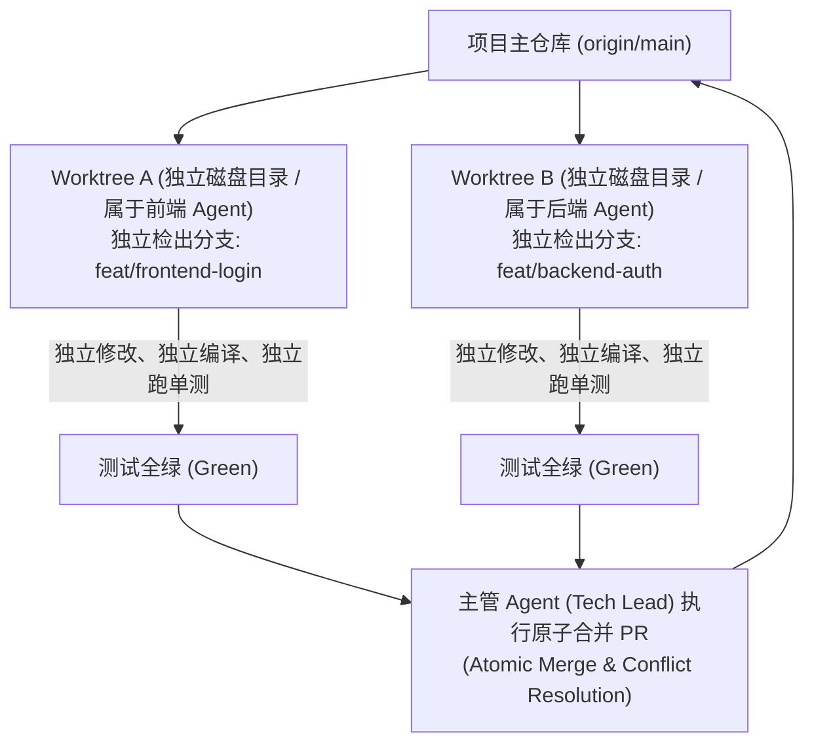
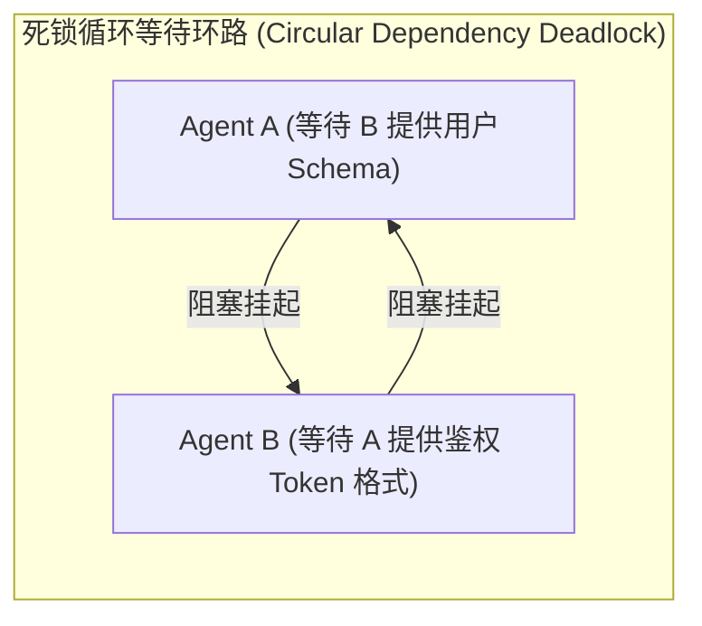

import { Quiz } from '@/components/Quiz'

# 10.2 A2A 通信协议与死锁防范：结构化总线与工作区隔离

> **本节要点**：当系统中有数十个智能体协同运转时，如何防止它们像菜市场吵架一样陷入混沌？掌握面向机器高内聚的 **A2A（Agent-to-Agent）结构化信封通信协议**；解决多智能体并发写代码时的资源竞争难题——**Git Worktree 物理工作区隔离范式**；攻克分布式系统经典的 **死锁（Deadlock）** 与 **级联重试风暴（Retry Storms）**。

---

## 1. 告别菜市场式喧嚣：A2A 结构化信封协议

许多初级多智能体开源库在通信设计上极其简陋：
* 让智能体 A 生成一段自然语言聊天文本，直接塞进智能体 B 的对话记录中；
* 智能体 B 又回了一大堆客套话：“*收到，亲爱的 A，我已经明白你的意思了，接下来我认为……*”。

这种**纯自然语言唠嗑通信**存在致命缺陷：
1. **Token 极大浪费**：对话充斥客套寒暄与冗余格式，几次交谈就挤爆窗口；
2. **机器无法可靠解析**：智能体 A 无法断言智能体 B 是否真正完成了某项确定性动作；
3. **缺乏状态追踪**：无法区分一条消息究竟是“异步通知”、“同步阻塞调用”还是“紧急广播”。

现代成熟的工业级 MAS 均采用 **结构化信封协议（Structured Envelope Protocol）**：



```typescript
export interface A2AMessageEnvelope<T = any> {
  messageId: string;
  traceId: string;
  sender: string;
  recipient: string;
  type: 'REQUEST' | 'RESPONSE' | 'BROADCAST';
  action: string;
  payload: T;
  requiresAck: boolean;
  timeoutMs: number;
}
```

---

## 2. 状态隔离：Git Worktree 并发工作区实践

在多智能体协同编写复杂代码库时，一个最常发生的灾难就是**文件写入竞争（File Write Collisions）**：
* 前端 Agent 正在修改 `src/App.tsx` 第 20 行；
* 样式 Agent 同时对 `src/App.tsx` 执行了格式化重写；
* 两者互相覆盖，导致代码库瞬间沦为不可运行的损坏状态。

生产级系统采用源自 Git 的 **工作树隔离范式（Git Worktree Isolation）**：



### Worktree 隔离的核心优势：
*   **零文件锁竞争**：各个 Agent 在操作系统中拥有完全独立的磁盘工作路径，互不干扰；
*   **环境互不污染**：前端 Agent 安装的特定临时 npm 包绝不会影响后端的依赖环境；
*   **原子性合入保障**：只有当分支上的所有自动化测试全部通过后，才允许向主分支合并。

---

## 3. 规避死锁与级联重试风暴

当多智能体存在相互等待与调用时，分布式系统经典的故障必然出现：



### 3.1 死锁消除：有向无环图（DAG）拓扑检测
*   调度器在派发子任务时，严格维持一个全局调用依赖图（Dependency Graph）；
*   任何 A2A 依赖注册前，执行 **Tarjan 强连通分量算法或拓扑排序检测**；
*   一旦检测到环路，立即拒绝挂起，并主动抛出异常强制解除死锁。

### 3.2 级联重试风暴防范 (Retry Storms)
当底层某一个数据库服务偶发超时挂死：
* 如果 10 个子 Agent 同时以固定 1 秒间隔死板重试，产生的网络并发洪峰会瞬间彻底击穿已经脆弱的后端服务；
* **工业级准则**：强制采用 **带随机抖动的全随机指数退避（Exponential Backoff with Full Jitter）**，配合全局熔断器（Circuit Breaker），在检测到连续 3 次失败后立即熔断降级。

```text
重试等待间隔计算：
Wait_Time = Random(0, Min(Max_Backoff, Base_Backoff * 2^attempt))
```

---

## 4. 本节练习与反思

<Quiz
  question="在多智能体并发协同开发同一个大型代码仓库时，为什么强烈推荐使用'Git Worktree 工作树独立隔离'架构，而不是所有 Agent 在同一个物理文件夹内直接编辑？"
  options={[
    "为每个 Agent 分配独立的物理磁盘工作目录和专属分支，彻底避免了同时修改同一文件导致的代码相互覆盖与文件锁竞争，保证了测试验证的独立原子性",
    "因为 Git Worktree 能够把所有的代码文件压缩为原体积的千分之一",
    "因为一个文件夹在被两个人同时打开时会导致操作系统的屏幕发生闪烁",
    "为了让每一个 Agent 每天必须多向 GitHub 缴纳一份企业用户订阅费"
  ]}
  correctIndex={0}
  explanation="状态隔离是并发工程的铁律。在单目录中并发编辑必然导致脏写、文件锁冲突以及未通过编译的代码相互破坏。Worktree 让每个智能体在自己的干净副本中完成开发与测试，最终通过标准化 PR 机制合并，从根本上杜绝了环境竞争事故。"
/>

<Quiz
  question="在多智能体系统中，当多个 Agent 之间发起相互依赖调用时，如何从架构层面有效防范'循环依赖死锁（Deadlock）'导致系统永久挂起？"
  options={[
    "在消息调度中心维护全局依赖有向图，实时检测环路并拒绝循环等待，同时对所有 A2A 消息调用设置硬性超时熔断阈值",
    "强制要求所有的 Agent 必须按照名字的拼音字母升序排队，每天只允许一个人说话",
    "在发生卡死时，由运维人员每天手动重启机房的总电源开关",
    "取消所有 Agent 之间的通信能力，让它们完全不知道彼此的存在"
  ]}
  correctIndex={0}
  explanation="死锁的核心成因在于循环等待与无限期阻塞。通过图算法静态/动态排查环路依赖，并为所有的跨 Agent 请求配置必须遵守的硬超时时间（如 30 秒超时强杀熔断），是保证分布式智能体集群稳健运转的基础保障。"
/>
