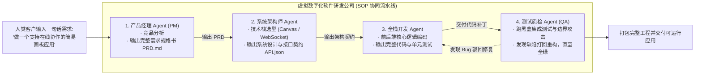

import { Quiz } from '@/components/Quiz'

# 10.3 数字化软件组织镜像：MetaGPT、ChatDev 与康威定律

> **本节要点**：为什么现代多智能体系统的最佳落地载体，是精准模拟人类的“数字化虚拟软件公司”？深度拆解 **MetaGPT** 与 **ChatDev** 的角色分工与 SOP 运转机制；揭示 **康威定律（Conway's Law）** 与 **人月神话（Brooks' Law）** 在 AI 时代的数学重现；用 TypeScript 亲手搭建一个具备 PM、架构师、全栈工程师与 QA 的虚拟敏捷研发班组。

---

## 1. 虚拟软件公司：复杂工程协同的最佳隐喻

为什么绝大多数开创性的多智能体框架（如 MetaGPT、ChatDev、CrewAI）都不约而同地选择“软件开发团队”作为核心模拟场景？
这是因为：**软件工程是人类历史上分工最严谨、交付物契约最清晰、可检验性最高的智力协作形态！**

*   每个角色都有几十年行业沉淀的标准交付规范（PRD、架构图、OpenAPI 契约、单元测试报告）；
*   角色之间的交接具备物理确定性（一个步骤的产出物直接作为下一个步骤的严格输入）；
*   任何模糊不清的自然语言推诿，最终都必须在编译期与单元测试面前无所遁形。



---

## 2. 康威定律与人月神话在 AI 时代的重现

当我们用多智能体构建系统时，传统的软件工程社会学规律被惊人地完美复现：

### 2.1 康威定律（Conway's Law）
> *“系统设计受制于产生这些设计的组织的沟通结构。”*

在 AI Agent 架构中同样如此：
* 如果你设计了 3 个相互独立的 Agent 分别负责“用户认证”、“订单交易”和“物流追踪”，系统自然而然会产出 3 个松耦合、通过 RESTful 通信的微服务；
* **Agent 团队的通信拓扑，直接决定了最终生成软件的物理架构！**

### 2.2 人月神话（Brooks' Law）与通信爆炸
初学者常常陷入误区：“既然 3 个 Agent 能开发小软件，那我在系统里放 100 个 Agent，岂不是能瞬间开发出 Windows 操作系统？”
现实是：**盲目堆砌 Agent 数量会导致系统陷入严重的协调瘫痪！**

```text
通信链路复杂度公式：
C = N * (N - 1) / 2
```

当 $N = 100$ 时，点对点潜在通信通道达到近 **5000 条**！
智能体之间将整天忙于交换状态、同步信封、解决意见分歧，**99% 的 Token 都在用于沟通内耗，实际业务代码产出反而断崖式下跌**。
因此，工业级 MAS 的最佳团队规模通常严格控制在 **3 ~ 7 个专精角色**。

---

## 3. 全栈实战：构建虚拟软件研发敏捷冲刺流水线 (TypeScript)

```typescript
// virtual-software-sprint.ts
import { OpenAI } from 'openai';

export class VirtualSoftwareCompany {
  private client = new OpenAI();

  /**
   * 敏捷冲刺：从一句话需求到全绿交付
   */
  async runAgileSprint(userIdea: string): Promise<string> {
    console.log('🚀 [Sprint] 启动虚拟研发团队冲刺，原始意图:', userIdea);

    // 步骤 1: 产品经理编写 PRD
    console.log('📋 [PM Agent] 正在撰写需求规格书 PRD...');
    const prd = await this.askRole(
      '你是一位资深产品经理。请将用户的创意扩充为一份结构严密的 PRD，包含：核心用户故事、功能清单与非功能约束。',
      userIdea
    );

    // 步骤 2: 架构师根据 PRD 输出技术规范
    console.log('🏛️ [Architect Agent] 正在进行架构选型与接口定义...');
    const techSpec = await this.askRole(
      '你是一位主任系统架构师。请根据下述 PRD 设计系统技术栈、数据模型与前后端 REST API 契约：\n' + prd,
      '请输出架构设计文档。'
    );

    // 步骤 3: 工程师根据技术规范编码实现
    console.log('💻 [Engineer Agent] 正在根据架构契约执行代码编写...');
    const codeArtifact = await this.askRole(
      '你是一位资深全栈工程师。请根据如下架构设计，产出核心功能代码及配套的单元测试用例：\n' + techSpec,
      '请输出完整实现。'
    );

    // 步骤 4: QA 审计验卷
    console.log('🔍 [QA Agent] 正在对交付代码执行综合审计与边界检验...');
    const qaReport = await this.askRole(
      '你是一位极其严苛的 QA 质检专家。请审查如下代码与测试是否存在边界缺陷或安全隐患：\n' + codeArtifact,
      '请给出验收评估结论。'
    );

    console.log('🎉 [Sprint] 冲刺顺利结束，全流程交付物已归档完成！');
    return `=== 最终冲刺交付汇总 ===\n\n【PRD 需求】:\n${prd}\n\n【技术架构】:\n${techSpec}\n\n【QA 验收】:\n${qaReport}`;
  }

  private async askRole(roleInstruction: string, input: string): Promise<string> {
    const res = await this.client.chat.completions.create({
      model: 'gpt-4o-mini',
      messages: [
        { role: 'system', content: roleInstruction },
        { role: 'user', content: input },
      ],
    });
    return res.choices[0].message.content || '';
  }
}
```

---

## 4. 本节练习与反思

<Quiz
  question="为什么以 MetaGPT、ChatDev 为代表的数字化软件组织在多智能体协作中取得了极高成功率？"
  options={[
    "软件工程领域具备高度成熟的角色分工与严密的结构化中间交付物契约（PRD、架构图、API规范、单元测试），极大降低了智能体之间的自然语言理解歧义",
    "因为写软件是世界上最简单的工作，完全不需要任何长程逻辑思考",
    "因为所有的编程语言代码都是由大模型公司官方免费提供的",
    "因为软件工程师不需要吃饭睡觉，所以在计算机中运行最容易"
  ]}
  correctIndex={0}
  explanation="多智能体协作最怕的是'模糊'。软件工程历经几十年发展，沉淀了人类知识界最规范的 SOP 和契约表达（如用 OpenAPI 规范定义接口，用单元测试定义真理）。这种高信息密度的强契约，为多智能体无歧义流转提供了天然的数字轨道。"
/>

<Quiz
  question="在设计多智能体系统时，根据人月神话（Brooks' Law）与通信网络复杂度，为什么盲目扩大 Agent 数量（如一次性拉入 100 个 Agent）往往会导致系统效率不升反降？"
  options={[
    "Agent 之间的潜在通信与协调通道随节点数呈二次方级爆炸（N*(N-1)/2），导致巨量 Token 和时间被消耗在内部意见同步与沟通内耗中，反而降低了核心生产力",
    "因为现代操作系统的键盘最多只能同时识别 3 个 Agent 的打字操作",
    "因为大语言模型只要同时连接超过 10 台计算机就会发生物理短路",
    "因为国际电信联盟对单个软件内部的虚拟角色数量有严格的法律配额限制"
  ]}
  correctIndex={0}
  explanation="沟通成本是分布式系统的核心开销。当 Agent 数量过多时，彼此之间的信息同步、状态仲裁与冲突消除的开销将迅速超过分工带来的收益（通信爆炸）。工业级最佳实践是保持精简的高内聚小班组（通常 3~7 个专精角色）。"
/>
