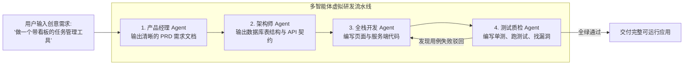
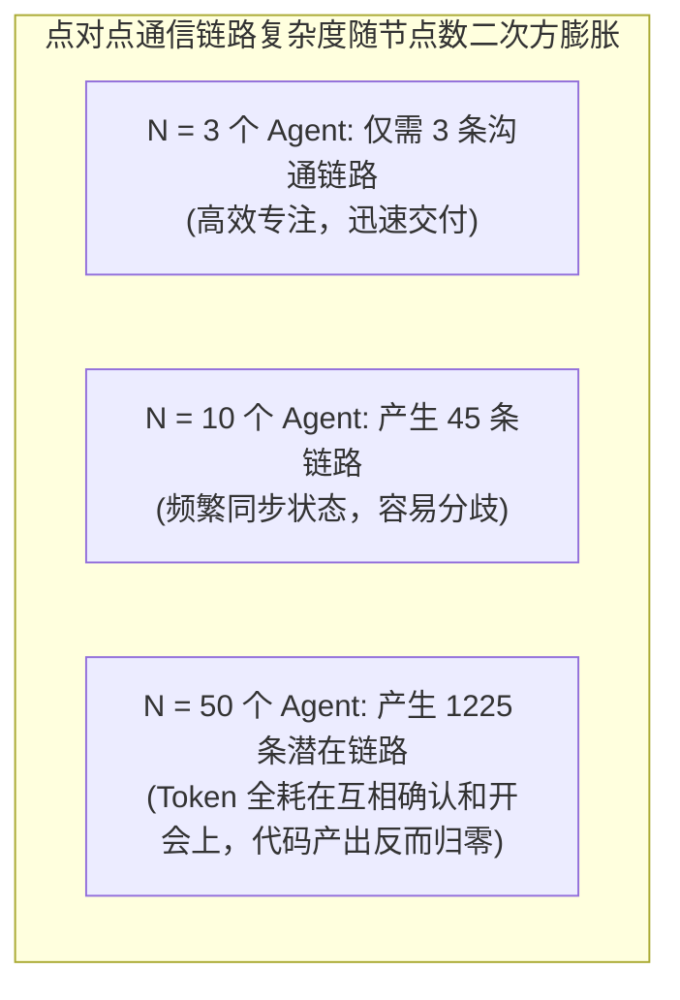

import { Quiz } from '@/components/Quiz'

# 10.3 软件研发团队模拟：MetaGPT、ChatDev 与敏捷分工

> 为什么开源社区里绝大多数多智能体协作项目（比如 MetaGPT、ChatDev），都喜欢用“模拟一家软件开发公司”来做范例？为什么不模拟一所大学或者一家广告公司？原因很简单：软件工程是所有智力协作里**交付物标准最清晰、客观检验最方便**的领域。产品经理写 PRD、架构师画接口定义、程序员写代码、测试跑单测——每一步都有标准的文件格式，代码对不对跑一次测试就知道，根本不用靠主观猜测。这一节我们聊聊如何用多智能体模拟一套敏捷研发流程，以及为什么 Agent 绝对不是越多越好。

---

## 1. 为什么“软件公司”是多智能体最理想的落地场景？

多智能体协作最怕的是“沟通模糊”与“无法验卷”。软件开发恰好完美避开了这两个雷区：



1. **每一步都有明确的标准中间产物**：上游产出的 OpenAPI 文档，下游程序员可以直接作为输入引用，减少自然语言沟通误差；
2. **测试是客观的裁判**：不管是哪个 Agent 写的代码，只要在终端里执行 `npm test` 返回 `exit code 0`，就代表通过了第一道门槛，不用靠评委打分。

---

## 2. Agent 绝对不是越多越好：人月神话与通信开销

很多人刚接触多智能体时容易陷入一个误区：“既然 3 个 Agent 能写小应用，那我拉 100 个 Agent 进来，是不是一天就能把整套电商系统做出来？”

现实往往恰恰相反：**Agent 数量一多，系统很容易陷入沟通瘫痪。**



如果每个 Agent 都能给其他 Agent 广播消息，沟通渠道的数量是 $N(N-1)/2$：
* 当 $N = 50$ 时，潜在的沟通链路多达 **1225 条**；
* 系统的 Token 绝大部分都会浪费在“确认收到”、“同步进展”、“解决分歧”上，真正的生产力反而断崖式下跌。

在实际工程中，团队规模通常严格控制在 **3 到 5 个专精角色**（例如：主管主控、前端、后端、测试），职责边界切得越清晰，系统运转越高效。

---

## 3. 实战：一个简易的敏捷研发冲刺工作流 (TypeScript)

在 Node.js 中，我们可以通过链式编排把 PRD、架构定义、编码与测试审查串起来：

```typescript
// virtual-dev-sprint.ts
import { OpenAI } from 'openai';

export class VirtualDevSprint {
  private client = new OpenAI();

  /**
   * 敏捷冲刺：从一句话需求到代码交付
   */
  async runSprint(userIdea: string): Promise<string> {
    console.log('🚀 [Sprint] 开始处理新需求:', userIdea);

    // 1. 产品经理写需求规格
    console.log('📋 [PM Agent] 正在撰写需求规范 (PRD)...');
    const prd = await this.callRole(
      '你是一位资深产品经理。请将用户的创意拆解为结构清晰的 PRD，包含：核心功能清单与边界约束。',
      userIdea
    );

    // 2. 架构师设计 API 契约
    console.log('🏛️ [Architect Agent] 正在设计数据表结构与 API 契约...');
    const techSpec = await this.callRole(
      '你是一位架构师。请根据以下 PRD 设计技术栈、数据表结构及 REST API 接口契约：\n' + prd,
      '请输出技术设计文档。'
    );

    // 3. 工程师编写代码
    console.log('💻 [Engineer Agent] 正在编写核心代码与单元测试...');
    const code = await this.callRole(
      '你是一位资深工程师。请严格根据上述架构契约，产出核心功能代码及对应的测试用例：\n' + techSpec,
      '请输出完整实现。'
    );

    // 4. QA 审查并提漏洞
    console.log('🔍 [QA Agent] 正在进行代码审查与边界测试...');
    const qaReview = await this.callRole(
      '你是一位严格的 QA 工程师。请审查以下代码是否存在边界条件遗漏或逻辑缺陷：\n' + code,
      '请给出审查意见。'
    );

    console.log('🎉 [Sprint] 敏捷冲刺完成，交付物已生成！');
    return `=== 研发冲刺交付成果 ===\n\n【PRD 需求】:\n${prd}\n\n【技术设计】:\n${techSpec}\n\n【代码实现】:\n${code}\n\n【QA 审查结论】:\n${qaReview}`;
  }

  private async callRole(systemPrompt: string, userContent: string): Promise<string> {
    const res = await this.client.chat.completions.create({
      model: 'gpt-4o-mini',
      messages: [
        { role: 'system', content: systemPrompt },
        { role: 'user', content: userContent },
      ],
    });
    return res.choices[0].message.content || '';
  }
}
```

---

## 4. 自测练习

<Quiz
  question="为什么 MetaGPT、ChatDev 等多智能体框架在模拟'软件开发团队'时效果尤为显著？"
  options={[
    "软件工程具备成熟的角色分工和强契约的中间产物（PRD 文档、OpenAPI 契约、单元测试），极大降低了智能体之间的自然语言歧义，且代码正确性可以用测试用例客观验证",
    "因为写代码是所有脑力劳动里最简单、最不需要严谨推理的工作",
    "因为所有的编程语言官方都内置了大模型专用的通信端口",
    "因为软件开发不需要人类参与，可以直接由大模型全自动永久接管"
  ]}
  correctIndex={0}
  explanation="多智能体协作最怕模糊推诿。软件工程历经几十年沉淀，拥有全行业最规范的标准化交付物（如 JSON Schema 接口定义、Markdown 需求书）以及可通过沙箱自动运行验证的单元测试，为 Agent 之间的无歧义协作提供了天然的底座。"
/>

<Quiz
  question="在设计多智能体系统时，为什么盲目增加 Agent 数量（比如一次性拉入数十个 Agent 互相自由通信）往往会导致效率暴跌？"
  options={[
    "点对点通信链路的潜在复杂度随节点数呈二次方激增（N*(N-1)/2），会导致绝大多数 Token 和算力都浪费在互相同步、确认和打架上，真正的业务产出反而受阻",
    "因为操作系统的屏幕无法同时容纳超过 5 个虚拟头像",
    "因为大语言模型在节点数超过 10 个时会自动触发硬件降频保护",
    "因为各大云厂商的 API 协议规定同一个 IP 每天只能发起最多 10 次多智能体调用"
  ]}
  correctIndex={0}
  explanation="人月神话在 AI 时代依然成立。自由通信的多智能体系统，沟通开销会随着节点数平方级爆炸。工业界落地时更倾向于维持 3 到 5 个边界清晰的专精小班组，配合主控统筹，以保证低沟通内耗与高执行力。"
/>
