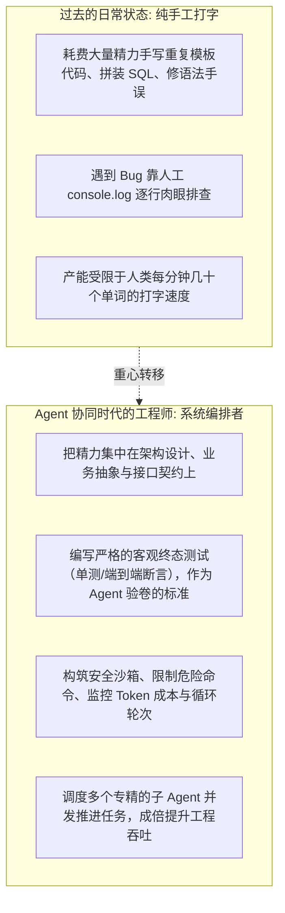
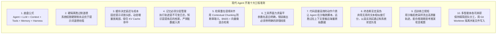

import { Quiz } from '@/components/Quiz'

# 10.4 全书总结与工程心法：从打字员到智能体编排者

> 学完这整套课程，很多人会思考一个最直接的问题：有了能写代码、能排障、能自己调工具的 Agent，作为程序员的我们，工作重心到底会发生什么改变？过去我们大部分时间花在手写重复的 CRUD 模板、查漏掉的分号、以及调琐碎的 CSS 样式上。而在 Agent 深度协同的时代，工程师的核心价值正在转向**“系统编排”**：定义清晰的验收标准（测试用例）、搭好隔离安全的执行沙箱、设计低噪音的上下文与工具界面、并在后台做好死锁与成本监控。这一节我们梳理贯穿全书的十大工程认知，给这场 Agent 深度之旅做一个扎实的收尾。

---

## 1. 工程师角色的转变：从手写每一行到搭建系统闭环

未来的技术竞争力，不再看谁能更快背出某个冷门 API 的入参顺序，而是看**谁能给概率模型设计出更可靠的执行环境、更精准的反馈闭环，以及更稳固的安全底线**。

---

## 2. 全书贯穿的十大 Agent 工程法则

回顾前面十章的内容，我们可以把核心的工程认知提炼为十条准则：

---

## 3. 重温《苦涩的教训》：相信通用计算与环境反馈

全书第一章我们提到了强化学习学者 Rich Sutton 著名的《苦涩的教训》（The Bitter Lesson）：
> “AI 领域过去 70 年最深刻的教训是：试图把人类专家的直觉和细则硬编码进系统的做法，最终都会被利用通用计算力（搜索与大规模学习）的方法所超越。”

做 Agent 工程同样如此：
* **不要试图写几百条复杂的正则表达式去死抠 Agent 的每一个中间字句**；
* **花精力去建一个带超时和隔离的 Docker 沙箱、写一套覆盖全面的自动化测试用例、把好安全底线，然后让模型在真实的执行反馈中去试错、推理、修正并跑通任务。**

把“规则的死板控制”让位于“环境的客观反馈”，是构建真正具备实战抗挫力 Agent 的核心心法。

---

## 4. 自测练习

<Quiz
  question="在深入理解 Agent 工程体系后，一名成熟的'智能体编排工程师（Agent Orchestrator）'应该将主要精力聚焦在什么地方？"
  options={[
    "搭建客观可靠的沙箱执行环境、设计严谨的自动化终态断言、配置安全熔断缰绳，并构建能给模型提供准确排障线索的反馈闭环",
    "每天纯手工在记事本中为模型预先写好几万个 if-else 逻辑分支",
    "强制要求大模型每次调用工具前背诵一遍操作系统的用户手册",
    "试图手动修改每一个显卡晶体管的物理排列方式"
  ]}
  correctIndex={0}
  explanation="编排者的核心职责是'搭跑道、立规则、定判决'。人类不再需要逐行手写每一个实现细节，而是为 Agent 打造具备可自愈、可验证的系统闭环，利用环境真实的运行反馈驱动模型自主达成复杂的工程交付。"
/>

<Quiz
  question="Rich Sutton 提出的《苦涩的教训（The Bitter Lesson）》给现代 Agent 架构设计带来的最核心启示是什么？"
  options={[
    "依赖通用计算（搜索推演与反馈学习）的方法长期来看远胜于手工堆砌的死板规则；工程师应重点构建可利用算力和环境客观反馈的工程基础设施",
    "因为计算硬件成本高昂，所以程序员应该放弃所有的代码版本控制工具",
    "只有用浓缩黑咖啡泼洒服务器机箱才能提高深度学习模型的智商",
    "人类应该彻底停止所有软件开发工作并退回到机械打字机时代"
  ]}
  correctIndex={0}
  explanation="试图通过穷举人类专家的直觉规则去硬控模型，往往既脆弱又难以维护。现代 Agent 架构更应该立足于构建自动化测试、隔离沙箱与反馈机制，让模型在充足的算力探索和物理反馈中不断修正方案，解决复杂的工程难题。"
/>
