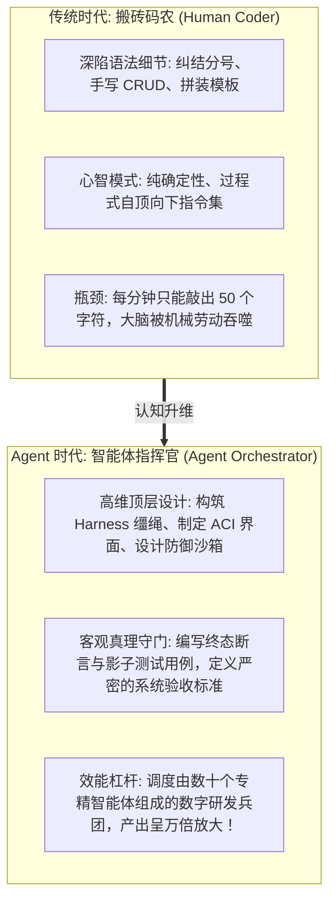
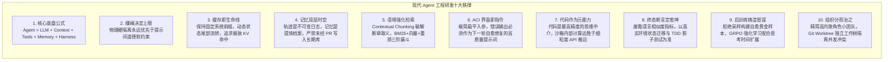
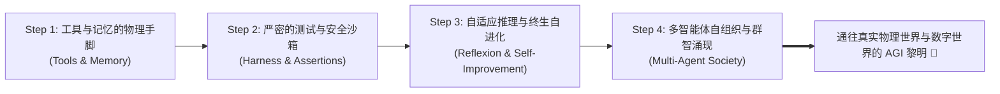

import { Quiz } from '@/components/Quiz'

# 10.4 终局展望与指挥官心法：全书十大工程铁律与 AGI 阶梯

> **本节要点**：站在全书完结的宏伟山巅，见证软件工程范式的世纪大迁徙——从“逐行编码的打字员”全面跃迁为“调度万千数字实体的 **智能体指挥官（Agent Orchestrator）**”；终极提炼贯穿全书 10 大章节的 **现代 Agent 研发十大工程铁律**；重温理查德·萨顿（Rich Sutton）的《苦涩的教训》（The Bitter Lesson），洞察通往 AGI（通用人工智能）的终极行动阶梯。

---

## 1. 工程师范式的世纪跃迁：从 Coder 到 Agent Orchestrator

当我们在 IDE 中亲手构建出具备记忆、工具调用、自愈排错与多智能体分工协同的系统时，我们必须清醒地意识到：**人类程序员的角色定位已经发生了不可逆转的历史性裂变！**

未来的核心竞争力不再是“你记住了多少个 API 的参数顺序”，而是**“你是否具备设计高质量环境、构建自愈闭环、并与概率模型进行深度工程协同的架构驾驭力”**。

---

## 2. 全书精粹：现代 Agent 研发十大工程铁律 (The Ten Commandments)

回顾整部《AI Agents in Depth》的工程漫游，请将以下 **十大基石铁律** 铭刻在你的架构心智中：

---

## 3. 终章呼应：Rich Sutton《苦涩的教训》与通往 AGI 的阶梯

在全书的开篇（1.1 节），我们引用了强化学习之父理查德·萨顿（Rich Sutton）在 2019 年写下的警世名篇《The Bitter Lesson》：

> **“在过去的 70 年里，人工智能领域最痛苦的教训是：那些试图将人类专家的直觉和规则硬编码进系统的做法，最终无一例外被利用海量计算力（搜索与通用学习）的方法彻底碾压。”**

站在 2026 年的今天，智能体工程正在再次验证这一真理：
1. **不要试图用成千上万行复杂的正则表达式去规定 Agent 的每一个子动作**；
2. **构建一个能够运行物理代码的沙箱环境、编写清晰可自动判决的单元测试套件、设立好绝对安全的防逃逸缰绳，然后——让大模型在充足的算力与测试反馈中自由探索、推理反思、自我对弈！**

恭喜你！至此，你已经完整学完了《AI Agents in Depth: Design Principles and Engineering Practice》全书 10 章的全部体系化课程。
带着这套坚不可摧的工程基石，奔赴属于你的 Agent 创造之旅吧！

---

## 4. 本节练习与反思

<Quiz
  question="根据全书总结的工程哲学，在面对复杂未知任务时，一位合格的'智能体指挥官（Agent Orchestrator）'应该将主要精力聚焦在什么地方？"
  options={[
    "构筑高精度的物理沙箱执行环境、编写严密客观的终态测试断言、配置安全防护网，并设计促进模型自愈探索的反馈闭环机制",
    "每天纯手工在记事本中为大模型手写十万个 if-else 规则分支",
    "要求大语言模型背诵人类历史上所有的法律条文并在每次回答前默写一遍",
    "试图修改每一个芯片晶体管的物理排布以加快大模型的生成速度"
  ]}
  correctIndex={0}
  explanation="指挥官的心法在于'建跑道、立规则、设终点'。人类不再手把手指挥每一次转弯，而是为智能体打造具备自我修正、自我验证能力的系统闭环，利用环境的真实物理反馈驱动智能体自主达成复杂工程目标。"
/>

<Quiz
  question="理查德·萨顿（Rich Sutton）提出的《苦涩的教训（The Bitter Lesson）》给现代 AI Agent 架构师的最核心启示是什么？"
  options={[
    "依赖通用计算（搜索推演与大规模学习试错）的方法，长期来看必然战胜人类精心手工编织的脆弱规则；架构师应当搭建可规模化利用算力与环境反馈的基础设施",
    "因为计算硬件太便宜了，所以程序员应该放弃所有的代码版本控制",
    "只有用苦涩的黑咖啡浇灌服务器主板才能训练出高智商的人工智能",
    "人类应该彻底停止对所有人工智能技术的研究并销毁所有电脑"
  ]}
  correctIndex={0}
  explanation="苦涩的教训揭示了计算与通用算法的力量。试图穷举人类直觉来硬控系统的努力终将被算力浪潮冲垮。优秀架构师应当拥抱这一真理：搭建高吞吐的仿真环境与客观反馈体系，让系统在通用的强化探索与计算扩展中持续涌现出超越人类预期的智慧。"
/>
